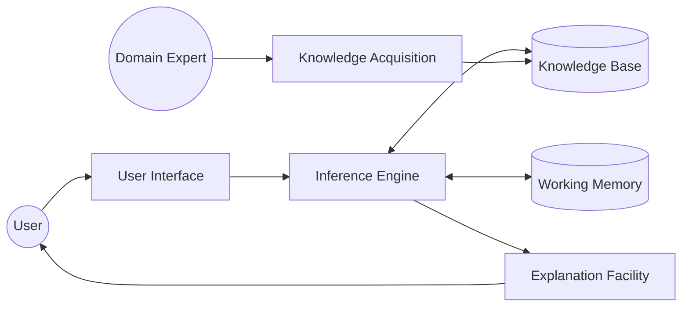
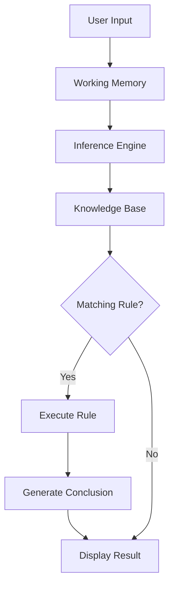
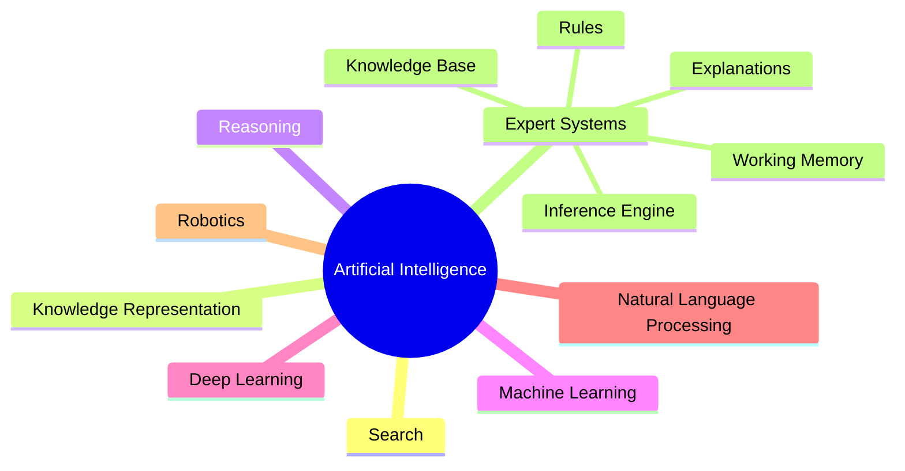

# What is an Expert System?

## Table of Contents

- Introduction
- Definition
- Why is it Called an Expert System?
- Objectives
- Characteristics
- Basic Components
- How an Expert System Works
- Expert System Architecture
- Working Process
- Simple Example
- Advantages
- Limitations
- Real-World Applications
- Difference Between Expert Systems and Conventional Programs
- Difference Between Expert Systems and Machine Learning
- Summary
- Key Terms
- Quick Quiz
- References

---

# Introduction

An **Expert System** is one of the earliest and most successful applications of **Artificial Intelligence (AI)**. It is a computer program that emulates the decision-making ability of a human expert in a specific domain.

Instead of learning from data like modern Machine Learning models, an Expert System relies on a collection of expert knowledge and logical rules to solve problems, provide recommendations, diagnose issues, and support decision-making.

Expert systems are designed to answer questions such as:

- What disease does a patient have?
- Why won't a car start?
- Which loan should a customer receive?
- Which fertilizer should a farmer use?

The system reaches conclusions by applying logical reasoning to stored knowledge.

---

# Definition

> **An Expert System is an AI-based software system that uses a knowledge base and an inference engine to solve complex problems that normally require the expertise of a human specialist.**

It attempts to mimic the reasoning process of experts within a particular field.

---

# Why is it Called an Expert System?

The name consists of two parts.

- **Expert** → Possesses specialized knowledge in a particular domain.
- **System** → A computer program that uses that knowledge to solve problems.

Instead of replacing human experts, it captures and preserves their knowledge so it can be reused by others.

---

# Objectives

The primary objectives of an Expert System are:

- Solve domain-specific problems
- Assist decision making
- Preserve expert knowledge
- Provide consistent solutions
- Reduce human errors
- Increase productivity
- Make expert advice available at any time

---

# Characteristics

A good Expert System has the following characteristics:

- Domain-specific knowledge
- Rule-based reasoning
- High accuracy
- Fast decision making
- Explanation capability
- Knowledge reuse
- Consistency
- Reliability
- Interactive user interface

---

# Basic Components

An Expert System is composed of several major components.

| Component | Purpose |
|-----------|----------|
| Knowledge Base | Stores facts and expert knowledge |
| Inference Engine | Applies logical reasoning |
| Working Memory | Stores current facts |
| User Interface | Allows interaction with users |
| Explanation Facility | Explains how conclusions were reached |
| Knowledge Acquisition Module | Adds new knowledge from experts |

---

# Expert System Architecture



---

# How an Expert System Works

The overall workflow consists of the following steps.

1. User enters information.
2. Facts are stored in working memory.
3. Inference engine searches the knowledge base.
4. Matching rules are selected.
5. Rules are executed.
6. New facts may be generated.
7. Final conclusion is presented.
8. Explanation facility explains the reasoning.

---

# Working Process



---

# Simple Example

Suppose an Expert System is developed for medical diagnosis.

### Facts

```
Temperature = 39°C

Cough = Yes

Body Pain = Yes
```

### Rule

```
IF Temperature > 38°C

AND Cough = Yes

AND Body Pain = Yes

THEN Disease = Flu
```

### Output

```
Diagnosis

Flu
```

### Explanation

```
Reason

Temperature > 38°C

Cough Present

Body Pain Present
```

---

# Advantages

- Provides expert-level decisions
- Available 24×7
- Consistent recommendations
- Reduces dependency on human experts
- Preserves valuable knowledge
- Faster than manual analysis
- Useful for repetitive decision making

---

# Limitations

- Expensive to develop
- Difficult to acquire expert knowledge
- Limited to one domain
- Cannot learn automatically
- Requires regular updates
- Cannot replace human creativity

---

# Real-World Applications

## Healthcare

- Disease diagnosis
- Drug recommendation

---

## Banking

- Loan approval
- Risk assessment

---

## Manufacturing

- Equipment fault diagnosis
- Quality inspection

---

## Agriculture

- Crop disease detection
- Irrigation advice

---

## Cybersecurity

- Malware analysis
- Intrusion detection

---

## Education

- Intelligent tutoring systems

---

## Business

- Customer support
- Decision support systems

---

# Difference Between Expert Systems and Conventional Programs

| Conventional Program | Expert System |
|----------------------|---------------|
| Uses algorithms | Uses knowledge and rules |
| Fixed logic | Dynamic reasoning |
| Difficult to explain decisions | Can explain conclusions |
| Limited flexibility | More intelligent decision making |

---

# Difference Between Expert Systems and Machine Learning

| Expert System | Machine Learning |
|---------------|------------------|
| Rule-based | Data-driven |
| Uses expert knowledge | Learns from data |
| No training required | Requires model training |
| Highly explainable | Often difficult to explain |
| Best for deterministic problems | Best for pattern recognition |

---

# Expert System in AI



---

# Summary

An Expert System is an Artificial Intelligence program that imitates the reasoning process of a human expert. It uses a **Knowledge Base** to store expert knowledge and an **Inference Engine** to apply logical rules and solve problems. Expert systems are widely used in healthcare, finance, manufacturing, agriculture, education, cybersecurity, and many other domains where expert knowledge can be represented using rules.

Although modern Machine Learning and Large Language Models have become increasingly popular, Expert Systems remain valuable wherever transparent, explainable, and rule-based decision-making is required.

---

# Key Terms

| Term | Meaning |
|------|---------|
| Expert System | AI system that mimics expert reasoning |
| Knowledge Base | Collection of facts and rules |
| Inference Engine | Performs logical reasoning |
| Working Memory | Stores current information |
| Rule | IF-THEN statement |
| Explanation Facility | Explains system decisions |
| Knowledge Acquisition | Process of collecting expert knowledge |

---

# Quick Quiz

### Beginner

1. What is an Expert System?
2. Why is it called an Expert System?
3. What is a Knowledge Base?
4. What is an Inference Engine?
5. What is Working Memory?

### Intermediate

1. Explain the working of an Expert System.
2. List the major components.
3. Give three real-world applications.
4. Compare Expert Systems and Machine Learning.
5. Why are Expert Systems considered explainable AI?

---

# References

## Books

- Artificial Intelligence: A Modern Approach — Stuart Russell & Peter Norvig
- Artificial Intelligence — Elaine Rich
- Expert Systems: Principles and Programming — Joseph Giarratano & Gary Riley

## Online Resources

- IBM AI Documentation
- Microsoft AI Learning Resources
- Stanford Artificial Intelligence Courses
- MIT OpenCourseWare (Artificial Intelligence)
```