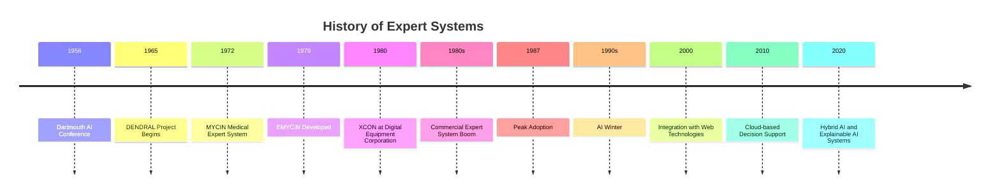
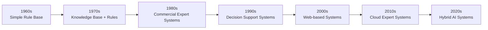
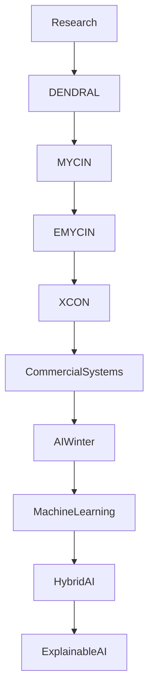

# History of Expert Systems

## Table of Contents

- Introduction
- Origins of Expert Systems
- Evolution Timeline
- First Generation (1960s–1970s)
- Commercial Expansion (1980s)
- Expert System Winter (Late 1980s–1990s)
- Modern Expert Systems
- Influential Expert Systems
- Contributions to Artificial Intelligence
- Evolution of Expert System Architecture
- Timeline Diagram
- Summary
- Key Dates
- Quick Quiz
- References

---

# Introduction

Expert Systems are among the earliest successful applications of **Artificial Intelligence (AI)**. They were developed to capture the knowledge of human experts and make that knowledge available through computer systems.

Unlike modern Machine Learning systems, Expert Systems rely on **explicitly encoded knowledge** and **logical reasoning** rather than learning from large datasets.

The history of Expert Systems spans more than sixty years and has significantly influenced the development of modern AI technologies.

---

# Origins of Expert Systems

During the 1950s and early 1960s, AI researchers believed that computers could eventually perform intelligent reasoning.

Researchers identified an important observation:

> Human experts solve problems primarily because of their specialized knowledge rather than exceptional calculation abilities.

This idea became known as the **Knowledge-Based Approach**.

Instead of building more complex algorithms, researchers focused on storing expert knowledge inside computers.

This gave birth to the concept of the **Expert System**.

---

# Evolution Timeline



---

# First Generation (1960s–1970s)

The first Expert Systems focused mainly on scientific and medical domains.

Characteristics:

- Rule-based reasoning
- Small knowledge bases
- Research-oriented
- Developed mainly in universities

Major achievements included:

- Chemical analysis
- Medical diagnosis
- Geological exploration

---

# DENDRAL (1965)

DENDRAL is widely recognized as the **first successful Expert System**.

Purpose:

- Identify unknown organic molecules.
- Assist chemists using mass spectrometry.

Developed at:

- Stanford University

Significance:

- Demonstrated that expert knowledge could outperform general-purpose algorithms in specialized domains.

---

# MYCIN (1972)

MYCIN was one of the most famous medical Expert Systems.

Purpose:

- Diagnose bacterial infections.
- Recommend antibiotics.
- Determine proper dosage.

Knowledge Base:

- More than **450 IF-THEN rules**

Example Rule

```
IF

Patient has fever

AND

Blood culture is positive

THEN

Suggest bacterial infection
```

Achievements:

- Comparable performance to experienced physicians.
- Introduced explanation facilities.

Limitation:

- Never widely deployed because of legal and ethical concerns.

---

# EMYCIN (1979)

Researchers realized that MYCIN's reasoning engine could be reused.

EMYCIN separated:

- Knowledge Base
- Inference Engine

This allowed developers to build new Expert Systems without rewriting the reasoning engine.

---

# Commercial Expansion (1980s)

The 1980s became known as the **Golden Age of Expert Systems**.

Large companies invested heavily.

Industries included:

- Banking
- Manufacturing
- Telecommunications
- Aerospace
- Healthcare

Thousands of Expert Systems were developed worldwide.

---

# XCON (1980)

Developed by:

Digital Equipment Corporation (DEC)

Purpose:

Configure computer hardware automatically.

Achievements:

- Saved millions of dollars annually.
- Reduced configuration errors.
- Increased productivity.

---

# Other Famous Systems

## PROSPECTOR

Purpose

- Mineral exploration

Domain

- Geology

---

## CADUCEUS

Purpose

- Medical diagnosis

---

## PUFF

Purpose

- Lung disease diagnosis

---

## INTERNIST-I

Purpose

- Internal medicine diagnosis

---

# AI Winter (Late 1980s–1990s)

Despite their success, Expert Systems faced several challenges.

Problems included:

- High development cost
- Difficult knowledge acquisition
- Expensive maintenance
- Rule explosion
- Poor scalability

As expectations exceeded actual capabilities, funding declined.

This period became known as the **AI Winter**.

---

# Why Expert Systems Declined

Major reasons:

- Knowledge acquisition bottleneck
- Hardware limitations
- Maintenance difficulties
- Limited learning ability
- Narrow application domains
- Rise of statistical machine learning

---

# Revival of AI

Around the 2000s, advances in computing power, storage, and the availability of large datasets shifted AI research toward:

- Machine Learning
- Neural Networks
- Deep Learning
- Data Mining

Although Expert Systems became less dominant, they continued to be used in areas requiring transparent and explainable decision-making.

---

# Modern Expert Systems

Today's Expert Systems are often combined with other AI technologies.

Modern systems may include:

- Machine Learning
- Knowledge Graphs
- Ontologies
- Natural Language Processing
- Cloud Computing
- Big Data
- Explainable AI (XAI)

These hybrid systems provide both learning capability and transparent reasoning.

---

# Evolution of Expert System Architecture



---

# Historical Progress



---

# Contributions to Artificial Intelligence

Expert Systems introduced many concepts that remain important today.

These include:

- Knowledge representation
- Rule-based reasoning
- Inference engines
- Knowledge engineering
- Explainable AI
- Decision support systems

Many modern AI applications still incorporate these ideas.

---

# Historical Comparison

| Era | Characteristics |
|------|-----------------|
| 1950s | Birth of Artificial Intelligence |
| 1960s | Knowledge-based reasoning begins |
| 1970s | Medical and scientific expert systems |
| 1980s | Commercial success |
| 1990s | AI Winter |
| 2000s | Web-based decision support |
| 2010s | Cloud integration |
| 2020s | Hybrid AI and Explainable AI |

---

# Summary

The history of Expert Systems reflects the evolution of Artificial Intelligence from symbolic reasoning to modern hybrid approaches. Beginning with pioneering systems such as **DENDRAL** and **MYCIN**, Expert Systems demonstrated that encoding expert knowledge could solve complex, domain-specific problems. Although their popularity declined during the AI Winter due to development and maintenance challenges, their core concepts—knowledge representation, inference, and explainability—remain fundamental in modern AI, especially in decision support and Explainable AI (XAI).

---

# Key Dates

| Year | Event |
|------|-------|
| 1956 | Dartmouth Conference established AI as a research field |
| 1965 | DENDRAL developed |
| 1972 | MYCIN introduced |
| 1979 | EMYCIN released |
| 1980 | XCON deployed |
| 1980s | Commercial boom |
| 1990s | AI Winter |
| 2000s | Web-based Expert Systems |
| 2020s | Hybrid AI systems |

---

# Quick Quiz

## Beginner

1. What was the first successful Expert System?
2. Which Expert System diagnosed bacterial infections?
3. What was the purpose of XCON?
4. What is the AI Winter?
5. What is knowledge engineering?

---

## Intermediate

1. Why did Expert Systems become popular in the 1980s?
2. Explain the knowledge acquisition bottleneck.
3. Compare DENDRAL and MYCIN.
4. Why did Expert Systems decline?
5. How are modern Expert Systems different from early systems?

---

# References

## Books

- Artificial Intelligence: A Modern Approach — Stuart Russell & Peter Norvig
- Expert Systems: Principles and Programming — Joseph Giarratano & Gary Riley
- Artificial Intelligence — Elaine Rich

## Research Papers

- Feigenbaum, E. A. — Knowledge Engineering
- Buchanan, B. G. — Rule-Based Expert Systems
- Shortliffe, E. H. — MYCIN Project

## Online Resources

- Stanford University AI Laboratory
- MIT OpenCourseWare (Artificial Intelligence)
- IBM AI Documentation