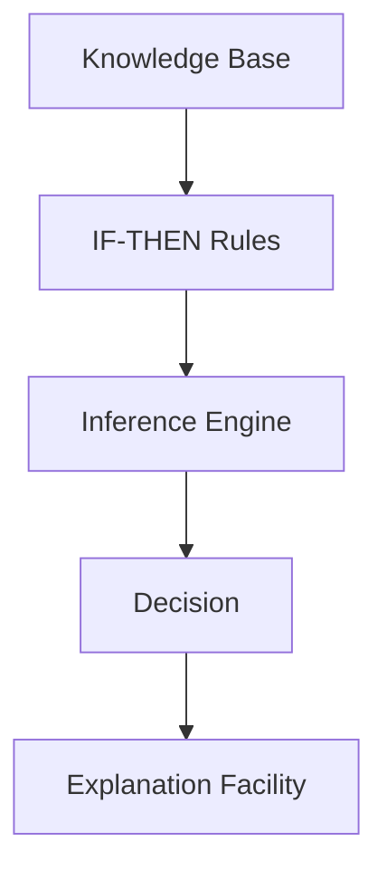
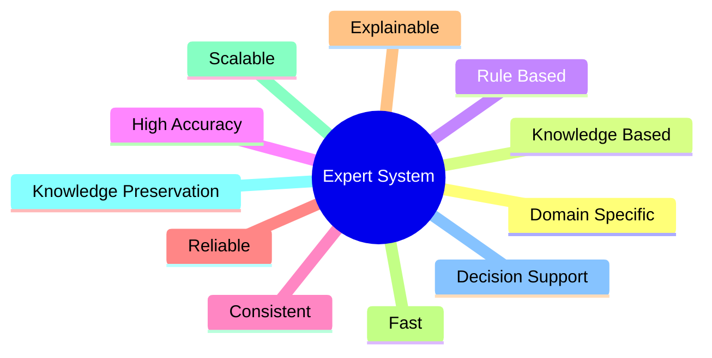

# Characteristics of Expert Systems

## Table of Contents

- Introduction
- What are Characteristics?
- Core Characteristics
- Technical Characteristics
- Functional Characteristics
- Intelligence Characteristics
- Characteristics Flow
- Characteristics Summary Table
- Real-World Example
- Importance of Characteristics
- Summary
- Key Terms
- Quick Quiz
- References

---

# Introduction

An **Expert System** is designed to emulate the reasoning and decision-making abilities of a human expert. Unlike conventional software that follows fixed algorithms, an Expert System possesses several unique characteristics that enable it to solve complex, domain-specific problems efficiently.

These characteristics distinguish Expert Systems from traditional computer programs and make them valuable in fields such as healthcare, finance, manufacturing, cybersecurity, and engineering.

---

# What are Characteristics?

Characteristics are the unique features or properties that define how an Expert System behaves and performs.

A good Expert System should be able to:

- Store expert knowledge
- Reason logically
- Explain its decisions
- Solve complex problems
- Produce consistent results
- Handle uncertainty

---

# Core Characteristics

## 1. Domain-Specific Knowledge

An Expert System is designed for a **specific domain** rather than general-purpose problem solving.

Examples:

- Medical diagnosis
- Legal advice
- Banking
- Agriculture
- Network troubleshooting

Example:

```
Medical Expert System

✔ Diagnoses diseases

✘ Cannot design buildings
```

---

## 2. Knowledge-Based

The intelligence of an Expert System comes from its **Knowledge Base** rather than mathematical calculations.

The Knowledge Base stores:

- Facts
- Rules
- Procedures
- Relationships

Example Rule

```
IF

Temperature > 38°C

AND

Cough = Yes

THEN

Disease = Flu
```

---

## 3. Rule-Based Reasoning

Most Expert Systems use **IF–THEN rules** to make decisions.

General format

```
IF Condition

THEN Action
```

Example

```
IF

Battery Voltage < 11V

THEN

Battery is Weak
```

---

## 4. High Accuracy

Expert Systems provide highly accurate recommendations when the knowledge base is complete and correct.

Because the same rules are applied consistently, the system minimizes human errors.

---

## 5. Consistency

Unlike humans, Expert Systems do not become:

- Tired
- Emotional
- Distracted

The same input always produces the same output.

Example

```
Input A

↓

Same Rules

↓

Same Output
```

---

## 6. Explanation Capability

One of the most valuable characteristics is the ability to explain decisions.

The system can answer:

- Why was this decision made?
- Which rule was used?
- Which facts were considered?

Example

```
Diagnosis

Flu

Reason

Temperature > 38°C

Cough Present

Body Pain Present
```

---

## 7. Fast Decision Making

An Expert System can analyze hundreds of rules in a fraction of a second.

This makes it useful in:

- Hospitals
- Banking
- Manufacturing
- Cybersecurity

---

## 8. Knowledge Preservation

The knowledge of experienced professionals can be stored permanently.

Benefits:

- Prevents knowledge loss
- Trains new employees
- Standardizes decision making

---

## 9. Reliability

Expert Systems produce reliable recommendations because they use verified expert knowledge.

Reliability depends on:

- Correct rules
- Updated knowledge
- Proper maintenance

---

## 10. Scalability

Knowledge can be expanded by adding new rules without redesigning the entire system.

Example

Old Rule Base

```
100 Rules
```

Updated Rule Base

```
500 Rules
```

---

# Technical Characteristics

## Symbolic Reasoning

Expert Systems manipulate symbols and rules instead of performing only numerical calculations.

---

## Separation of Knowledge and Reasoning

The Knowledge Base and Inference Engine are independent.

Advantages:

- Easy maintenance
- Reusable inference engine
- Easier upgrades

---

## Modular Design

Each component performs a specific task.

Examples:

- Knowledge Base
- Inference Engine
- User Interface
- Working Memory

---

## Knowledge Acquisition

New knowledge can be added continuously through experts or knowledge engineers.

---

# Functional Characteristics

An Expert System can perform tasks such as:

- Diagnosis
- Prediction
- Classification
- Planning
- Monitoring
- Configuration
- Scheduling
- Troubleshooting

---

# Intelligence Characteristics

Expert Systems exhibit several intelligent behaviors.

- Logical reasoning
- Decision support
- Problem solving
- Knowledge utilization
- Explanation generation
- Recommendation

---

# Characteristics Flow



---

# Expert System Characteristics Overview



---

# Characteristics Summary Table

| Characteristic | Description |
|----------------|-------------|
| Domain Specific | Designed for one problem domain |
| Knowledge Based | Uses expert knowledge |
| Rule Based | Uses IF–THEN rules |
| Accurate | Produces expert-level decisions |
| Consistent | Same input gives same output |
| Explainable | Can explain reasoning |
| Reliable | Produces dependable results |
| Fast | Quick decision making |
| Scalable | Easy to add knowledge |
| Maintainable | Knowledge can be updated |

---

# Real-World Example

Suppose a patient enters the following information.

```
Temperature = 39°C

Cough = Yes

Body Pain = Yes
```

The Expert System performs the following steps:


Output

```
Diagnosis

Flu
```

Explanation

```
Rule Used

IF Temperature > 38°C

AND Cough = Yes

AND Body Pain = Yes

THEN Flu
```

---

# Importance of Characteristics

These characteristics make Expert Systems suitable for:

- Medical diagnosis
- Financial decision support
- Industrial automation
- Aircraft maintenance
- Customer support
- Cybersecurity
- Agriculture
- Education

Without these characteristics, an Expert System would behave like a normal software application rather than an intelligent system.

---

# Summary

The characteristics of an Expert System define its intelligence and usefulness. Its domain-specific knowledge, rule-based reasoning, consistency, explanation capability, reliability, and fast decision-making distinguish it from conventional software. These features enable Expert Systems to solve complex problems efficiently while providing transparent and explainable recommendations.

---

# Key Terms

| Term | Meaning |
|------|---------|
| Domain Knowledge | Specialized knowledge of a field |
| Knowledge Base | Repository of facts and rules |
| Rule-Based Reasoning | Decision making using IF–THEN rules |
| Consistency | Same input always produces the same output |
| Explanation Facility | Explains how a conclusion was reached |
| Knowledge Preservation | Storing expert knowledge for future use |
| Reliability | Producing dependable decisions |

---

# Quick Quiz

## Beginner

1. What is a domain-specific system?
2. Why are Expert Systems called knowledge-based systems?
3. What is rule-based reasoning?
4. Why is consistency important?
5. What is an explanation facility?

---

## Intermediate

1. Explain knowledge preservation.
2. How is an Expert System different from conventional software?
3. Why is scalability important?
4. What factors affect reliability?
5. Give five characteristics of Expert Systems.

---

## Advanced

1. How does the separation of the Knowledge Base and Inference Engine improve maintainability?
2. Why is explainability an important advantage over many machine learning models?
3. Discuss how Expert Systems achieve high accuracy.
4. Explain the relationship between symbolic reasoning and rule-based inference.
5. Which characteristics are most important in safety-critical systems, and why?

---

# References

## Books

- Artificial Intelligence: A Modern Approach — Stuart Russell & Peter Norvig
- Expert Systems: Principles and Programming — Joseph C. Giarratano & Gary D. Riley
- Artificial Intelligence — Elaine Rich & Kevin Knight

## Online Resources

- IBM AI Documentation
- Microsoft AI Learning Resources
- Stanford Artificial Intelligence Laboratory
- MIT OpenCourseWare (Artificial Intelligence)