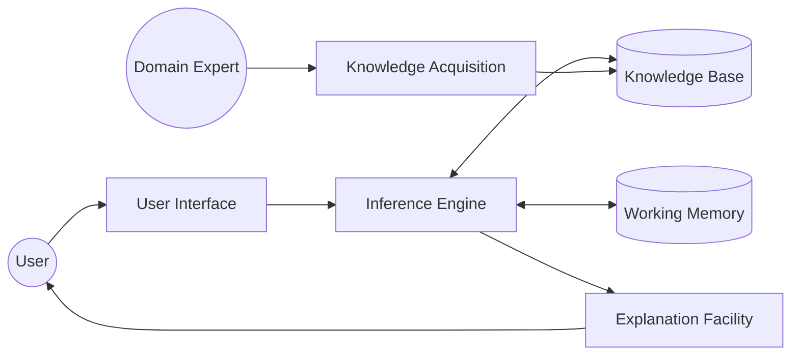
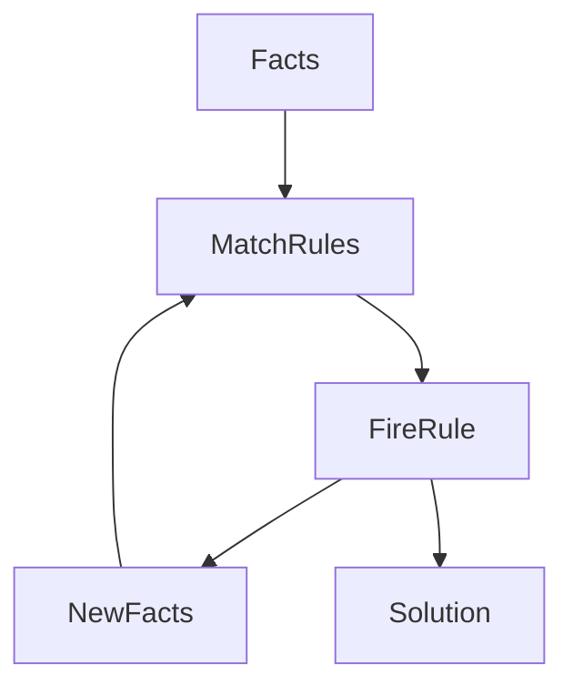
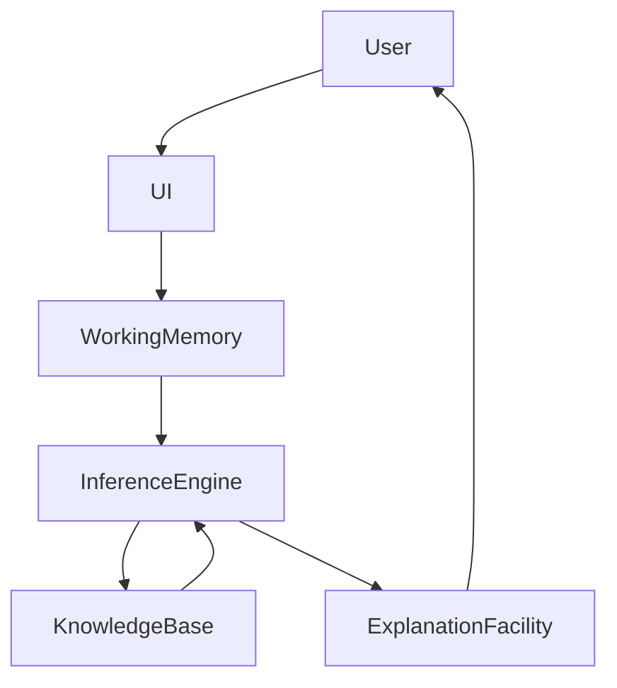
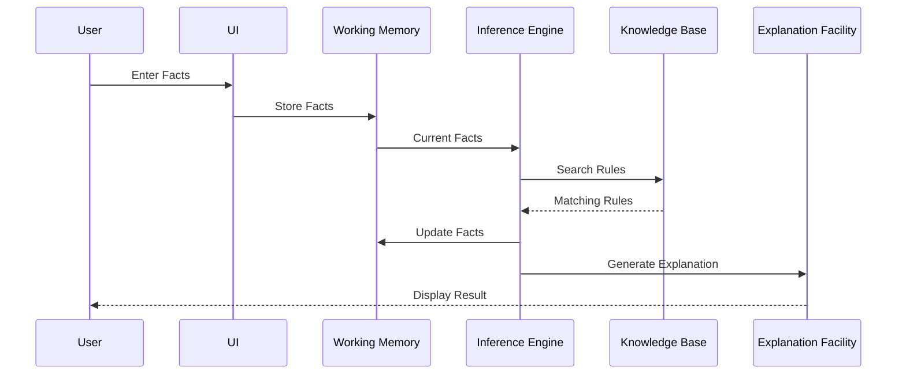

# Components of an Expert System

## Table of Contents

- Introduction
- Overview of Components
- Architecture Overview
- 1. Knowledge Base
- 2. Inference Engine
- 3. Working Memory (Fact Base)
- 4. User Interface
- 5. Explanation Facility
- 6. Knowledge Acquisition System
- Component Interaction
- Complete Workflow
- Real-World Example
- Component Comparison
- Advantages of Modular Components
- Summary
- Key Terms
- Quick Quiz
- References

---

# Introduction

An **Expert System** consists of several interconnected components that work together to simulate the reasoning and decision-making process of a human expert.

Each component has a specific responsibility. Together, they enable the system to store knowledge, reason about problems, explain decisions, and interact with users.

---

# Overview of Components

A typical Expert System consists of the following six major components:

1. Knowledge Base
2. Inference Engine
3. Working Memory (Fact Base)
4. User Interface
5. Explanation Facility
6. Knowledge Acquisition System

These components communicate continuously while solving a problem.

---

# Architecture Overview



---

# 1. Knowledge Base

## Definition

The **Knowledge Base** is the heart of an Expert System.

It stores all expert knowledge required to solve problems.

---

## Contents

A Knowledge Base may contain:

- Facts
- Rules
- Procedures
- Relationships
- Heuristics
- Constraints

---

## Example

```
IF

Temperature > 38°C

AND

Cough = Yes

THEN

Disease = Flu
```

---

## Responsibilities

- Store expert knowledge
- Organize rules
- Provide facts
- Support reasoning
- Allow updates

---

## Advantages

- Centralized knowledge
- Easy maintenance
- Reusable
- Expandable

---

# 2. Inference Engine

## Definition

The **Inference Engine** is the brain of the Expert System.

It applies logical reasoning to determine solutions based on the rules stored in the Knowledge Base.

---

## Responsibilities

- Match rules
- Select rules
- Execute rules
- Generate conclusions
- Update working memory

---

## Types of Reasoning

### Forward Chaining

Starts from known facts.

```
Facts

↓

Rules

↓

Conclusion
```

---

### Backward Chaining

Starts from a goal.

```
Goal

↓

Rules

↓

Facts
```

---

## Decision Process



---

# 3. Working Memory (Fact Base)

## Definition

Working Memory stores all information provided during the current problem-solving session.

Unlike the Knowledge Base, Working Memory changes continuously.

---

## Contains

- User inputs
- Intermediate results
- Current facts
- Temporary conclusions

---

## Example

```
Patient Name = John

Temperature = 39°C

Cough = Yes

Body Pain = Yes
```

---

## Responsibilities

- Store temporary facts
- Update during reasoning
- Share data with inference engine

---

# 4. User Interface

## Definition

The User Interface allows communication between users and the Expert System.

It accepts user inputs and displays recommendations.

---

## Responsibilities

- Accept data
- Display questions
- Show results
- Display explanations

---

## Example

```
Enter Temperature

39°C

Enter Symptoms

✔ Fever

✔ Cough

✔ Body Pain
```

---

# 5. Explanation Facility

## Definition

One of the unique features of Expert Systems is their ability to explain decisions.

The Explanation Facility answers questions such as:

- Why?
- How?
- Which rule was used?

---

## Example

```
Diagnosis

Flu

Reason

Temperature > 38°C

Cough = Yes

Body Pain = Yes

Rule #12 Executed
```

---

## Benefits

- Improves trust
- Easier debugging
- Better learning
- Supports decision making

---

# 6. Knowledge Acquisition System

## Definition

The Knowledge Acquisition System helps collect knowledge from domain experts and stores it in the Knowledge Base.

---

## Sources

- Human experts
- Research papers
- Manuals
- Books
- Databases
- Industry standards

---

## Responsibilities

- Gather knowledge
- Validate rules
- Update knowledge base
- Remove outdated rules

---

## Knowledge Acquisition Process


---

# Component Interaction

The following diagram shows how all components communicate.



---

# Complete Workflow



---

# Real-World Example

Suppose a patient visits a hospital.

### Step 1

User enters

```
Temperature = 39°C

Cough = Yes
```

↓

Stored in

Working Memory

↓

Inference Engine searches

Knowledge Base

↓

Rule Found

```
IF

Temperature > 38°C

AND

Cough = Yes

THEN

Flu
```

↓

Conclusion

```
Disease

Flu
```

↓

Explanation Facility

```
Diagnosis

Flu

Reason

Rule #15 Applied
```

---

# Component Comparison

| Component | Purpose | Stores Data | Performs Reasoning |
|------------|----------|-------------|--------------------|
| Knowledge Base | Expert knowledge | Yes | No |
| Inference Engine | Logical reasoning | No | Yes |
| Working Memory | Current facts | Yes | No |
| User Interface | User interaction | No | No |
| Explanation Facility | Explain decisions | No | No |
| Knowledge Acquisition | Collect expert knowledge | Yes | No |

---

# Advantages of Modular Components

- Easy maintenance
- Better scalability
- Independent updates
- Reusable modules
- Easier debugging
- Higher reliability
- Flexible architecture

---

# Summary

An Expert System is composed of six essential components that work together to simulate expert reasoning. The **Knowledge Base** stores expert knowledge, the **Inference Engine** performs logical reasoning, the **Working Memory** maintains temporary facts, the **User Interface** enables interaction, the **Explanation Facility** justifies decisions, and the **Knowledge Acquisition System** updates and expands the system's knowledge. This modular architecture makes Expert Systems reliable, maintainable, scalable, and capable of delivering transparent, explainable decisions.

---

# Key Terms

| Term | Meaning |
|------|---------|
| Knowledge Base | Repository of expert knowledge |
| Inference Engine | Performs logical reasoning |
| Working Memory | Temporary storage of facts |
| User Interface | Communication between user and system |
| Explanation Facility | Explains reasoning process |
| Knowledge Acquisition | Process of collecting expert knowledge |

---

# Quick Quiz

## Beginner

1. What is the Knowledge Base?
2. Which component is called the brain of an Expert System?
3. What is Working Memory?
4. What is the purpose of the User Interface?
5. Why is the Explanation Facility important?

---

## Intermediate

1. Compare the Knowledge Base and Working Memory.
2. Explain the role of the Inference Engine.
3. Why is modular architecture beneficial?
4. What is Knowledge Acquisition?
5. Describe the interaction between the components.

---

## Advanced

1. How does the Inference Engine coordinate with the Knowledge Base and Working Memory?
2. Why is the Explanation Facility essential in Explainable AI (XAI)?
3. Discuss how the separation of knowledge and reasoning improves maintainability.
4. Explain how a Knowledge Acquisition System supports long-term scalability.
5. How do the six components collectively emulate the decision-making process of a human expert?

---

# References

## Books

- Artificial Intelligence: A Modern Approach — Stuart Russell & Peter Norvig
- Expert Systems: Principles and Programming — Joseph C. Giarratano & Gary D. Riley
- Artificial Intelligence — Elaine Rich & Kevin Knight

## Online Resources

- IBM AI Documentation
- Stanford Artificial Intelligence Laboratory
- MIT OpenCourseWare (Artificial Intelligence)
- Microsoft AI Learning Resources