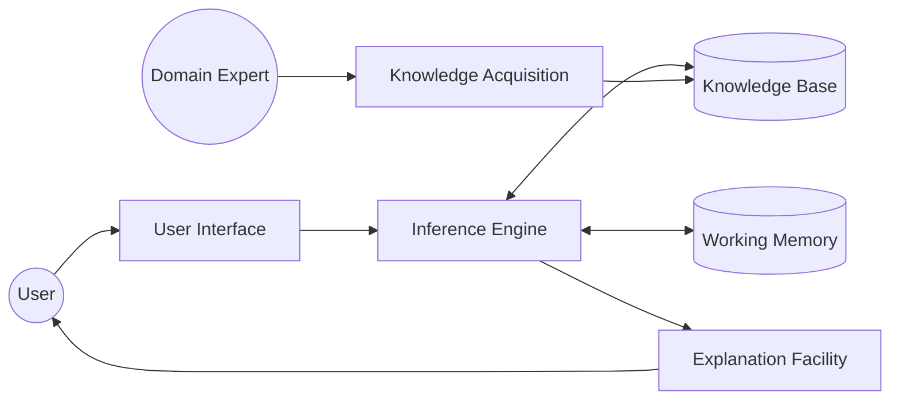
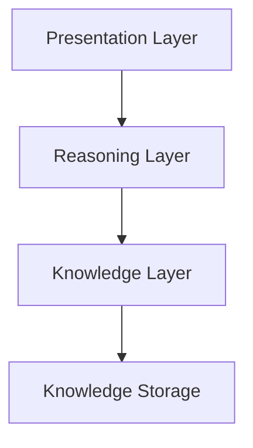
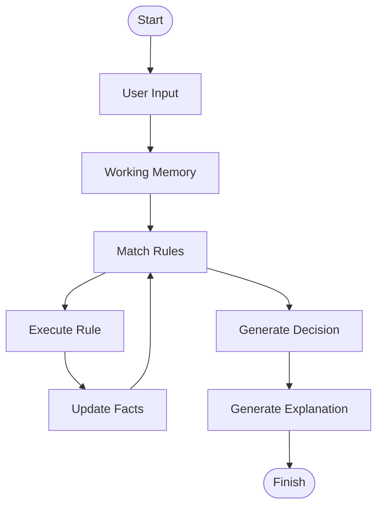
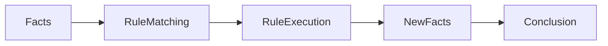
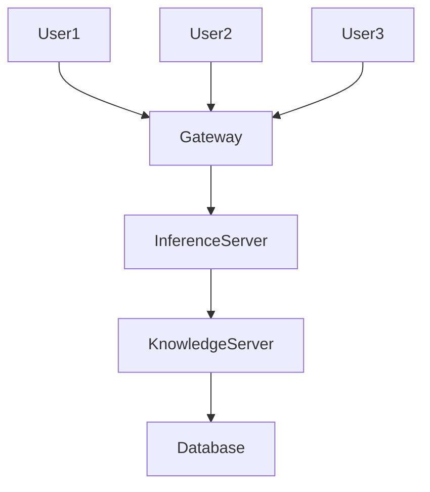
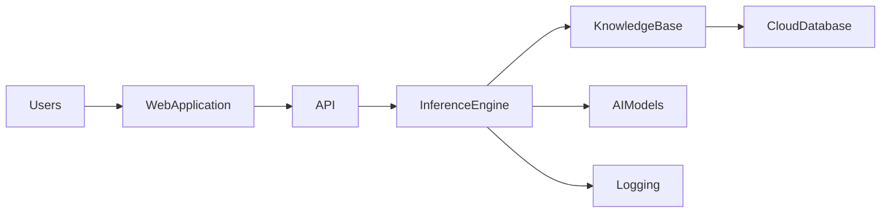

# Expert System Architecture

## Table of Contents

- Introduction
- What is Architecture?
- Objectives of the Architecture
- High-Level Architecture
- Components of the Architecture
- Data Flow
- Working Process
- Architecture Layers
- Rule Execution Cycle
- Forward Chaining Architecture
- Backward Chaining Architecture
- Distributed Expert System Architecture
- Modern Cloud Architecture
- Architecture Comparison
- Real-World Example
- Best Practices
- Summary
- Key Terms
- Quick Quiz
- References

---

# Introduction

The **architecture of an Expert System** defines how its various components are organized and interact to solve complex problems.

It provides a blueprint that shows:

- How users interact with the system.
- Where expert knowledge is stored.
- How reasoning is performed.
- How decisions are explained.
- How new knowledge is added.

A well-designed architecture ensures that the system is **accurate, maintainable, scalable, reusable, and explainable**.

---

# What is Architecture?

An **Expert System Architecture** is the structural design that describes the organization of all software components and the flow of information between them.

It consists of several independent modules working together.

---

# Objectives of the Architecture

The architecture is designed to:

- Separate knowledge from reasoning
- Improve maintainability
- Allow knowledge updates
- Support reusable inference engines
- Provide explainable decisions
- Improve scalability
- Support multiple users

---

# High-Level Architecture



---

# Components of the Architecture

## 1. User

The user interacts with the Expert System.

Responsibilities:

- Enter facts
- Ask questions
- View recommendations
- Read explanations

---

## 2. User Interface

Acts as the communication bridge between the user and the Expert System.

Functions:

- Accept user input
- Display questions
- Show recommendations
- Display explanations

---

## 3. Knowledge Base

Stores expert knowledge.

Contains:

- Facts
- Rules
- Heuristics
- Constraints
- Relationships

Example

```
IF Temperature > 38°C
AND Cough = Yes
THEN Disease = Flu
```

---

## 4. Inference Engine

The reasoning engine of the Expert System.

Functions:

- Match rules
- Execute rules
- Generate new facts
- Reach conclusions

Supports:

- Forward Chaining
- Backward Chaining

---

## 5. Working Memory

Stores temporary information.

Examples:

```
Temperature = 39°C

Cough = Yes
```

Working Memory changes continuously during reasoning.

---

## 6. Explanation Facility

Explains:

- Why a decision was made
- Which rule was used
- Which facts were considered

Example

```
Diagnosis

Flu

Reason

Rule #12

Temperature > 38°C

Cough = Yes
```

---

## 7. Knowledge Acquisition Module

Allows experts to update the Knowledge Base.

Sources include:

- Domain experts
- Research papers
- Technical manuals
- Databases
- Industry standards

---

# Data Flow

```mermaid
flowchart LR

User --> UI

UI --> WorkingMemory

WorkingMemory --> InferenceEngine

InferenceEngine --> KnowledgeBase

KnowledgeBase --> InferenceEngine

InferenceEngine --> WorkingMemory

InferenceEngine --> ExplanationFacility

ExplanationFacility --> UI

UI --> User
```



---

# Architecture Layers



---

## Presentation Layer

Responsible for:

- User interaction
- Input forms
- Reports
- Recommendations

---

## Reasoning Layer

Contains:

- Inference Engine
- Rule Matching
- Decision Logic

---

## Knowledge Layer

Contains:

- Facts
- Rules
- Knowledge Representation

---

## Storage Layer

Stores:

- Knowledge Base
- Configuration
- Logs
- User sessions

---

# Rule Execution Cycle



---

# Forward Chaining Architecture

Forward Chaining starts with known facts.



Suitable for:

- Diagnosis
- Monitoring
- Recommendation systems

---

# Backward Chaining Architecture

Backward Chaining starts from a goal.


Suitable for:

- Troubleshooting
- Medical diagnosis
- Question-answering systems

---

# Distributed Expert System Architecture

Large organizations often distribute Expert Systems.



Advantages

- Better scalability
- High availability
- Multiple users
- Centralized knowledge

---

# Modern Cloud Architecture

Modern Expert Systems are often deployed on cloud platforms.



Benefits

- Remote access
- Automatic updates
- High scalability
- Easy maintenance

---

# Architecture Comparison

| Architecture | Best For |
|--------------|----------|
| Classical Expert System | Small standalone systems |
| Rule-Based | Decision support |
| Distributed | Enterprise applications |
| Cloud-Based | Large organizations |
| Hybrid AI | Modern intelligent systems |

---

# Real-World Example

Medical Diagnosis System

```
Patient

↓

Temperature = 39°C

↓

Working Memory

↓

Inference Engine

↓

Knowledge Base

↓

Rule

IF Temperature > 38°C

AND Cough

THEN Flu

↓

Diagnosis

Flu

↓

Explanation Facility

↓

User
```

---

# Best Practices

- Keep the Knowledge Base separate from the Inference Engine.
- Design modular components.
- Use reusable rules.
- Maintain an explanation facility.
- Validate expert knowledge regularly.
- Update rules continuously.
- Avoid duplicate or conflicting rules.

---

# Summary

The architecture of an Expert System is a modular framework that separates **knowledge**, **reasoning**, and **user interaction**. It consists of the **Knowledge Base**, **Inference Engine**, **Working Memory**, **User Interface**, **Explanation Facility**, and **Knowledge Acquisition Module**. This separation improves maintainability, scalability, and explainability, allowing Expert Systems to deliver reliable, transparent, and efficient decision support across various domains.

---

# Key Terms

| Term | Meaning |
|------|---------|
| Architecture | Overall structure of an Expert System |
| Knowledge Base | Repository of expert knowledge |
| Inference Engine | Performs reasoning using rules |
| Working Memory | Temporary storage of current facts |
| Explanation Facility | Explains how decisions are made |
| Knowledge Acquisition | Collects and updates expert knowledge |
| Presentation Layer | User interaction layer |
| Reasoning Layer | Decision-making layer |

---

# Quick Quiz

## Beginner

1. What is an Expert System architecture?
2. What are its main components?
3. Which component stores rules?
4. Which component performs reasoning?
5. What is the purpose of Working Memory?

---

## Intermediate

1. Explain the flow of information in an Expert System.
2. Why is modular architecture important?
3. Compare the Knowledge Base and Working Memory.
4. What is the role of the Explanation Facility?
5. Why is the Knowledge Acquisition module necessary?

---

## Advanced

1. Compare classical, distributed, and cloud-based Expert System architectures.
2. Explain how forward and backward chaining fit into the architecture.
3. Discuss the advantages of separating knowledge from reasoning.
4. How does a cloud-based architecture improve scalability?
5. Design an architecture for an Expert System used in medical diagnosis.

---

# References

## Books

- Artificial Intelligence: A Modern Approach — Stuart Russell & Peter Norvig
- Expert Systems: Principles and Programming — Joseph C. Giarratano & Gary D. Riley
- Artificial Intelligence — Elaine Rich & Kevin Knight

## Online Resources

- IBM AI Documentation
- MIT OpenCourseWare (Artificial Intelligence)
- Stanford Artificial Intelligence Laboratory
- Microsoft AI Learning Resources