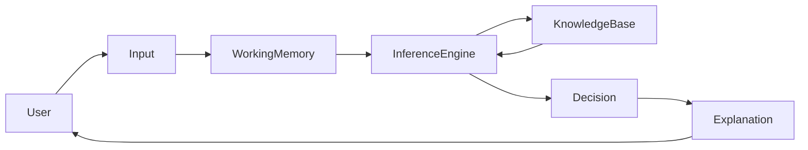
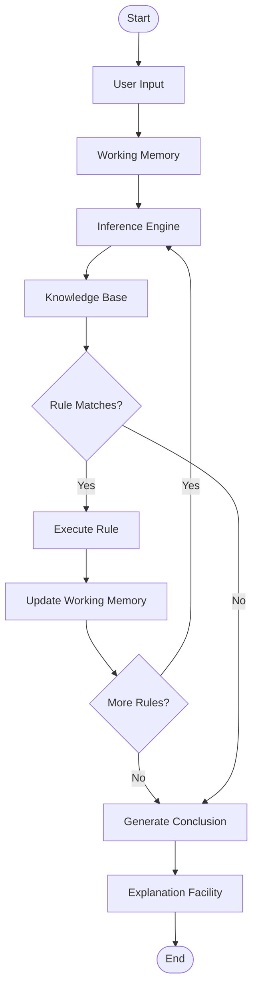
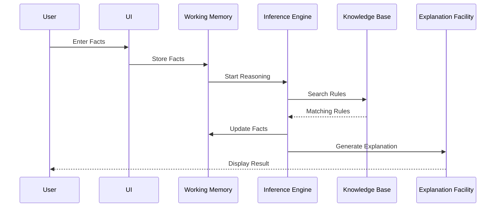

# Working Principle of an Expert System

## Table of Contents

- Introduction
- What is the Working Principle?
- Basic Workflow
- Step-by-Step Working Process
- Components Involved
- Working Cycle
- Rule Matching Process
- Forward Chaining Workflow
- Backward Chaining Workflow
- Detailed Working Example
- Medical Diagnosis Example
- Banking Example
- Advantages of the Working Principle
- Limitations
- Summary
- Key Terms
- Quick Quiz
- References

---

# Introduction

An **Expert System** works by imitating the reasoning process of a human expert. Instead of making random guesses, it applies logical rules stored in a **Knowledge Base** to the facts provided by the user.

The system repeatedly analyzes available facts, selects matching rules, executes them, generates new facts if necessary, and finally produces a recommendation or decision.

The intelligence of an Expert System comes from **knowledge and reasoning**, not from learning or statistical models.

---

# What is the Working Principle?

The **Working Principle** of an Expert System is the sequence of operations through which it:

- Receives user input
- Stores the facts
- Searches the Knowledge Base
- Matches applicable rules
- Applies logical reasoning
- Generates conclusions
- Explains the reasoning process

The system continues reasoning until a solution is found or no more applicable rules exist.

---

# Basic Workflow



---

# Step-by-Step Working Process

## Step 1 — User Provides Input

The process begins when a user enters facts into the system.

Example:

```
Temperature = 39°C

Cough = Yes

Body Pain = Yes
```

These facts represent the current problem.

---

## Step 2 — Facts are Stored

The input facts are stored inside **Working Memory**.

Working Memory contains only the information related to the current session.

Example

```
Working Memory

Temperature = 39°C

Cough = Yes

Body Pain = Yes
```

---

## Step 3 — Inference Engine Starts Reasoning

The Inference Engine retrieves facts from Working Memory.

It then searches the Knowledge Base for rules that match these facts.

---

## Step 4 — Rule Matching

Suppose the Knowledge Base contains:

```
Rule 1

IF

Temperature > 38°C

AND

Cough = Yes

THEN

Flu
```

The Inference Engine compares every condition with the available facts.

```
Temperature > 38°C

✔ True

Cough = Yes

✔ True
```

The rule matches.

---

## Step 5 — Rule Execution

Since all conditions are satisfied, the rule is executed.

```
Disease = Flu
```

The conclusion is added to Working Memory.

---

## Step 6 — Generate New Facts

Working Memory becomes

```
Temperature = 39°C

Cough = Yes

Body Pain = Yes

Disease = Flu
```

New facts may activate additional rules.

---

## Step 7 — Continue Reasoning

The Inference Engine again searches for matching rules.

Example

```
IF

Disease = Flu

THEN

Recommend Rest
```

Now another conclusion is generated.

```
Recommendation

Rest

Drink Water

Take Medicine
```

---

## Step 8 — Display Results

The final result is displayed to the user.

Example

```
Diagnosis

Flu

Recommendation

Medicine

Rest

Drink Fluids
```

---

## Step 9 — Explanation Facility

The system explains its reasoning.

Example

```
Diagnosis = Flu

Reason

Rule #5 Executed

Temperature > 38°C

Cough = Yes
```

This makes the Expert System transparent and trustworthy.

---

# Complete Working Cycle



---

# Components Involved

| Component | Responsibility |
|------------|----------------|
| User | Provides facts |
| User Interface | Accepts input and displays output |
| Working Memory | Stores temporary facts |
| Knowledge Base | Stores rules and expert knowledge |
| Inference Engine | Performs reasoning |
| Explanation Facility | Explains conclusions |

---

# Rule Matching Process


---

# Forward Chaining Workflow

Forward Chaining begins with known facts.

```mermaid
flowchart LR

Facts

-->

Rule 1

-->

New Fact

-->

Rule 2

-->

Conclusion
```

Example

```
Temperature = 39°C

↓

Flu

↓

Medicine

↓

Recovery Plan
```

Suitable for

- Diagnosis
- Monitoring
- Recommendation Systems

---

# Backward Chaining Workflow

Backward Chaining starts from a goal.

```mermaid
flowchart TD

Goal

-->

Find Rule

-->

Check Conditions

-->

Need Facts

-->

Facts Available?

Facts Available? -->|Yes| Goal Achieved

Facts Available? -->|No| Ask User
```

Example

Goal

```
Patient has Flu?
```

System asks

- Temperature?
- Cough?
- Body Pain?

---

# Medical Diagnosis Example

### User Input

```
Temperature = 39°C

Cough = Yes

Body Pain = Yes
```

↓

Knowledge Base

```
IF Temperature > 38°C

AND Cough = Yes

THEN Flu
```

↓

Result

```
Diagnosis

Flu
```

↓

Recommendation

```
Medicine

Rest

Drink Fluids
```

---

# Banking Example

User

```
Income = High

Credit Score = Excellent

Loan Amount = Low
```

Rule

```
IF

Income = High

AND

Credit Score = Excellent

THEN

Loan Approved
```

Output

```
Loan Approved
```

---

# Sequence of Operations



---

# Advantages of the Working Principle

- Logical reasoning
- Repeatable decisions
- Fast problem solving
- Transparent explanations
- Consistent outputs
- Easy rule modification
- Reusable knowledge

---

# Limitations

- Depends on the quality of rules
- Cannot learn automatically
- Difficult knowledge acquisition
- Large rule bases become complex
- May encounter conflicting rules

---

# Summary

The working principle of an Expert System is based on **knowledge-driven reasoning**. The user provides facts, which are stored in **Working Memory**. The **Inference Engine** compares these facts with rules stored in the **Knowledge Base**, executes matching rules, generates new facts, and continues reasoning until a final decision is reached. The **Explanation Facility** then provides a clear justification for the decision, making Expert Systems reliable, transparent, and suitable for domains where explainability is essential.

---

# Key Terms

| Term | Meaning |
|------|---------|
| Working Principle | Overall reasoning process of an Expert System |
| Working Memory | Temporary storage for current facts |
| Knowledge Base | Repository of expert knowledge |
| Inference Engine | Component that applies rules |
| Rule Matching | Comparing facts with rule conditions |
| Rule Execution | Applying matched rules |
| Explanation Facility | Explains the reasoning process |

---

# Quick Quiz

## Beginner

1. What is the first step in the working principle of an Expert System?
2. Where are user facts stored?
3. Which component searches for matching rules?
4. What happens after a rule is executed?
5. What is the purpose of the Explanation Facility?

---

## Intermediate

1. Explain the role of Working Memory.
2. How does the Inference Engine perform rule matching?
3. Compare Forward Chaining and Backward Chaining workflows.
4. Why can new facts trigger additional rules?
5. Why is explainability important in Expert Systems?

---

## Advanced

1. Design the working process for a loan approval Expert System.
2. Explain how repeated rule execution can derive complex conclusions.
3. Discuss the impact of conflicting rules on the reasoning process.
4. How does the working principle support Explainable AI (XAI)?
5. Compare the reasoning workflow of an Expert System with a Machine Learning model.

---

# References

## Books

- Artificial Intelligence: A Modern Approach — Stuart Russell & Peter Norvig
- Expert Systems: Principles and Programming — Joseph C. Giarratano & Gary D. Riley
- Artificial Intelligence — Elaine Rich & Kevin Knight

## Online Resources

- IBM AI Documentation
- Stanford Artificial Intelligence Laboratory
- MIT OpenCourseWare (Artificial Intelligence)
- Microsoft AI Learning Resources