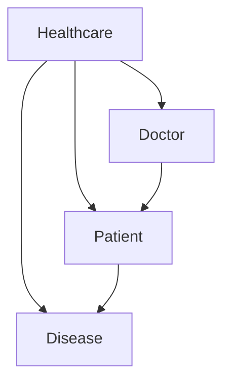
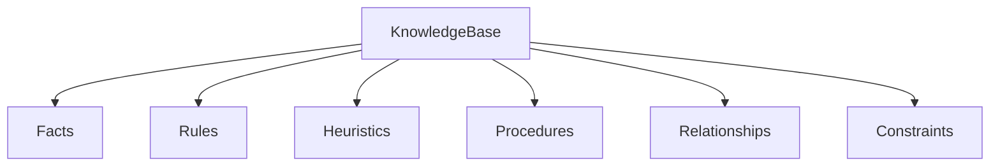
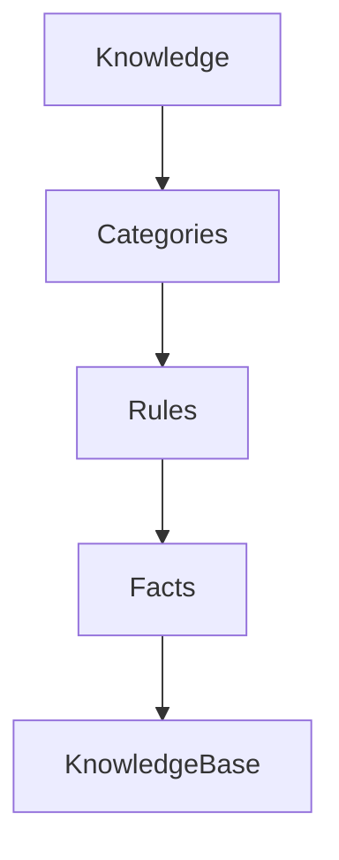
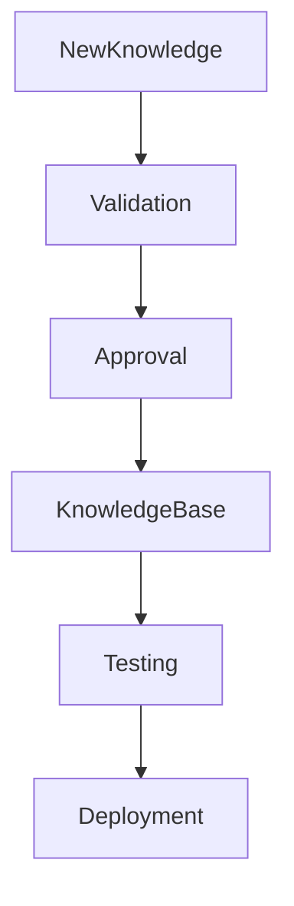
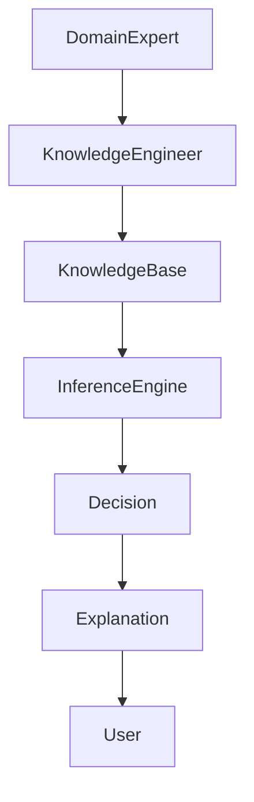
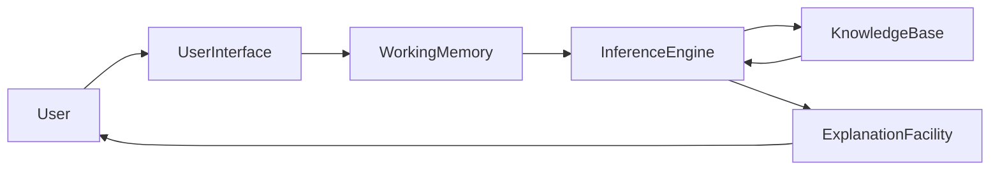

# Knowledge Base in Expert Systems

## Table of Contents

- Introduction
- What is a Knowledge Base?
- Why is the Knowledge Base Important?
- Objectives
- Characteristics
- Types of Knowledge
- Knowledge Representation
- Structure of a Knowledge Base
- Components
- Knowledge Acquisition
- Knowledge Storage
- Knowledge Retrieval
- Knowledge Updating
- Knowledge Base Workflow
- Example Knowledge Base
- Medical Diagnosis Example
- Banking Example
- Advantages
- Limitations
- Best Practices
- Comparison with Database
- Summary
- Key Terms
- Quick Quiz
- References

---

# Introduction

The **Knowledge Base (KB)** is the most important component of an Expert System. It contains the knowledge that enables the system to make intelligent decisions. Without a Knowledge Base, an Expert System cannot reason, solve problems, or provide recommendations.

Unlike traditional software that relies mainly on algorithms, Expert Systems rely on **stored expert knowledge** represented in a structured form.

The quality of an Expert System largely depends on the quality, completeness, and accuracy of its Knowledge Base.

---

# What is a Knowledge Base?

A **Knowledge Base** is a structured repository that stores facts, rules, relationships, heuristics, and domain-specific knowledge collected from human experts and other reliable sources.

### Definition

> **A Knowledge Base is a collection of expert knowledge organized in a form that allows an Expert System to reason and solve problems.**

---

# Why is the Knowledge Base Important?

The Knowledge Base acts as the **memory** of an Expert System.

It enables the system to:

- Store expert knowledge
- Preserve domain expertise
- Support logical reasoning
- Answer complex questions
- Solve domain-specific problems
- Generate recommendations

Without a Knowledge Base, the Inference Engine has nothing to reason with.

---

# Objectives

The primary objectives of a Knowledge Base are:

- Store expert knowledge permanently
- Organize knowledge efficiently
- Support logical reasoning
- Enable easy updates
- Improve decision accuracy
- Preserve organizational knowledge
- Facilitate knowledge sharing

---

# Characteristics

A good Knowledge Base should be:

- Accurate
- Complete
- Consistent
- Well-organized
- Easy to update
- Scalable
- Reusable
- Reliable
- Explainable

---

# Types of Knowledge

Expert Systems store different types of knowledge.

## 1. Facts

Facts describe known information.

Example

```
Temperature = 39°C

Blood Pressure = Normal
```

---

## 2. Rules

Rules define logical relationships.

```
IF Temperature > 38°C

THEN Fever = Yes
```

---

## 3. Heuristic Knowledge

Rules based on expert experience.

Example

```
IF Patient is Elderly

THEN Monitor Frequently
```

---

## 4. Procedural Knowledge

Describes how tasks are performed.

Example

```
Step 1

Collect Symptoms

↓

Analyze Symptoms

↓

Generate Diagnosis
```

---

## 5. Declarative Knowledge

Describes facts about a domain.

Example

```
Water boils at 100°C
```

---

## 6. Meta Knowledge

Knowledge about knowledge.

Example

```
Rule #20 has higher priority than Rule #15.
```

---

# Knowledge Representation

Knowledge can be represented in several ways.

## Rule-Based Representation

```
IF Income > ₹10,00,000

AND Credit Score > 750

THEN Loan = Approved
```

---

## Semantic Network


---

## Frames

```
Vehicle

├── Wheels = 4

├── Fuel = Petrol

└── Seats = 5
```

---

## Predicate Logic

```
Doctor(John)

Treats(John, Patient)
```

---

## Ontology



---

# Structure of a Knowledge Base



---

# Components

A Knowledge Base generally contains:

| Component | Description |
|-----------|-------------|
| Facts | Current information |
| Rules | IF–THEN logic |
| Heuristics | Expert experience |
| Constraints | Domain restrictions |
| Relationships | Connections among concepts |
| Metadata | Information about knowledge |

---

# Knowledge Acquisition

Knowledge enters the Knowledge Base through the Knowledge Acquisition process.

Sources include:

- Domain Experts
- Engineers
- Research Papers
- Books
- Databases
- Company Policies
- Industry Standards


---

# Knowledge Storage

Knowledge is organized into logical structures.



---

# Knowledge Retrieval

The Inference Engine retrieves relevant knowledge whenever reasoning begins.


---

# Knowledge Updating

Knowledge must evolve over time.



---

# Knowledge Base Workflow



---

# Example Knowledge Base

```
Rule 1

IF Temperature > 38°C

THEN Fever

-------------------

Rule 2

IF Fever

AND Cough

THEN Flu

-------------------

Rule 3

IF Flu

THEN Recommend Rest
```

---

# Medical Diagnosis Example

User Input

```
Temperature = 39°C

Cough = Yes
```

Knowledge Base

```
IF Temperature > 38°C

THEN Fever

IF Fever

AND Cough

THEN Flu
```

Output

```
Diagnosis

Flu
```

---

# Banking Example

Knowledge Base

```
IF

Income > ₹10,00,000

AND Credit Score > 750

THEN Loan Approved

------------------

IF

Income < ₹2,00,000

THEN Loan Rejected
```

---

# Advantages

- Stores expert knowledge permanently
- Easy to update
- Supports logical reasoning
- Highly reusable
- Consistent decisions
- Enables explainable AI
- Centralized knowledge management

---

# Limitations

- Knowledge acquisition is difficult
- Expensive to build
- Requires maintenance
- Rule conflicts may occur
- May become very large
- Depends heavily on expert availability

---

# Best Practices

- Keep rules simple
- Avoid duplicate knowledge
- Validate all rules
- Maintain version control
- Document every rule
- Remove obsolete knowledge
- Regularly review the Knowledge Base
- Separate facts from rules

---

# Knowledge Base vs Database

| Knowledge Base | Database |
|----------------|----------|
| Stores knowledge | Stores data |
| Contains rules | Contains records |
| Supports reasoning | Supports retrieval |
| Intelligent | Passive |
| Used by Inference Engine | Used by applications |

---

# Complete Architecture



---

# Summary

The **Knowledge Base** is the foundation of every Expert System. It stores facts, rules, heuristics, procedures, and relationships that represent the expertise of human specialists. The Inference Engine uses this stored knowledge to solve problems, generate recommendations, and explain its decisions. A well-designed Knowledge Base is accurate, consistent, maintainable, and scalable, making it the primary source of intelligence in an Expert System.

---

# Key Terms

| Term | Meaning |
|------|---------|
| Knowledge Base | Repository of expert knowledge |
| Facts | Known information |
| Rules | IF–THEN statements |
| Heuristics | Experience-based knowledge |
| Declarative Knowledge | Describes facts |
| Procedural Knowledge | Describes processes |
| Meta Knowledge | Knowledge about knowledge |
| Knowledge Acquisition | Collecting expert knowledge |

---

# Quick Quiz

## Beginner

1. What is a Knowledge Base?
2. Why is it important?
3. What are facts?
4. What are rules?
5. What is heuristic knowledge?

---

## Intermediate

1. Explain the different types of knowledge.
2. Compare a Knowledge Base with a database.
3. Describe the knowledge acquisition process.
4. What is knowledge representation?
5. Why is consistency important in a Knowledge Base?

---

## Advanced

1. Design a Knowledge Base for a library management Expert System.
2. Discuss the challenges of maintaining a large Knowledge Base.
3. Explain how the Inference Engine interacts with the Knowledge Base.
4. Compare rule-based and ontology-based knowledge representation.
5. How can conflicting rules be detected and resolved?

---

# References

## Books

- Artificial Intelligence: A Modern Approach — Stuart Russell & Peter Norvig
- Expert Systems: Principles and Programming — Joseph C. Giarratano & Gary D. Riley
- Artificial Intelligence — Elaine Rich & Kevin Knight

## Online Resources

- IBM AI Documentation
- Stanford Artificial Intelligence Laboratory
- MIT OpenCourseWare (Artificial Intelligence)
- Microsoft AI Learning Resources