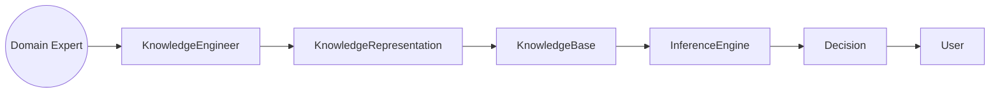
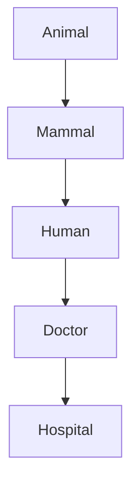
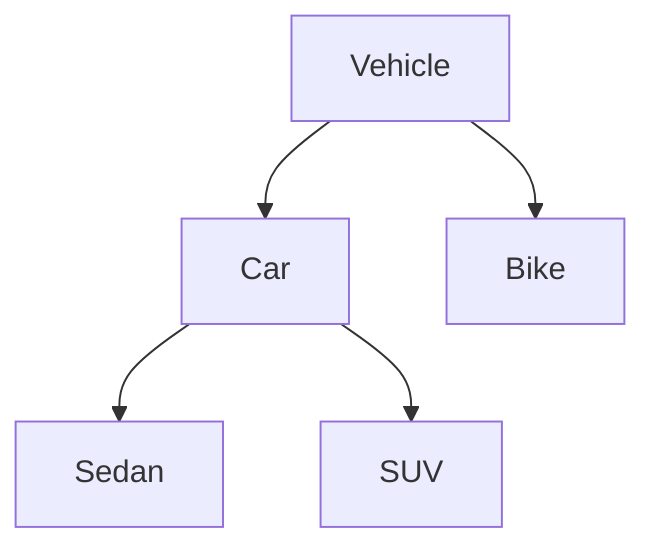
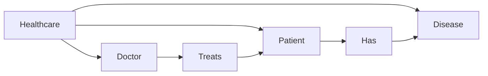
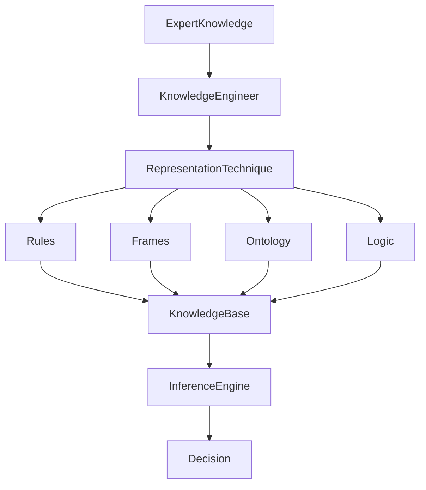

# Knowledge Representation in Expert Systems

## Table of Contents

- Introduction
- What is Knowledge Representation?
- Why Knowledge Representation is Important
- Objectives
- Characteristics
- Knowledge Representation Process
- Types of Knowledge
- Knowledge Representation Techniques
  - Logical Representation
  - Rule-Based Representation
  - Semantic Networks
  - Frames
  - Scripts
  - Ontologies
  - Decision Trees
  - Object-Oriented Representation
- Comparison of Representation Techniques
- Choosing the Right Representation
- Real-World Examples
- Advantages
- Limitations
- Best Practices
- Summary
- Key Terms
- Quick Quiz
- References

---

# Introduction

An Expert System is only as intelligent as the knowledge it contains. However, raw knowledge cannot be used directly by a computer. It must first be organized and represented in a structured format that a computer can understand and reason with.

This process is called **Knowledge Representation (KR)**.

Knowledge Representation is one of the fundamental areas of Artificial Intelligence because it bridges the gap between human knowledge and computer reasoning.

---

# What is Knowledge Representation?

Knowledge Representation is the process of organizing and encoding knowledge so that a computer system can understand, store, retrieve, and reason with it.

Instead of storing information as plain text, knowledge is represented using logical structures such as:

- Rules
- Facts
- Relationships
- Objects
- Graphs
- Ontologies

---

## Definition

> **Knowledge Representation is a method of representing real-world information in a structured form so that an Expert System can reason and solve problems.**

---

# Why Knowledge Representation is Important

Without Knowledge Representation:

- The system cannot reason.
- Rules cannot be applied.
- Facts cannot be connected.
- Decisions cannot be made.

Knowledge Representation enables:

- Logical reasoning
- Decision making
- Problem solving
- Knowledge sharing
- Explainable AI

---

# Objectives

The goals of Knowledge Representation include:

- Represent expert knowledge accurately
- Support automated reasoning
- Improve knowledge reuse
- Simplify problem solving
- Enable easy updates
- Improve explainability
- Reduce ambiguity

---

# Characteristics

A good knowledge representation should be:

- Accurate
- Consistent
- Complete
- Efficient
- Scalable
- Flexible
- Easy to update
- Easy to understand
- Machine-readable

---

# Knowledge Representation Process



---

# Types of Knowledge

Expert Systems usually represent several kinds of knowledge.

| Type | Description |
|------|-------------|
| Declarative | Facts about objects |
| Procedural | How tasks are performed |
| Heuristic | Experience-based knowledge |
| Structural | Relationships among concepts |
| Meta Knowledge | Knowledge about knowledge |

---

# Knowledge Representation Techniques

## 1. Logical Representation

Knowledge is represented using formal logic.

### Example

```
Human(Sachin)

Human(x)

↓

Mortal(x)

Therefore

Mortal(Sachin)
```

### Advantages

- Precise
- Mathematical
- Easy to verify

### Limitations

- Difficult to model uncertainty
- Less intuitive

---

## 2. Rule-Based Representation

The most common representation in Expert Systems.

General format

```
IF Condition

THEN Action
```

### Example

```
IF

Temperature > 38°C

AND

Cough = Yes

THEN

Disease = Flu
```

---

### Rule Execution

```mermaid
flowchart LR

Facts

-->

Rule Matching

-->

Rule Execution

-->

Conclusion
```

---

## 3. Semantic Networks

Knowledge is represented as a graph.

Nodes represent concepts.

Edges represent relationships.



Advantages

- Easy visualization
- Good relationship modeling

---

## 4. Frames

Frames organize knowledge into objects and attributes.

Example

```
Vehicle

├── Name : Car

├── Wheels : 4

├── Fuel : Petrol

├── Seats : 5

└── Engine : 1200cc
```

Frame hierarchy



Advantages

- Similar to object-oriented programming
- Easy inheritance

---

## 5. Scripts

Scripts describe sequences of events.

Restaurant Example

```text
Enter Restaurant

↓

Sit Down

↓

Read Menu

↓

Order Food

↓

Eat

↓

Pay Bill

↓

Leave
```

Useful for:

- Event modeling
- Robotics
- NLP

---

## 6. Ontologies

Ontologies describe concepts and relationships in a domain.



Advantages

- Standardized vocabulary
- Knowledge sharing
- Semantic Web

---

## 7. Decision Trees

Knowledge is represented as decisions.

```mermaid
flowchart TD

Start

-->

Temperature > 38°C?

Temperature > 38°C?

-->|Yes| Cough?

Temperature > 38°C?

-->|No| Healthy

Cough?

-->|Yes| Flu

Cough?

-->|No| Fever
```

Useful for

- Classification
- Diagnosis
- Recommendations

---

## 8. Object-Oriented Representation

Knowledge is represented using classes and objects.

```text
Person

├── Name

├── Age

├── Address

└── Occupation

↓

Doctor

↓

Cardiologist
```

Advantages

- Modular
- Reusable
- Extensible

---

# Comparison of Knowledge Representation Techniques

| Technique | Strength | Weakness | Best Use |
|-----------|----------|----------|----------|
| Rules | Simple | Large rule sets become difficult | Expert Systems |
| Logic | Precise | Complex | Automated reasoning |
| Semantic Network | Relationship modeling | Large graphs | Knowledge graphs |
| Frames | Organized | Less flexible | Object modeling |
| Scripts | Event sequences | Limited scope | Process modeling |
| Ontology | Rich semantics | Complex development | Semantic Web |
| Decision Tree | Easy visualization | Limited complexity | Classification |
| Object-Oriented | Reusable | Requires design | Software systems |

---

# Choosing the Right Representation

| Situation | Recommended Technique |
|-----------|-----------------------|
| Medical diagnosis | Rule-Based |
| Legal reasoning | Logic |
| Knowledge graph | Semantic Network |
| Product catalog | Frames |
| Restaurant process | Scripts |
| Healthcare ontology | Ontologies |
| Loan approval | Decision Tree |
| Software modeling | Object-Oriented |

---

# Complete Knowledge Representation Workflow



---

# Real-World Example

## Medical Diagnosis

Facts

```
Temperature = 39°C

Cough = Yes
```

Rule

```
IF

Temperature > 38°C

AND

Cough = Yes

THEN

Flu
```

Output

```
Diagnosis

Flu
```

---

## Banking

```
IF

Credit Score > 750

AND

Income > ₹10,00,000

THEN

Loan Approved
```

---

## Agriculture

```
IF

Leaf Color = Yellow

AND

Soil Moisture = Low

THEN

Nitrogen Deficiency
```

---

# Advantages

- Supports reasoning
- Easy knowledge reuse
- Organized information
- Explainable decisions
- Efficient retrieval
- Scalable
- Improves consistency

---

# Limitations

- Knowledge acquisition is difficult
- Complex domains require multiple techniques
- Large Knowledge Bases become difficult to manage
- Maintenance cost is high
- Representation may become outdated

---

# Best Practices

- Keep rules independent.
- Avoid duplicate knowledge.
- Use modular structures.
- Validate expert knowledge.
- Document every rule.
- Regularly update the Knowledge Base.
- Choose the representation technique based on the application domain.
- Use ontologies for interoperability.

---

# Summary

Knowledge Representation is the foundation of every Expert System. It transforms human expertise into structured forms that computers can understand and process. Different techniques—such as **rule-based systems, logical representation, semantic networks, frames, scripts, ontologies, decision trees, and object-oriented models**—are suitable for different applications. Selecting the appropriate representation improves reasoning efficiency, maintainability, scalability, and explainability, making Knowledge Representation one of the most critical components of Artificial Intelligence.

---

# Key Terms

| Term | Meaning |
|------|---------|
| Knowledge Representation | Structured representation of knowledge |
| Rule | IF–THEN statement |
| Fact | Known information |
| Semantic Network | Graph of concepts and relationships |
| Frame | Object with attributes |
| Script | Sequence of events |
| Ontology | Formal description of concepts and relationships |
| Predicate Logic | Logic-based representation |
| Decision Tree | Hierarchical decision model |

---

# Quick Quiz

## Beginner

1. What is Knowledge Representation?
2. Why is it important in Expert Systems?
3. What is a rule-based representation?
4. What is a semantic network?
5. What is an ontology?

---

## Intermediate

1. Compare frames and semantic networks.
2. Explain the advantages of rule-based representation.
3. When should scripts be used?
4. Compare ontologies and decision trees.
5. Why is Knowledge Representation essential for the Inference Engine?

---

## Advanced

1. Design a Knowledge Representation model for an online shopping Expert System.
2. Compare logical representation with ontology-based representation.
3. Explain how different representation techniques affect reasoning efficiency.
4. Discuss the trade-offs between expressiveness and computational complexity.
5. Why are ontologies widely used in modern AI and the Semantic Web?

---

# References

## Books

- Artificial Intelligence: A Modern Approach — Stuart Russell & Peter Norvig
- Expert Systems: Principles and Programming — Joseph C. Giarratano & Gary D. Riley
- Knowledge Representation and Reasoning — Ronald Brachman & Hector Levesque
- Artificial Intelligence — Elaine Rich & Kevin Knight

## Online Resources

- Stanford Encyclopedia of Philosophy – Knowledge Representation
- IBM AI Documentation
- MIT OpenCourseWare – Artificial Intelligence
- W3C OWL & RDF Specifications
- Microsoft AI Learning Resources