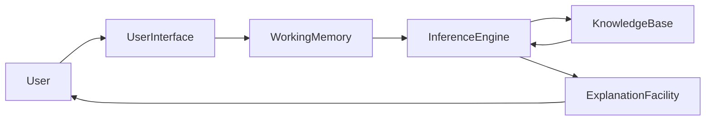
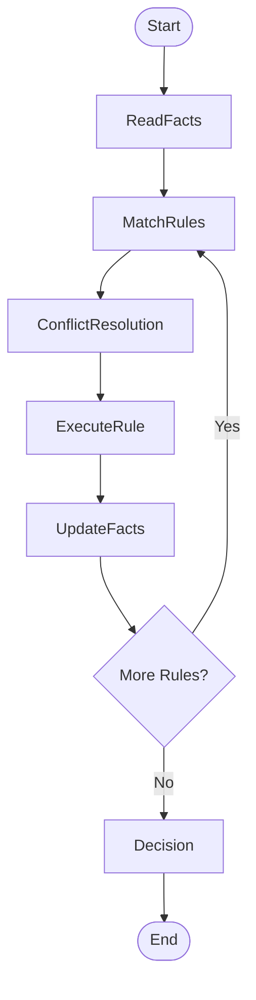
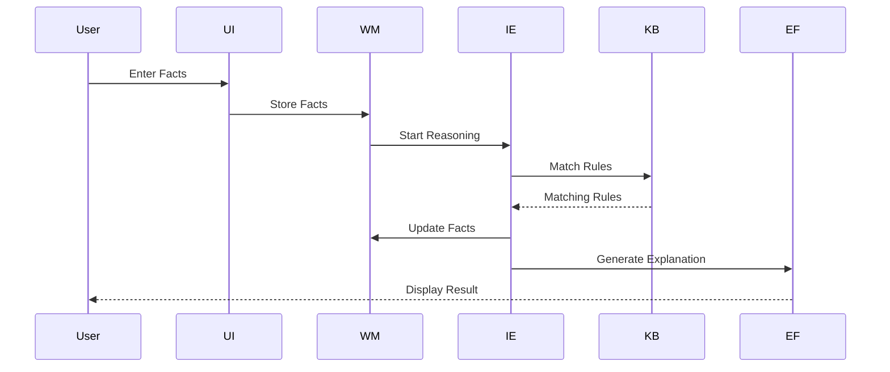

# Inference Engine in Expert Systems

## Table of Contents

- Introduction
- What is an Inference Engine?
- Why is an Inference Engine Important?
- Objectives
- Characteristics
- Role in an Expert System
- Architecture
- Components of an Inference Engine
- Working Principle
- Inference Cycle
- Pattern Matching
- Conflict Resolution
- Rule Execution
- Forward Chaining
- Backward Chaining
- Mixed (Hybrid) Chaining
- Real-World Examples
- Advantages
- Limitations
- Best Practices
- Summary
- Key Terms
- Quick Quiz
- References

---

# Introduction

The **Inference Engine** is the **brain** of an Expert System. It is responsible for applying logical reasoning to the knowledge stored in the **Knowledge Base** to solve problems and make decisions.

The Knowledge Base stores facts and rules, while the Inference Engine determines **which rules should be applied**, **when they should be executed**, and **what conclusions should be generated**.

Without an Inference Engine, an Expert System would simply be a collection of stored information without any intelligence.

---

# What is an Inference Engine?

An **Inference Engine** is the reasoning component of an Expert System that examines facts, searches the Knowledge Base for matching rules, executes those rules, and produces conclusions.

---

## Definition

> **An Inference Engine is the reasoning mechanism of an Expert System that derives new knowledge from existing facts and rules using logical inference techniques.**

---

# Why is an Inference Engine Important?

The Inference Engine enables an Expert System to:

- Analyze facts
- Apply logical rules
- Solve problems
- Make decisions
- Generate recommendations
- Explain conclusions
- Update working memory

---

# Objectives

The primary objectives of an Inference Engine are:

- Perform logical reasoning
- Select appropriate rules
- Generate conclusions
- Update facts
- Resolve rule conflicts
- Support explainable decision making
- Improve consistency

---

# Characteristics

A good Inference Engine should be:

- Accurate
- Efficient
- Consistent
- Explainable
- Scalable
- Modular
- Reliable
- Fast

---

# Role in an Expert System



The Inference Engine acts as the central controller that connects all major components.

---

# Architecture

```mermaid
flowchart TD

User

↓

User Interface

↓

Working Memory

↓

Inference Engine

↓

Knowledge Base

↓

Decision

↓

Explanation Facility

↓

User
```

---

# Components of an Inference Engine

## Rule Matcher

Compares current facts with rules stored in the Knowledge Base.

---

## Agenda (Conflict Set)

Stores all rules that currently satisfy the available facts.

---

## Conflict Resolver

Chooses which rule should execute first when multiple rules are applicable.

---

## Rule Executor

Executes the selected rule.

---

## Working Memory Manager

Updates Working Memory after each rule execution.

---

## Explanation Generator

Records the reasoning process.

---

# Internal Structure


---

# Working Principle

The Inference Engine follows these steps:

1. Read facts from Working Memory.
2. Search the Knowledge Base.
3. Match applicable rules.
4. Resolve conflicts.
5. Execute a rule.
6. Generate new facts.
7. Update Working Memory.
8. Repeat until no more rules match.

---

# Inference Cycle



---

# Pattern Matching

Pattern matching compares the facts stored in Working Memory with rule conditions.

Example Facts

```
Temperature = 39°C

Cough = Yes
```

Rule

```
IF

Temperature > 38°C

AND

Cough = Yes

THEN Flu
```

Both conditions match.

The rule becomes eligible for execution.

---

# Conflict Resolution

Sometimes several rules match simultaneously.

Example

```
Rule 1

IF Fever

THEN Flu
```

```
Rule 2

IF Fever

THEN Viral Infection
```

The Conflict Resolver chooses which rule executes first.

Common strategies include:

- Rule priority (salience)
- Most specific rule
- First matching rule
- Most recent facts
- Highest confidence value

---

# Rule Execution

Once a rule is selected, its action is executed.

Example

```
IF Fever

AND Cough

THEN Disease = Flu
```

Working Memory becomes

```
Temperature = 39°C

Cough = Yes

Disease = Flu
```

---

# Forward Chaining

Forward Chaining starts with known facts and derives conclusions.

```mermaid
flowchart LR

Facts

-->

Rule 1

-->

New Facts

-->

Rule 2

-->

Conclusion
```

Example

```
Temperature = 39°C

↓

Fever

↓

Flu

↓

Treatment
```

Best suited for:

- Diagnosis
- Monitoring
- Recommendation systems

---

# Backward Chaining

Backward Chaining starts with a goal.

```mermaid
flowchart TD

Goal

-->

Find Rule

-->

Need Facts

-->

Ask User

-->

Goal Verified
```

Example

Goal

```
Does the patient have Flu?
```

System checks:

- Temperature
- Cough
- Body Pain

Best suited for:

- Troubleshooting
- Medical diagnosis
- Legal reasoning

---

# Mixed (Hybrid) Chaining

Modern Expert Systems often combine both approaches.

```mermaid
flowchart LR

Facts

-->

Forward Chaining

-->

Intermediate Results

-->

Backward Chaining

-->

Final Decision
```

Advantages

- Faster reasoning
- Better flexibility
- Improved accuracy

---

# Medical Diagnosis Example

Working Memory

```
Temperature = 39°C

Cough = Yes

Body Pain = Yes
```

Knowledge Base

```
IF Temperature > 38°C

THEN Fever

-----------------

IF Fever

AND Cough

THEN Flu

-----------------

IF Flu

THEN Recommend Rest
```

Inference Engine

```
Rule 1

↓

Rule 2

↓

Rule 3
```

Output

```
Diagnosis = Flu

Recommendation = Rest
```

---

# Loan Approval Example

Facts

```
Income = ₹15,00,000

Credit Score = 810

Employment = Permanent
```

Rules

```
IF

Income > ₹10,00,000

AND Credit Score > 750

THEN Loan Approved
```

Decision

```
Loan Approved
```

---

# Sequence Diagram



---

# Advantages

- Fast reasoning
- Consistent decisions
- Transparent logic
- Reusable rules
- Supports explainable AI
- Modular design
- High reliability

---

# Limitations

- Depends on rule quality
- Large rule bases reduce performance
- Knowledge acquisition is difficult
- Conflict resolution may become complex
- Cannot learn automatically

---

# Best Practices

- Keep rules independent.
- Use efficient pattern matching.
- Minimize conflicting rules.
- Maintain rule priorities.
- Document every rule.
- Regularly validate the Knowledge Base.
- Optimize Working Memory updates.
- Keep reasoning explainable.

---

# Summary

The **Inference Engine** is the reasoning core of an Expert System. It evaluates facts stored in **Working Memory**, compares them with rules in the **Knowledge Base**, resolves conflicts, executes appropriate rules, and derives conclusions. Through techniques such as **Forward Chaining**, **Backward Chaining**, and **Hybrid Chaining**, the Inference Engine enables Expert Systems to provide accurate, consistent, and explainable decisions across various domains.

---

# Key Terms

| Term | Meaning |
|------|---------|
| Inference Engine | Reasoning component of an Expert System |
| Pattern Matching | Comparing facts with rule conditions |
| Conflict Resolution | Selecting one rule when multiple rules match |
| Rule Execution | Applying a selected rule |
| Forward Chaining | Fact-driven reasoning |
| Backward Chaining | Goal-driven reasoning |
| Working Memory | Temporary storage of current facts |
| Agenda | Collection of rules eligible for execution |

---

# Quick Quiz

## Beginner

1. What is an Inference Engine?
2. Why is it called the brain of an Expert System?
3. What is pattern matching?
4. What is conflict resolution?
5. What is rule execution?

---

## Intermediate

1. Explain the inference cycle.
2. Compare Forward Chaining and Backward Chaining.
3. What is the role of the agenda?
4. Why is Working Memory important?
5. How does the Inference Engine interact with the Knowledge Base?

---

## Advanced

1. Design an Inference Engine for a hospital diagnosis system.
2. Compare rule-based inference with probabilistic inference.
3. Explain how hybrid chaining improves reasoning performance.
4. Discuss common conflict resolution strategies and their trade-offs.
5. How can an Inference Engine be optimized for very large Knowledge Bases?

---

# References

## Books

- *Artificial Intelligence: A Modern Approach* — Stuart Russell & Peter Norvig
- *Expert Systems: Principles and Programming* — Joseph C. Giarratano & Gary D. Riley
- *Knowledge Representation and Reasoning* — Ronald Brachman & Hector Levesque
- *Artificial Intelligence* — Elaine Rich & Kevin Knight

## Online Resources

- IBM AI Documentation
- Stanford Artificial Intelligence Laboratory
- MIT OpenCourseWare – Artificial Intelligence
- Microsoft AI Learning Resources
- CLIPS Documentation