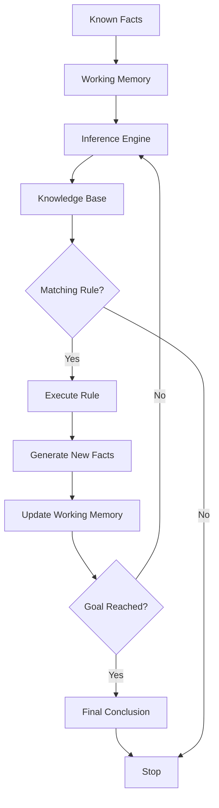
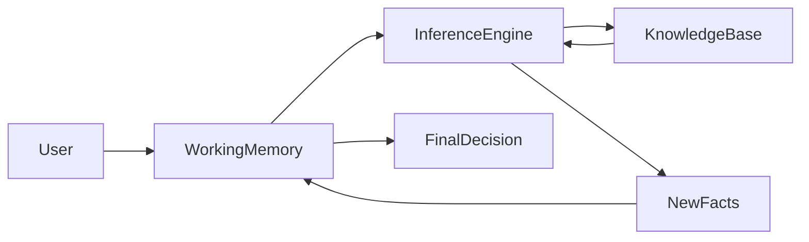
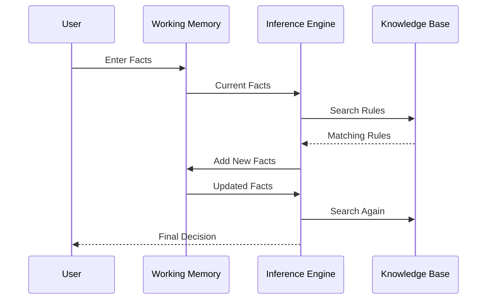

# Forward Chaining in Expert Systems

## Table of Contents

- Introduction
- What is Forward Chaining?
- Definition
- Why Forward Chaining is Important
- Characteristics
- Objectives
- How Forward Chaining Works
- Working Principle
- Forward Chaining Algorithm
- Architecture
- Rule Matching Process
- Working Cycle
- Detailed Example
- Medical Diagnosis Example
- Loan Approval Example
- Advantages
- Limitations
- Forward Chaining vs Backward Chaining
- Applications
- Best Practices
- Summary
- Key Terms
- Quick Quiz
- References

---

# Introduction

**Forward Chaining** is one of the most widely used reasoning techniques in Expert Systems. It is a **data-driven inference method** that starts with known facts and repeatedly applies rules until a conclusion or goal is reached.

Rather than beginning with a hypothesis, Forward Chaining continuously searches for rules whose conditions match the available facts. Whenever a rule matches, it is executed, producing new facts that may activate additional rules.

This process continues until:

- A desired conclusion is reached
- No more rules can be applied

Forward Chaining is particularly useful in monitoring systems, recommendation systems, diagnosis systems, industrial automation, and decision support applications.

---

# What is Forward Chaining?

Forward Chaining is a reasoning strategy in which the Inference Engine begins with known facts and repeatedly applies IF–THEN rules to derive new facts until a solution is obtained.

---

## Definition

> **Forward Chaining is a data-driven inference technique that starts with known facts and applies production rules to infer new facts until a goal is reached or no applicable rules remain.**

---

# Why Forward Chaining is Important

Forward Chaining enables Expert Systems to:

- Automatically derive conclusions
- Discover unknown information
- Produce recommendations
- Monitor continuously changing environments
- Solve multi-step reasoning problems
- Build complex conclusions from simple facts

---

# Characteristics

Forward Chaining is:

- Data-driven
- Automatic
- Incremental
- Rule-based
- Explainable
- Iterative
- Deterministic (when rules are deterministic)

---

# Objectives

Forward Chaining aims to:

- Derive new knowledge
- Solve problems from available facts
- Apply expert knowledge consistently
- Automate reasoning
- Support intelligent decision making

---

# How Forward Chaining Works

The reasoning process follows these steps:

1. User enters facts.
2. Facts are stored in Working Memory.
3. The Inference Engine searches for matching rules.
4. Matching rules are executed.
5. New facts are generated.
6. Working Memory is updated.
7. Repeat until no more rules match or the goal is reached.

---

# Working Principle



---

# Forward Chaining Algorithm

```text
Input:
    Initial Facts
    Rule Base

Repeat

    Search for matching rules

    IF rule conditions are satisfied

        Execute the rule

        Add new facts

    ELSE

        Stop

Until Goal Found
```

---

# Architecture



---

# Rule Matching Process

Example Rule

```
IF

Temperature > 38°C

AND

Cough = Yes

THEN Fever
```

Current Facts

```
Temperature = 39°C

Cough = Yes
```

Both conditions match.

↓

Rule executes.

↓

New Fact

```
Fever = Yes
```

---

# Working Cycle

```mermaid
flowchart TD

Facts

-->

Rule Matching

-->

Rule Selection

-->

Rule Execution

-->

Generate Facts

-->

Working Memory

-->

Rule Matching
```

---

# Detailed Example

Knowledge Base

```
Rule 1

IF Temperature > 38°C

THEN Fever

----------------

Rule 2

IF Fever

AND Cough

THEN Flu

----------------

Rule 3

IF Flu

THEN Recommend Rest
```

Initial Facts

```
Temperature = 39°C

Cough = Yes
```

Reasoning

```
Rule 1

↓

Fever

↓

Rule 2

↓

Flu

↓

Rule 3

↓

Recommend Rest
```

Final Output

```
Diagnosis = Flu

Recommendation = Rest
```

---

# Medical Diagnosis Example

Facts

```
Temperature = 39°C

Cough = Yes

Body Pain = Yes
```

Rules

```
IF Temperature > 38°C

THEN Fever

----------------

IF Fever

AND Cough

THEN Flu

----------------

IF Flu

THEN Medicine
```

Result

```
Medicine

Rest

Drink Fluids
```

---

# Loan Approval Example

Facts

```
Income = ₹15,00,000

Credit Score = 820

Employment = Permanent
```

Rules

```
IF

Income > ₹10,00,000

AND Credit Score > 750

THEN Loan Approved

----------------

IF Loan Approved

THEN Generate Offer Letter
```

Result

```
Loan Approved

Offer Letter Generated
```

---

# Complete Forward Chaining Process



---

# Decision Flow

```mermaid
flowchart TD

Start

-->

Input Facts

-->

Match Rules

-->

Rule Found?

Rule Found?

-->|Yes| Execute Rule

Rule Found?

-->|No| Stop

Execute Rule

-->

Generate New Fact

-->

Goal Achieved?

Goal Achieved?

-->|No| Match Rules

Goal Achieved?

-->|Yes| Display Result
```

---

# Advantages

- Automatic reasoning
- Handles multiple rules
- Suitable for monitoring
- Easy to explain
- Generates intermediate conclusions
- Good for dynamic environments
- Supports continuous decision making

---

# Limitations

- May execute unnecessary rules
- Slow for very large rule bases
- Requires efficient conflict resolution
- High memory usage
- Can produce many intermediate facts

---

# Forward Chaining vs Backward Chaining

| Feature | Forward Chaining | Backward Chaining |
|----------|-----------------|-------------------|
| Approach | Data-driven | Goal-driven |
| Starts With | Facts | Goal |
| Searches | Conclusions | Supporting facts |
| Suitable For | Monitoring, diagnosis | Troubleshooting, verification |
| Stops When | No more rules or goal reached | Goal verified or disproved |

---

# Applications

Forward Chaining is widely used in:

- Medical diagnosis
- Industrial automation
- Smart agriculture
- Fraud detection
- Cybersecurity monitoring
- Industrial process control
- Recommendation systems
- Network monitoring
- Decision support systems
- Manufacturing

---

# Best Practices

- Keep rules modular.
- Avoid circular rules.
- Prioritize frequently used rules.
- Minimize redundant facts.
- Validate rule consistency.
- Use efficient pattern matching.
- Optimize Working Memory updates.
- Regularly review the Knowledge Base.

---

# Summary

Forward Chaining is a **data-driven reasoning strategy** in which an Expert System begins with known facts and repeatedly applies matching IF–THEN rules to derive new knowledge. The process continues until no additional rules can fire or the desired goal is achieved. It is particularly effective for applications that require continuous reasoning, monitoring, diagnosis, and automated decision support. Its explainability, transparency, and rule-based logic make it a fundamental inference technique in Expert Systems.

---

# Key Terms

| Term | Meaning |
|------|---------|
| Forward Chaining | Data-driven inference technique |
| Fact | Known information stored in Working Memory |
| Rule | IF–THEN knowledge statement |
| Rule Matching | Comparing facts with rule conditions |
| Rule Execution | Applying a matched rule |
| Working Memory | Temporary storage of current facts |
| Knowledge Base | Collection of expert knowledge |
| Inference Engine | Component that performs reasoning |

---

# Quick Quiz

## Beginner

1. What is Forward Chaining?
2. Why is it called data-driven reasoning?
3. Where are facts stored?
4. Which component performs rule matching?
5. What happens after a rule is executed?

---

## Intermediate

1. Explain the complete Forward Chaining process.
2. Why is Working Memory updated after each rule execution?
3. Compare Forward Chaining with Backward Chaining.
4. Why is conflict resolution necessary?
5. Give three real-world applications of Forward Chaining.

---

## Advanced

1. Design a Forward Chaining Expert System for crop disease diagnosis.
2. Explain how Forward Chaining scales with large rule bases.
3. Discuss techniques for optimizing pattern matching.
4. Compare Forward Chaining with graph search algorithms.
5. Explain how Forward Chaining contributes to Explainable AI (XAI).

---

# References

## Books

- Artificial Intelligence: A Modern Approach — Stuart Russell & Peter Norvig
- Expert Systems: Principles and Programming — Joseph C. Giarratano & Gary D. Riley
- Knowledge Representation and Reasoning — Ronald Brachman & Hector Levesque
- Artificial Intelligence — Elaine Rich & Kevin Knight

## Online Resources

- CLIPS User Guide
- IBM AI Documentation
- Stanford Artificial Intelligence Laboratory
- MIT OpenCourseWare – Artificial Intelligence
- Microsoft AI Learning Resources