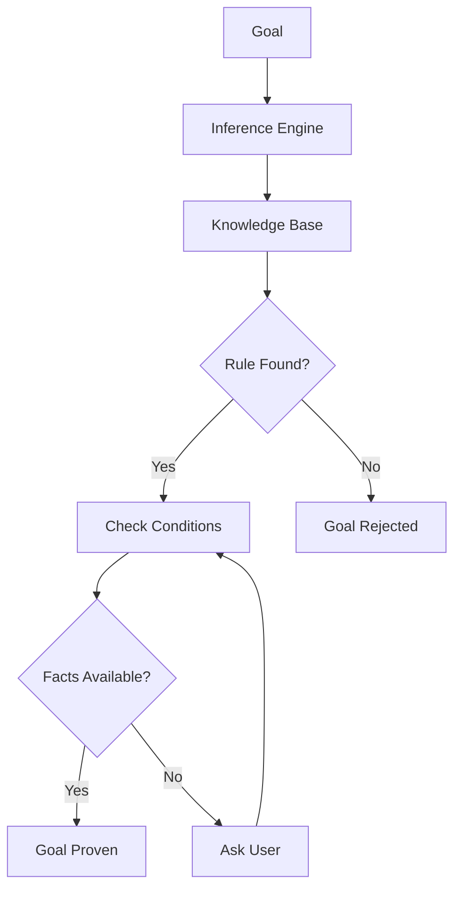
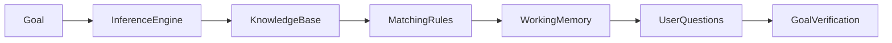
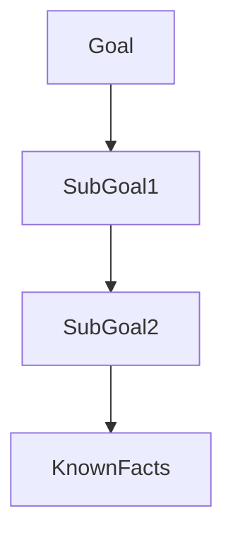
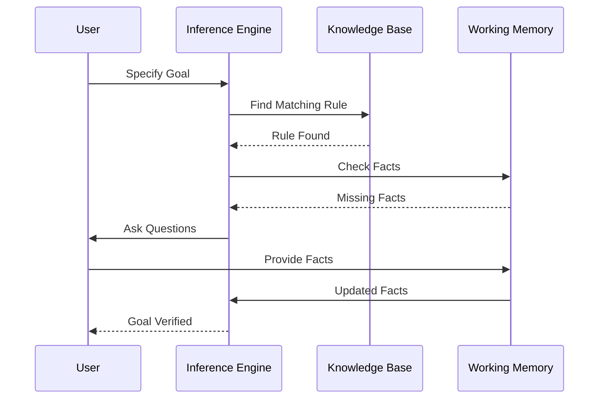

# Backward Chaining in Expert Systems

## Table of Contents

- Introduction
- What is Backward Chaining?
- Definition
- Why Backward Chaining is Important
- Characteristics
- Objectives
- How Backward Chaining Works
- Working Principle
- Backward Chaining Algorithm
- Architecture
- Goal Stack
- Rule Matching Process
- Working Cycle
- Detailed Example
- Medical Diagnosis Example
- Loan Approval Example
- Advantages
- Limitations
- Forward Chaining vs Backward Chaining
- Applications
- Best Practices
- Summary
- Key Terms
- Quick Quiz
- References

---

# Introduction

**Backward Chaining** is a **goal-driven reasoning technique** used in Expert Systems. Unlike **Forward Chaining**, which starts with known facts, Backward Chaining starts with a **goal (hypothesis)** and works backward to determine whether sufficient facts support that goal.

The Inference Engine searches for rules whose conclusions match the desired goal. It then attempts to prove the conditions of those rules. If some required facts are missing, the system asks the user for additional information or searches for other rules that can derive those facts.

Backward Chaining is especially useful when the number of possible goals is relatively small and the objective is to verify whether a specific conclusion is true.

---

# What is Backward Chaining?

Backward Chaining is an inference strategy that starts from a goal and works backward through the Knowledge Base until the goal is either proved or disproved.

---

## Definition

> **Backward Chaining is a goal-driven inference technique in which an Expert System begins with a hypothesis and works backward through rules and facts to determine whether the hypothesis is true.**

---

# Why is Backward Chaining Important?

Backward Chaining helps Expert Systems to:

- Verify hypotheses
- Reduce unnecessary rule execution
- Ask only relevant questions
- Improve reasoning efficiency
- Solve diagnostic problems
- Support intelligent decision making

---

# Characteristics

Backward Chaining is:

- Goal-driven
- Rule-based
- Recursive
- Efficient for hypothesis testing
- Explainable
- Interactive
- Selective

---

# Objectives

The objectives of Backward Chaining are:

- Verify a goal
- Minimize unnecessary reasoning
- Reduce search space
- Improve diagnostic accuracy
- Support explainable decisions
- Efficiently use expert knowledge

---

# How Backward Chaining Works

The reasoning process follows these steps:

1. Define the goal.
2. Search for rules that can achieve the goal.
3. Check whether the rule conditions are already known.
4. If conditions are unknown, search for rules that can prove them.
5. If necessary, ask the user for missing facts.
6. Repeat until the goal is proved or disproved.

---

# Working Principle



---

# Backward Chaining Algorithm

```text
Input:
    Goal
    Rule Base

Repeat

    Find rule whose conclusion matches the goal

    Check all rule conditions

    IF conditions are satisfied

        Goal is proved

    ELSE

        Try to prove missing conditions

Until Goal Proven or No Rule Exists
```

---

# Architecture



---

# Goal Stack

The Goal Stack keeps track of goals and sub-goals.

Example

```
Goal

Patient has Flu?

↓

Need Fever?

↓

Need Temperature?

↓

Need Cough?
```

---

# Goal Stack Diagram



---

# Rule Matching Process

Goal

```
Disease = Flu
```

Knowledge Base

```
IF Fever

AND Cough

THEN Flu
```

The system now needs to verify:

```
Fever?

Cough?
```

If these facts are unavailable, additional rules or user input are used.

---

# Working Cycle

```mermaid
flowchart TD

Goal

-->

Find Rule

-->

Check Conditions

-->

Need More Facts?

Need More Facts?

-->|Yes| Ask User

Need More Facts?

-->|No| Goal Verified

Ask User

-->

Update Working Memory

-->

Check Conditions
```

---

# Detailed Example

Knowledge Base

```
Rule 1

IF Temperature > 38°C

THEN Fever

----------------

Rule 2

IF Fever

AND Cough

THEN Flu
```

Goal

```
Patient has Flu?
```

Reasoning

```
Need Fever

↓

Need Temperature

↓

Temperature = 39°C

↓

Fever

↓

Need Cough

↓

Cough = Yes

↓

Flu Confirmed
```

---

# Medical Diagnosis Example

Goal

```
Patient has Pneumonia?
```

Knowledge Base

```
IF

High Fever

AND Chest Pain

AND X-Ray Positive

THEN Pneumonia
```

The Expert System asks:

- Does the patient have a high fever?
- Is there chest pain?
- Is the X-ray positive?

If all conditions are true:

```
Diagnosis

Pneumonia
```

---

# Loan Approval Example

Goal

```
Loan Approved?
```

Knowledge Base

```
IF

Income > ₹10,00,000

AND

Credit Score > 750

AND

Employment = Permanent

THEN Loan Approved
```

The system verifies each condition before making a decision.

---

# Complete Backward Chaining Process



---

# Decision Flow

```mermaid
flowchart TD

Start

-->

Specify Goal

-->

Find Rule

-->

Rule Exists?

Rule Exists?

-->|No| Goal Fails

Rule Exists?

-->|Yes| Check Conditions

Check Conditions

-->

All Conditions True?

All Conditions True?

-->|Yes| Goal Proven

All Conditions True?

-->|No| Ask User

Ask User

-->

Update Facts

-->

Check Conditions
```

---

# Advantages

- Efficient goal verification
- Executes fewer rules
- Reduces unnecessary computation
- Suitable for diagnosis
- Interactive questioning
- Explainable reasoning
- Focused search

---

# Limitations

- Not suitable for continuous monitoring
- Requires predefined goals
- Can become recursive for complex problems
- Depends on rule quality
- Goal selection is critical

---

# Forward Chaining vs Backward Chaining

| Feature | Forward Chaining | Backward Chaining |
|----------|-----------------|-------------------|
| Approach | Data-driven | Goal-driven |
| Starts With | Facts | Goal |
| Search Direction | Facts → Conclusion | Goal → Facts |
| Best For | Monitoring, recommendation | Diagnosis, troubleshooting |
| Rule Execution | Many rules may execute | Only relevant rules execute |
| User Interaction | Usually less | Usually more |

---

# Applications

Backward Chaining is widely used in:

- Medical diagnosis
- Fault diagnosis
- Technical troubleshooting
- Legal expert systems
- Tax advisory systems
- Customer support
- Equipment maintenance
- Network fault detection
- Scientific research
- Decision verification

---

# Best Practices

- Define clear goals.
- Keep rules independent.
- Avoid circular dependencies.
- Prioritize important rules.
- Validate rule consistency.
- Organize the Knowledge Base logically.
- Minimize unnecessary recursion.
- Record explanations for every decision.

---

# Summary

Backward Chaining is a **goal-driven inference strategy** in which an Expert System starts with a desired conclusion and works backward through the Knowledge Base to verify whether the necessary conditions are satisfied. Instead of evaluating every rule, it focuses only on rules relevant to the specified goal, making it highly efficient for diagnosis, troubleshooting, and verification tasks. Its ability to ask targeted questions and explain its reasoning makes it one of the most important reasoning techniques in Expert Systems.

---

# Key Terms

| Term | Meaning |
|------|---------|
| Backward Chaining | Goal-driven reasoning technique |
| Goal | Desired conclusion or hypothesis |
| Sub-goal | Intermediate objective needed to prove a goal |
| Goal Stack | Structure used to manage goals and sub-goals |
| Rule Matching | Finding rules whose conclusions match the goal |
| Working Memory | Stores current facts |
| Knowledge Base | Repository of rules and expert knowledge |
| Inference Engine | Performs logical reasoning |

---

# Quick Quiz

## Beginner

1. What is Backward Chaining?
2. Why is it called goal-driven reasoning?
3. What is a goal in an Expert System?
4. What happens if required facts are missing?
5. Which component performs Backward Chaining?

---

## Intermediate

1. Explain the complete Backward Chaining process.
2. What is a Goal Stack?
3. Compare Backward Chaining with Forward Chaining.
4. Why is Backward Chaining efficient for diagnosis?
5. How does the Inference Engine verify a hypothesis?

---

## Advanced

1. Design a Backward Chaining Expert System for car fault diagnosis.
2. Explain recursive goal decomposition with an example.
3. Compare Backward Chaining with depth-first search.
4. Discuss optimization strategies for large rule bases.
5. Explain how Backward Chaining contributes to Explainable AI (XAI).

---

# References

## Books

- *Artificial Intelligence: A Modern Approach* — Stuart Russell & Peter Norvig
- *Expert Systems: Principles and Programming* — Joseph C. Giarratano & Gary D. Riley
- *Knowledge Representation and Reasoning* — Ronald Brachman & Hector Levesque
- *Artificial Intelligence* — Elaine Rich & Kevin Knight

## Online Resources

- IBM AI Documentation
- CLIPS User Guide
- Stanford Artificial Intelligence Laboratory
- MIT OpenCourseWare – Artificial Intelligence
- Microsoft AI Learning Resources