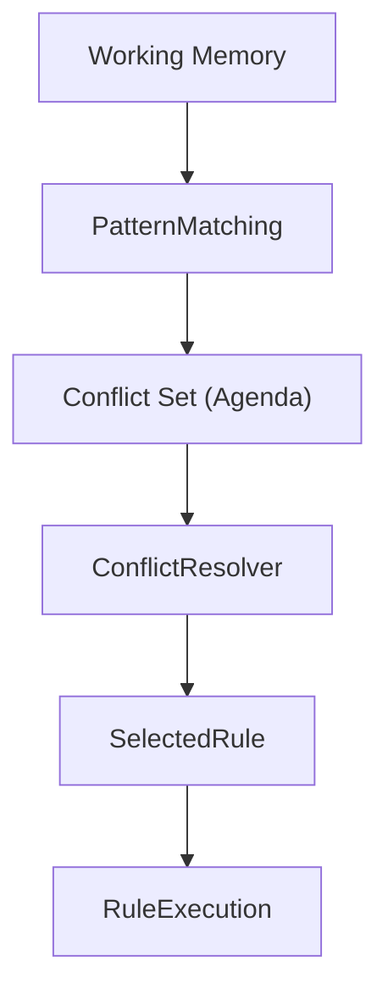
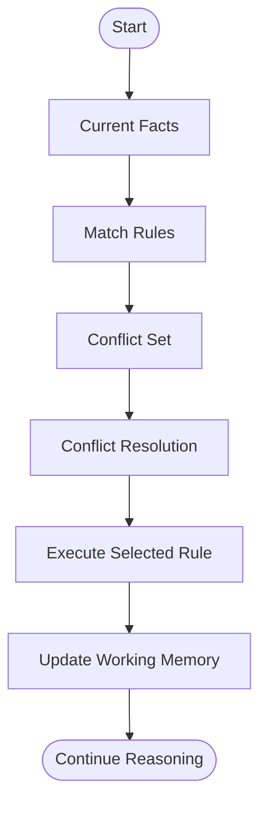
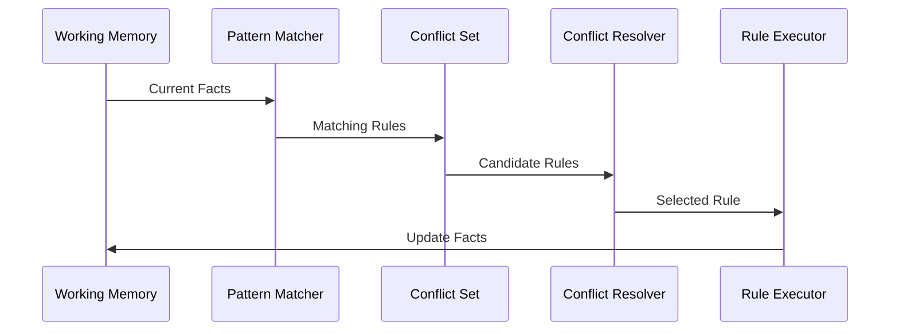

# Conflict Resolution in Expert Systems

## Table of Contents

- Introduction
- What is Conflict Resolution?
- Why Conflict Resolution is Important
- Definition
- Objectives
- Characteristics
- Why Conflicts Occur
- Conflict Set (Agenda)
- Conflict Resolution Process
- Architecture
- Conflict Resolution Strategies
  - Rule Priority (Salience)
  - Specificity
  - Recency
  - Refraction
  - Rule Ordering
  - Random Selection
  - Confidence Factor
- Working Example
- Medical Diagnosis Example
- Banking Example
- Advantages
- Limitations
- Best Practices
- Summary
- Key Terms
- Quick Quiz
- References

---

# Introduction

In an Expert System, multiple rules may become applicable at the same time because several rules match the current facts stored in the **Working Memory**.

Since the Inference Engine can usually execute only one rule at a time, it must decide **which rule should fire first**.

This decision-making process is called **Conflict Resolution**.

Conflict Resolution ensures that the Expert System chooses the most appropriate rule, leading to accurate, consistent, and efficient reasoning.

---

# What is Conflict Resolution?

Conflict Resolution is the process of selecting one rule for execution when multiple rules satisfy the current facts.

---

## Definition

> **Conflict Resolution is the mechanism used by the Inference Engine to select the best rule from a set of applicable rules (called the Conflict Set or Agenda).**

---

# Why Conflict Resolution is Important

Without Conflict Resolution:

- Multiple rules could execute simultaneously.
- Incorrect conclusions may be generated.
- Reasoning becomes inconsistent.
- Infinite rule execution loops may occur.
- System performance decreases.

Conflict Resolution provides:

- Consistent reasoning
- Efficient execution
- Predictable results
- Improved accuracy
- Better explainability

---

# Objectives

The main objectives are:

- Select the best rule
- Improve reasoning efficiency
- Avoid ambiguity
- Prevent unnecessary rule execution
- Reduce computational cost
- Maintain consistency

---

# Characteristics

A good Conflict Resolution mechanism should be:

- Deterministic
- Efficient
- Consistent
- Fair
- Explainable
- Scalable
- Flexible

---

# Why Conflicts Occur

Suppose the Working Memory contains:

```
Temperature = 39°C

Cough = Yes

Body Pain = Yes
```

Knowledge Base

```
Rule 1

IF Temperature > 38°C

THEN Fever

------------------

Rule 2

IF Temperature > 38°C

THEN Infection

------------------

Rule 3

IF Temperature > 38°C

AND Cough = Yes

THEN Flu
```

All three rules match.

The Inference Engine must decide which one to execute first.

---

# Conflict Set (Agenda)

The **Conflict Set** (also called the **Agenda**) is the collection of all rules whose conditions are currently satisfied.



---

# Conflict Resolution Process



---

# Architecture


---

# Conflict Resolution Strategies

## 1. Rule Priority (Salience)

Each rule is assigned a priority.

Higher priority rules execute first.

Example

| Rule | Priority |
|------|----------|
| Rule A | 100 |
| Rule B | 50 |
| Rule C | 10 |

Execution Order

```
Rule A

↓

Rule B

↓

Rule C
```

**Advantages**

- Easy to implement
- Predictable
- Commonly used

---

## 2. Specificity Strategy

The rule with **more conditions** is considered more specific and executes first.

Example

```
Rule A

IF Fever

THEN Infection
```

```
Rule B

IF Fever

AND Cough

AND Body Pain

THEN Flu
```

Rule B executes because it is more specific.

---

## 3. Recency Strategy

Rules using the **most recently added facts** are executed first.

Example

```
Fact Added

Temperature = 39°C

↓

Fact Added

Cough = Yes
```

Rules involving **Cough = Yes** receive higher priority.

---

## 4. Refraction Strategy

A rule cannot execute repeatedly using the same facts.

This prevents infinite loops.

Example

```
Rule

IF Fever

THEN Alert Doctor
```

Once executed for the same facts, it will not execute again unless new facts are introduced.

---

## 5. Rule Ordering Strategy

Rules are executed according to their predefined order inside the Knowledge Base.

Example

```
Rule 1

↓

Rule 2

↓

Rule 3
```

Simple but less flexible.

---

## 6. Random Selection

One matching rule is selected randomly.

Useful mainly for experimentation and simulations.

Not recommended for critical applications.

---

## 7. Confidence Factor Strategy

Each rule has a confidence score.

Example

| Rule | Confidence |
|------|------------|
| Rule A | 0.95 |
| Rule B | 0.80 |
| Rule C | 0.60 |

The highest-confidence rule executes first.

---

# Strategy Comparison

| Strategy | Selection Basis | Best For |
|----------|-----------------|----------|
| Rule Priority | Assigned priority | Production systems |
| Specificity | Most detailed rule | Medical diagnosis |
| Recency | Newest facts | Real-time monitoring |
| Refraction | Prevent repeated execution | Rule-based systems |
| Rule Ordering | Fixed sequence | Small Expert Systems |
| Confidence Factor | Highest certainty | Uncertain reasoning |
| Random | Random choice | Simulations |

---

# Working Example

Working Memory

```
Temperature = 39°C

Cough = Yes

Body Pain = Yes
```

Knowledge Base

```
Rule 1

IF Temperature > 38°C

THEN Fever

Priority = 10

-------------------

Rule 2

IF Temperature > 38°C

AND Cough = Yes

THEN Flu

Priority = 100
```

Conflict Set

```
Rule 1

Rule 2
```

Selected Rule

```
Rule 2
```

Reason

```
Higher Priority
```

---

# Medical Diagnosis Example

Knowledge Base

```
IF Fever

THEN Viral Infection

Priority = 30

------------------

IF Fever

AND Rash

THEN Measles

Priority = 90
```

Patient Facts

```
Fever

Rash
```

Conflict Set

```
Rule 1

Rule 2
```

Selected Rule

```
Rule 2

(Measles)
```

---

# Banking Example

Facts

```
Income = ₹12,00,000

Credit Score = 820

Employment = Permanent
```

Rules

```
Rule A

Approve Loan

Priority = 100
```

```
Rule B

Offer Premium Credit Card

Priority = 80
```

Loan approval executes first because it has a higher priority.

---

# Complete Workflow



---

# Advantages

- Produces consistent reasoning
- Improves efficiency
- Prevents rule conflicts
- Supports explainable AI
- Optimizes rule execution
- Avoids infinite loops
- Improves decision quality

---

# Limitations

- Strategy selection can be complex
- Large Conflict Sets increase computation
- Incorrect priorities may produce wrong decisions
- Rule maintenance becomes difficult in large systems
- Different strategies may produce different outcomes

---

# Best Practices

- Assign meaningful rule priorities.
- Keep rules independent.
- Avoid duplicate rules.
- Use specificity for diagnosis systems.
- Apply refraction to prevent repeated execution.
- Validate priorities regularly.
- Document conflict resolution policies.
- Test rule interactions thoroughly.

---

# Summary

Conflict Resolution is a fundamental process in Expert Systems that determines **which rule should execute when multiple rules match the current facts**. The Inference Engine builds a **Conflict Set (Agenda)** and applies strategies such as **Rule Priority, Specificity, Recency, Refraction, Rule Ordering, Random Selection,** or **Confidence Factors** to choose the most appropriate rule. Effective conflict resolution improves reasoning efficiency, consistency, accuracy, and explainability, making it essential for reliable Expert Systems.

---

# Key Terms

| Term | Meaning |
|------|---------|
| Conflict Resolution | Selecting one rule from multiple matching rules |
| Conflict Set (Agenda) | Collection of all eligible rules |
| Salience | Rule priority |
| Specificity | Preference for more detailed rules |
| Recency | Preference for newer facts |
| Refraction | Prevents repeated execution of the same rule |
| Confidence Factor | Degree of certainty assigned to a rule |
| Rule Ordering | Fixed execution sequence |

---

# Quick Quiz

## Beginner

1. What is Conflict Resolution?
2. What is a Conflict Set?
3. Why can't all matching rules execute simultaneously?
4. What is rule priority (salience)?
5. What is refraction?

---

## Intermediate

1. Compare specificity and recency strategies.
2. Why is Conflict Resolution necessary?
3. Explain how the Conflict Set is created.
4. What is the role of the Conflict Resolver?
5. Why are confidence factors useful?

---

## Advanced

1. Design a Conflict Resolution strategy for a hospital Expert System.
2. Compare salience-based and confidence-based rule selection.
3. Explain how refraction prevents infinite rule execution.
4. Discuss trade-offs between deterministic and random strategies.
5. How does Conflict Resolution improve Explainable AI (XAI)?

---

# References

## Books

- *Artificial Intelligence: A Modern Approach* — Stuart Russell & Peter Norvig
- *Expert Systems: Principles and Programming* — Joseph C. Giarratano & Gary D. Riley
- *Knowledge Representation and Reasoning* — Ronald Brachman & Hector Levesque
- *Artificial Intelligence* — Elaine Rich & Kevin Knight

## Online Resources

- CLIPS Documentation
- IBM AI Documentation
- Stanford Artificial Intelligence Laboratory
- MIT OpenCourseWare – Artificial Intelligence
- Microsoft AI Learning Resources