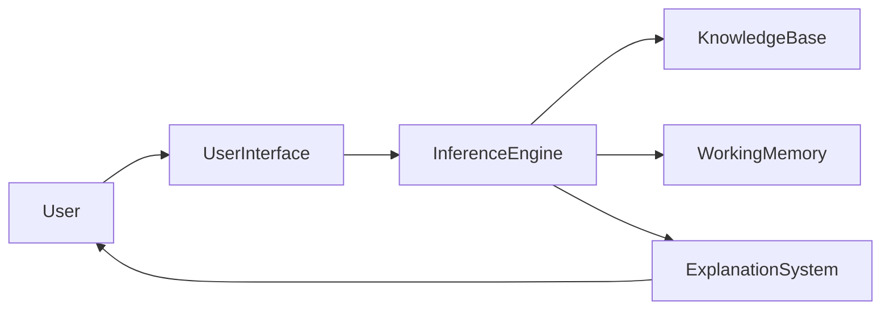
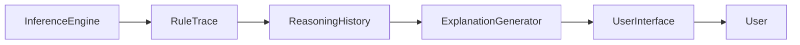
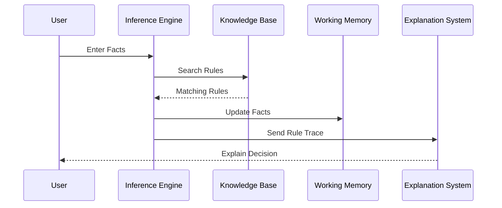

# Explanation System (Explanation Facility) in Expert Systems

## Table of Contents

- Introduction
- What is an Explanation System?
- Definition
- Why an Explanation System is Important
- Objectives
- Characteristics
- Role in an Expert System
- Architecture
- Components of an Explanation System
- Types of Explanations
- Working Principle
- Explanation Generation Process
- Example Workflow
- Medical Diagnosis Example
- Banking Example
- Advantages
- Limitations
- Best Practices
- Explanation System vs Inference Engine
- Modern Explainable AI (XAI)
- Summary
- Key Terms
- Quick Quiz
- References

---

# Introduction

One of the unique features that distinguishes an **Expert System** from traditional software is its ability to explain its reasoning.

Unlike conventional programs that simply display an output, an Expert System can answer questions such as:

- Why was this decision made?
- How was this conclusion reached?
- Which rules were used?
- Which facts influenced the decision?
- Why wasn't another conclusion selected?

This capability is provided by the **Explanation System**, also called the **Explanation Facility**.

---

# What is an Explanation System?

The Explanation System is a component of an Expert System that records and explains the reasoning process performed by the Inference Engine.

It helps users understand how the system arrived at a particular conclusion.

---

## Definition

> **An Explanation System is a component of an Expert System that provides human-understandable explanations of how and why the system reached a particular decision.**

---

# Why is an Explanation System Important?

The Explanation System provides:

- Transparency
- User trust
- Decision justification
- Easier debugging
- Knowledge verification
- Educational support
- Regulatory compliance

Without explanations, users may hesitate to trust automated decisions.

---

# Objectives

The Explanation System aims to:

- Explain reasoning
- Increase user confidence
- Improve transparency
- Support debugging
- Help validate expert knowledge
- Make AI decisions understandable
- Assist knowledge engineers

---

# Characteristics

A good Explanation System should be:

- Clear
- Accurate
- Transparent
- Consistent
- Understandable
- Interactive
- Reliable
- Easy to interpret

---

# Role in an Expert System



The Explanation System receives reasoning information from the Inference Engine and presents it to the user in an understandable form.

---

# Architecture

```mermaid
flowchart TD

User

↓

User Interface

↓

Inference Engine

↓

Knowledge Base

↓

Working Memory

↓

Explanation System

↓

Decision Report

↓

User
```

---

# Components of an Explanation System

## Explanation Generator

Creates explanations from the reasoning process.

---

## Rule Trace

Records every rule executed during reasoning.

---

## Fact Tracker

Records all facts used during decision making.

---

## Reasoning History

Maintains the complete reasoning sequence.

---

## User Explanation Interface

Displays explanations in an understandable format.

---

# Internal Structure



---

# Types of Explanations

## 1. How Explanation

Explains **how** the conclusion was reached.

Example

```
Temperature = 39°C

↓

Rule #5 Executed

↓

Diagnosis = Flu
```

---

## 2. Why Explanation

Explains **why** the system asked a particular question.

Example

```
Why are you asking for Temperature?

Because it is required to determine
whether the patient has a fever.
```

---

## 3. Why Not Explanation

Explains why another conclusion was not selected.

Example

```
Why not Pneumonia?

Chest Pain = No

Therefore

Rule #12 was not satisfied.
```

---

## 4. What-If Explanation

Shows how changing facts would change the outcome.

Example

```
Current Credit Score = 680

↓

Loan Rejected

If Credit Score = 760

↓

Loan Approved
```

---

## 5. Rule Trace Explanation

Displays all executed rules.

```
Rule 3

↓

Rule 8

↓

Rule 12

↓

Decision
```

---

# Working Principle

The Explanation System operates after or during reasoning.

Steps:

1. Record executed rules.
2. Record facts used.
3. Store reasoning sequence.
4. Generate explanations.
5. Display explanations to the user.

---

# Explanation Generation Process

```mermaid
flowchart TD

Facts

-->

Inference Engine

-->

Executed Rules

-->

Reasoning History

-->

Explanation Generator

-->

User Report
```

---

# Complete Workflow



---

# Medical Diagnosis Example

### User Input

```
Temperature = 39°C

Cough = Yes

Body Pain = Yes
```

Knowledge Base

```
IF Temperature > 38°C

AND Cough = Yes

THEN Flu
```

System Decision

```
Diagnosis

Flu
```

Explanation

```
Rule #15 Executed

Temperature > 38°C

✔ True

Cough = Yes

✔ True

Diagnosis = Flu
```

---

# Banking Example

### User Input

```
Income = ₹15,00,000

Credit Score = 810

Employment = Permanent
```

Decision

```
Loan Approved
```

Explanation

```
Reason

Income > ₹10,00,000

✔

Credit Score > 750

✔

Permanent Employment

✔

Rule #8 Executed
```

---

# Decision Report Example

```text
Decision

Loan Approved

----------------------

Rules Executed

Rule 3

Rule 8

Rule 12

----------------------

Facts Used

Income

Credit Score

Employment

----------------------

Confidence

95%
```

---

# Explanation System vs Inference Engine

| Inference Engine | Explanation System |
|------------------|--------------------|
| Performs reasoning | Explains reasoning |
| Executes rules | Displays executed rules |
| Generates conclusions | Justifies conclusions |
| Updates Working Memory | Shows reasoning history |
| Core decision-making component | User-facing interpretation component |

---

# Modern Explainable AI (XAI)

Modern AI systems emphasize **Explainable AI (XAI)**, where models provide understandable reasons for their predictions.

The Explanation System in Expert Systems is an early and classic example of XAI.

Applications include:

- Healthcare
- Banking
- Insurance
- Cybersecurity
- Autonomous vehicles
- Legal decision support
- Government services

---

# Advantages

- Improves user trust
- Increases transparency
- Simplifies debugging
- Helps validate rules
- Supports training and education
- Enables regulatory compliance
- Facilitates knowledge maintenance

---

# Limitations

- Complex explanations may confuse users
- Large rule bases produce lengthy traces
- Additional storage is required
- May expose sensitive business rules
- Difficult to explain highly complex reasoning chains

---

# Best Practices

- Keep explanations simple and user-friendly.
- Show only relevant rules.
- Highlight important facts.
- Support "Why?" and "How?" questions.
- Record complete reasoning history.
- Avoid exposing confidential rules unnecessarily.
- Use visual diagrams where appropriate.
- Regularly validate explanation quality.

---

# Summary

The **Explanation System** (or **Explanation Facility**) is an essential component of an Expert System that makes its reasoning transparent and understandable. By recording executed rules, tracking facts, and generating human-readable explanations, it allows users to understand **how**, **why**, and **why not** a particular decision was made. This capability improves trust, simplifies debugging, supports knowledge validation, and forms the foundation of modern **Explainable AI (XAI)**.

---

# Key Terms

| Term | Meaning |
|------|---------|
| Explanation System | Component that explains reasoning |
| Explanation Facility | Another name for the Explanation System |
| Rule Trace | Record of executed rules |
| Reasoning History | Sequence of logical steps taken |
| How Explanation | Explains how a conclusion was reached |
| Why Explanation | Explains why information was requested |
| Why Not Explanation | Explains why an alternative conclusion was rejected |
| What-If Analysis | Shows how changing inputs changes the outcome |
| Explainable AI (XAI) | AI systems that provide understandable explanations |

---

# Quick Quiz

## Beginner

1. What is an Explanation System?
2. Why is it important in an Expert System?
3. What is a Rule Trace?
4. What is a "How" explanation?
5. What is a "Why" explanation?

---

## Intermediate

1. Explain the working principle of an Explanation System.
2. Compare the Inference Engine and the Explanation System.
3. What is a "Why Not" explanation?
4. Why is reasoning history important?
5. How does an Explanation System improve user trust?

---

## Advanced

1. Design an Explanation System for a hospital diagnosis Expert System.
2. Explain how Explanation Systems support Explainable AI (XAI).
3. Compare explanation mechanisms in Expert Systems and Machine Learning models.
4. Discuss challenges in generating understandable explanations for large Knowledge Bases.
5. How can explanation quality be evaluated in decision-support systems?

---

# References

## Books

- *Artificial Intelligence: A Modern Approach* — Stuart Russell & Peter Norvig
- *Expert Systems: Principles and Programming* — Joseph C. Giarratano & Gary D. Riley
- *Knowledge Representation and Reasoning* — Ronald Brachman & Hector Levesque
- *Artificial Intelligence* — Elaine Rich & Kevin Knight

## Online Resources

- IBM AI Documentation
- MIT OpenCourseWare – Artificial Intelligence
- Stanford Artificial Intelligence Laboratory
- Microsoft AI Learning Resources
- Explainable AI (XAI) Research Resources