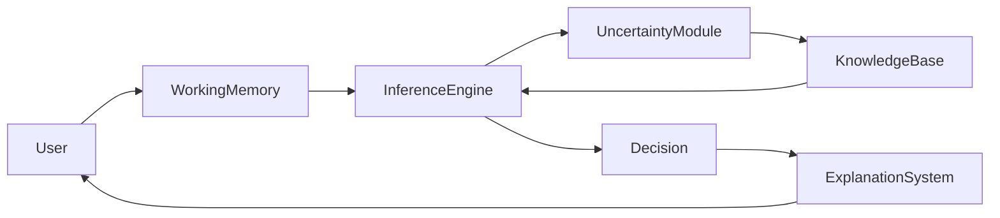
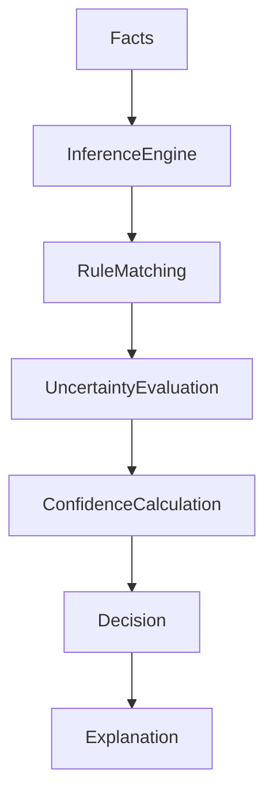

# Uncertainty Handling in Expert Systems

## Table of Contents

- Introduction
- What is Uncertainty?
- Definition
- Why Uncertainty Handling is Important
- Sources of Uncertainty
- Objectives
- Characteristics
- Need for Uncertainty Handling
- Types of Uncertainty
- Uncertainty Handling Techniques
  - Certainty Factors
  - Bayesian Probability
  - Fuzzy Logic
  - Dempster-Shafer Theory
  - Possibility Theory
  - Rough Set Theory
- Architecture
- Working Principle
- Medical Diagnosis Example
- Weather Prediction Example
- Loan Approval Example
- Comparison of Techniques
- Advantages
- Limitations
- Best Practices
- Modern Applications
- Summary
- Key Terms
- Quick Quiz
- References

---

# Introduction

Real-world problems rarely involve complete, perfect, or certain information. Human experts often make decisions using incomplete facts, uncertain observations, ambiguous symptoms, or probabilities.

For example, a doctor may suspect that a patient has influenza with an **80% confidence level** rather than being completely certain.

To imitate this human reasoning process, **Expert Systems must be able to handle uncertainty**.

Uncertainty handling enables an Expert System to make intelligent decisions even when available information is incomplete, vague, inconsistent, or probabilistic.

---

# What is Uncertainty?

**Uncertainty** refers to situations where the available information is insufficient, ambiguous, incomplete, imprecise, or unreliable, making it impossible to reach a completely certain conclusion.

---

## Definition

> **Uncertainty Handling is the process of representing, reasoning with, and making decisions using incomplete, uncertain, or imprecise knowledge in an Expert System.**

---

# Why Uncertainty Handling is Important

Without uncertainty handling, an Expert System would:

- Produce unreliable decisions
- Reject incomplete inputs
- Fail in real-world environments
- Ignore probabilistic evidence
- Be less useful for diagnosis and prediction

Uncertainty handling allows Expert Systems to:

- Estimate confidence
- Make probabilistic decisions
- Handle incomplete information
- Support human-like reasoning
- Improve robustness

---

# Sources of Uncertainty

Uncertainty may arise from:

- Missing information
- Incomplete knowledge
- Ambiguous user input
- Sensor errors
- Measurement inaccuracies
- Human judgment
- Conflicting expert opinions
- Noisy data
- Changing environments

---

# Objectives

The goals of uncertainty handling are:

- Represent uncertain knowledge
- Improve decision quality
- Handle incomplete facts
- Estimate confidence levels
- Support probabilistic reasoning
- Increase system reliability
- Mimic human expert reasoning

---

# Characteristics

Good uncertainty handling should be:

- Flexible
- Explainable
- Probabilistic
- Scalable
- Reliable
- Robust
- Consistent
- Efficient

---

# Need for Uncertainty Handling

Consider the rule:

```
IF

Temperature > 38°C

AND

Cough = Yes

THEN Flu
```

Suppose the patient has:

```
Temperature = 37.9°C

Cough = Mild

Body Pain = Unknown
```

A traditional Expert System may fail to reach a conclusion.

A system with uncertainty handling may conclude:

```
Probability of Flu = 78%
```

---

# Types of Uncertainty

## 1. Incomplete Information

Some facts are unavailable.

Example

```
Temperature = Unknown
```

---

## 2. Imprecise Information

Values are approximate.

Example

```
High Fever

Very Low Income

Moderate Risk
```

---

## 3. Ambiguous Information

The same information has multiple interpretations.

Example

```
Patient feels weak.
```

---

## 4. Probabilistic Information

Knowledge includes probabilities.

Example

```
Probability of Disease = 0.85
```

---

## 5. Conflicting Information

Different experts provide different conclusions.

Example

```
Doctor A → Flu

Doctor B → COVID
```

---

# Uncertainty Handling Techniques

## 1. Certainty Factors (CF)

Certainty Factors represent the confidence level associated with a conclusion.

Range

```
-1.0 → Completely False

0 → Unknown

+1.0 → Completely True
```

Example

```
IF Fever

AND Cough

THEN Flu

CF = 0.85
```

Result

```
Diagnosis

Flu

Confidence = 85%
```

---

## 2. Bayesian Probability

Uses probability theory to update beliefs based on new evidence.

Bayes' Theorem

```text
P(H|E) = (P(E|H) × P(H)) / P(E)
```

Where:

- **P(H)** = Prior probability
- **P(E|H)** = Likelihood
- **P(E)** = Evidence probability
- **P(H|E)** = Posterior probability

Example

```
Probability of Flu

Before Test = 30%

After Test = 82%
```

---

## 3. Fuzzy Logic

Fuzzy Logic handles vague concepts using degrees of membership instead of true/false values.

Example

Instead of

```
Temperature = High
```

Use

```
Temperature belongs to

High = 0.82

Medium = 0.18
```

Membership Function


Applications

- Air conditioners
- Washing machines
- Medical diagnosis
- Autonomous vehicles

---

## 4. Dempster-Shafer Theory

Represents belief and plausibility instead of exact probabilities.

Provides:

- Belief
- Plausibility
- Ignorance

Useful when evidence comes from multiple sources.

---

## 5. Possibility Theory

Uses possibility and necessity measures.

Example

```
Possibility of Rain = 0.9

Necessity of Rain = 0.6
```

Suitable for vague information.

---

## 6. Rough Set Theory

Handles uncertainty without requiring probability distributions.

Useful when:

- Data is incomplete
- Knowledge is inconsistent
- Information is missing

---

# Architecture



---

# Working Principle



---

# Medical Diagnosis Example

Patient

```
Temperature = 38.5°C

Cough = Mild

Body Pain = Yes
```

Knowledge Base

```
IF Fever

AND Cough

THEN Flu

CF = 0.80
```

Output

```
Diagnosis

Flu

Confidence = 80%
```

---

# Weather Prediction Example

Facts

```
Humidity = High

Pressure = Low

Clouds = Dense
```

Inference

```
Probability of Rain

92%
```

---

# Loan Approval Example

Applicant

```
Income = ₹9,50,000

Credit Score = 730

Employment = Permanent
```

Inference

```
Loan Approval Probability

72%
```

Instead of a strict Yes/No decision.

---

# Comparison of Techniques

| Technique | Best For | Strength | Weakness |
|-----------|----------|----------|----------|
| Certainty Factors | Expert Systems | Simple and intuitive | Subjective confidence values |
| Bayesian Probability | Probabilistic reasoning | Strong mathematical foundation | Requires probability estimates |
| Fuzzy Logic | Vague concepts | Handles linguistic variables | Membership functions must be designed |
| Dempster-Shafer | Multiple evidence sources | Represents uncertainty explicitly | Computationally expensive |
| Possibility Theory | Incomplete information | Simple for vague knowledge | Less precise than probability |
| Rough Set Theory | Incomplete datasets | No prior probabilities required | Limited expressiveness |

---

# Advantages

- Handles incomplete knowledge
- Supports human-like reasoning
- Improves decision quality
- Produces confidence scores
- Increases system flexibility
- Better real-world performance
- Enhances Explainable AI

---

# Limitations

- Increased computational complexity
- Difficult parameter estimation
- More complex Knowledge Base
- Higher implementation cost
- Possible uncertainty propagation errors

---

# Best Practices

- Choose the uncertainty model based on the application domain.
- Combine deterministic rules with probabilistic reasoning when appropriate.
- Validate confidence values using expert feedback.
- Clearly explain confidence levels to users.
- Regularly update uncertainty parameters.
- Avoid overconfidence in uncertain conclusions.

---

# Modern Applications

Uncertainty handling is widely used in:

- Medical diagnosis
- Financial risk analysis
- Weather forecasting
- Autonomous vehicles
- Robotics
- Cybersecurity
- Smart agriculture
- Fault diagnosis
- Recommendation systems
- Intelligent decision support

---

# Summary

Real-world decision making is rarely based on perfect information. **Uncertainty Handling** enables Expert Systems to reason effectively even when knowledge is incomplete, ambiguous, or probabilistic. Techniques such as **Certainty Factors, Bayesian Probability, Fuzzy Logic, Dempster-Shafer Theory, Possibility Theory,** and **Rough Set Theory** allow systems to estimate confidence, manage uncertainty, and provide more realistic recommendations. This capability is essential for modern intelligent systems operating in dynamic and uncertain environments.

---

# Key Terms

| Term | Meaning |
|------|---------|
| Uncertainty | Lack of complete or precise knowledge |
| Certainty Factor | Degree of confidence in a conclusion |
| Bayesian Probability | Probability updated using evidence |
| Fuzzy Logic | Reasoning with degrees of truth |
| Dempster-Shafer Theory | Evidence-based uncertainty model |
| Possibility Theory | Reasoning with possibility and necessity |
| Rough Set Theory | Handling incomplete and inconsistent data |
| Confidence Score | Estimated reliability of a conclusion |

---

# Quick Quiz

## Beginner

1. What is uncertainty in an Expert System?
2. Why is uncertainty handling necessary?
3. What is a Certainty Factor?
4. What is Bayesian Probability?
5. What is Fuzzy Logic?

---

## Intermediate

1. Compare Certainty Factors and Bayesian Probability.
2. Why is Fuzzy Logic useful for vague information?
3. Explain Dempster-Shafer Theory.
4. What are the major sources of uncertainty?
5. Why is confidence estimation important?

---

## Advanced

1. Design an uncertainty-handling mechanism for a medical diagnosis Expert System.
2. Compare probability-based and fuzzy reasoning approaches.
3. Explain how uncertainty handling supports Explainable AI (XAI).
4. Discuss trade-offs between Certainty Factors and Bayesian reasoning.
5. How can multiple uncertainty techniques be combined in a hybrid Expert System?

---

# References

## Books

- *Artificial Intelligence: A Modern Approach* — Stuart Russell & Peter Norvig
- *Expert Systems: Principles and Programming* — Joseph C. Giarratano & Gary D. Riley
- *Knowledge Representation and Reasoning* — Ronald Brachman & Hector Levesque
- *Fuzzy Sets and Fuzzy Logic* — George J. Klir & Bo Yuan

## Online Resources

- IBM AI Documentation
- MIT OpenCourseWare – Artificial Intelligence
- Stanford Artificial Intelligence Laboratory
- IEEE Xplore – Uncertainty in AI
- Microsoft AI Learning Resources