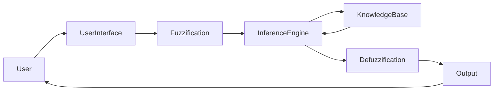
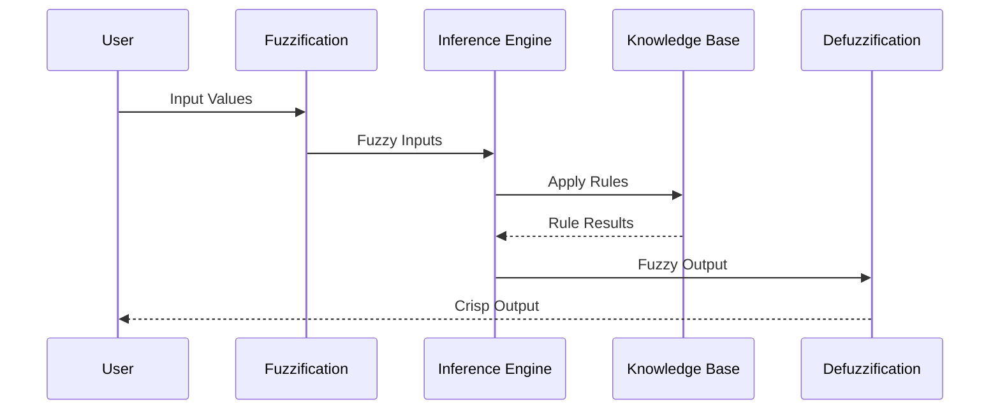

# Fuzzy Expert Systems

## Table of Contents

- Introduction
- What is a Fuzzy Expert System?
- Definition
- Why Fuzzy Expert Systems are Important
- History
- Need for Fuzzy Expert Systems
- Classical Logic vs Fuzzy Logic
- Characteristics
- Objectives
- Architecture
- Components of a Fuzzy Expert System
- Working Principle
- Fuzzy Inference Process
- Membership Functions
- Types of Membership Functions
- Fuzzy Rules
- Defuzzification Methods
- Fuzzy Inference Models
- Real-World Examples
- Medical Diagnosis Example
- Air Conditioner Example
- Washing Machine Example
- Autonomous Vehicle Example
- Advantages
- Limitations
- Fuzzy Expert Systems vs Traditional Expert Systems
- Applications
- Best Practices
- Summary
- Key Terms
- Quick Quiz
- References

---

# Introduction

Many real-world problems involve **vague, uncertain, or imprecise information**. Traditional Expert Systems rely on **Boolean (True/False)** logic, which cannot effectively represent concepts like:

- High temperature
- Slight pain
- Moderate risk
- Fast speed
- Heavy traffic

To overcome this limitation, **Fuzzy Expert Systems** combine **Expert Systems** with **Fuzzy Logic**, allowing computers to reason similarly to humans using degrees of truth instead of absolute true or false values.

---

# What is a Fuzzy Expert System?

A **Fuzzy Expert System** is an Expert System that uses **Fuzzy Logic** to reason with uncertain, vague, or imprecise knowledge.

Instead of making strict Yes/No decisions, it assigns **degrees of membership** to different possibilities.

---

## Definition

> **A Fuzzy Expert System is a knowledge-based intelligent system that uses fuzzy logic and fuzzy inference rules to solve problems involving uncertainty, vagueness, and imprecise information.**

---

# Why Fuzzy Expert Systems are Important

Fuzzy Expert Systems:

- Mimic human reasoning
- Handle vague concepts
- Improve decision quality
- Reduce rigid decision boundaries
- Work well with uncertain inputs
- Support real-world intelligent control

---

# History

- **1965** – Lotfi A. Zadeh introduced **Fuzzy Set Theory**.
- **1970s** – Fuzzy Logic gained attention in control systems.
- **1980s** – Fuzzy Expert Systems were applied in industrial automation.
- **1990s** – Used in consumer electronics and medical diagnosis.
- **Today** – Used in AI, robotics, autonomous vehicles, IoT, and smart systems.

---

# Need for Fuzzy Expert Systems

Consider a traditional rule:

```
IF Temperature > 38°C
THEN Fever
```

What if the temperature is **37.9°C**?

A traditional system may answer:

```
No Fever
```

A Fuzzy Expert System may answer:

```
Fever = 0.82

High Temperature = 0.75
```

This better reflects human reasoning.

---

# Classical Logic vs Fuzzy Logic

| Classical Logic | Fuzzy Logic |
|-----------------|-------------|
| True or False | Degree of truth |
| Binary values | Continuous values |
| Sharp boundaries | Smooth boundaries |
| Precise reasoning | Approximate reasoning |
| 0 or 1 | Any value between 0 and 1 |

---

# Characteristics

A Fuzzy Expert System is:

- Knowledge-based
- Rule-driven
- Flexible
- Human-like
- Explainable
- Robust
- Adaptive
- Suitable for uncertain environments

---

# Objectives

The objectives are:

- Handle vague knowledge
- Improve decision making
- Mimic human experts
- Solve uncertain problems
- Increase system flexibility
- Support intelligent control

---

# Architecture



---

# Components of a Fuzzy Expert System

## User Interface

Accepts user input and displays results.

---

## Knowledge Base

Stores fuzzy rules and expert knowledge.

Example

```
IF Temperature is High

AND Humidity is Medium

THEN Fan Speed is Fast
```

---

## Database

Stores fuzzy variables and membership functions.

---

## Fuzzification Module

Converts crisp input values into fuzzy values.

Example

```
Temperature = 38°C

↓

High = 0.82

Medium = 0.18
```

---

## Inference Engine

Evaluates fuzzy rules and determines fuzzy outputs.

---

## Defuzzification Module

Converts fuzzy output into a crisp numerical value.

Example

```
Fan Speed = 82%
```

---

# Internal Architecture

```mermaid
flowchart TD

Input

-->

Fuzzification

-->

Rule Base

-->

Inference Engine

-->

Aggregation

-->

Defuzzification

-->

Output
```

---

# Working Principle

The Fuzzy Expert System follows these steps:

1. Accept input values.
2. Convert crisp values into fuzzy values.
3. Apply fuzzy rules.
4. Aggregate rule outputs.
5. Defuzzify the result.
6. Produce the final decision.

---

# Fuzzy Inference Process

```mermaid
flowchart TD

Start

-->

Input

-->

Fuzzification

-->

Rule Evaluation

-->

Aggregation

-->

Defuzzification

-->

Decision

-->

End
```

---

# Membership Functions

Membership functions define how much a value belongs to a fuzzy set.

Example

```
Temperature = 35°C

Cold = 0.1

Warm = 0.7

Hot = 0.3
```

---

# Types of Membership Functions

## Triangular

```text
      /\
     /  \
____/    \____
```

---

## Trapezoidal

```text
    ______
   /      \
__/        \__
```

---

## Gaussian

```text
      /\
    /    \
  /        \
_/          \_
```

---

## Bell-Shaped

Smooth curve suitable for gradual transitions.

---

## Sigmoid

Useful for increasing or decreasing trends.

---

# Fuzzy Rules

Example

```
IF

Temperature is High

AND

Humidity is Medium

THEN

Fan Speed is Fast
```

Another Rule

```
IF

Temperature is Very High

THEN

Fan Speed is Maximum
```

---

# Defuzzification Methods

## 1. Centroid Method

Most widely used.

Computes the center of the output area.

---

## 2. Mean of Maximum (MOM)

Averages the maximum membership values.

---

## 3. Largest of Maximum (LOM)

Chooses the largest value with maximum membership.

---

## 4. Smallest of Maximum (SOM)

Chooses the smallest value with maximum membership.

---

# Fuzzy Inference Models

## Mamdani Model

- Most popular
- Human-readable
- Common in control systems

---

## Sugeno Model

- Produces mathematical outputs
- Efficient for optimization
- Widely used in machine learning

---

## Tsukamoto Model

- Monotonic output membership functions
- Useful for specialized control applications

---

# Medical Diagnosis Example

Patient

```
Temperature = 38.2°C

Cough = Mild

Body Pain = Moderate
```

Rules

```
IF

Temperature is High

AND Cough is Mild

THEN Flu
```

Output

```
Flu Probability

82%
```

---

# Air Conditioner Example

Input

```
Temperature = 34°C

Humidity = High
```

Rules

```
IF Temperature is High

AND Humidity is High

THEN Cooling is Maximum
```

Output

```
Cooling Level = 90%
```

---

# Washing Machine Example

Input

```
Clothes = Very Dirty

Load = Heavy
```

Output

```
Wash Time = 72 Minutes
```

---

# Autonomous Vehicle Example

Input

```
Road = Wet

Visibility = Low

Traffic = Heavy
```

Output

```
Recommended Speed = 38 km/h
```

---

# Complete Workflow



---

# Advantages

- Handles uncertainty effectively
- Mimics human reasoning
- Smooth decision making
- Easy to understand
- Robust against noisy inputs
- Supports explainable decisions
- Suitable for complex control systems

---

# Limitations

- Rule creation requires domain experts
- Membership functions require tuning
- Large rule bases become difficult to maintain
- Computational complexity increases with many variables
- Not self-learning without integration with machine learning

---

# Fuzzy Expert Systems vs Traditional Expert Systems

| Traditional Expert System | Fuzzy Expert System |
|---------------------------|---------------------|
| Boolean logic | Fuzzy logic |
| Yes/No decisions | Degree-based decisions |
| Exact inputs | Approximate inputs |
| Sharp boundaries | Smooth transitions |
| Less flexible | Highly flexible |

---

# Applications

Fuzzy Expert Systems are widely used in:

- Medical diagnosis
- Air conditioning systems
- Washing machines
- Cameras
- Robotics
- Autonomous vehicles
- Industrial automation
- Financial risk analysis
- Smart agriculture
- Traffic management
- Consumer electronics
- Decision support systems

---

# Best Practices

- Define meaningful membership functions.
- Keep fuzzy rules simple and consistent.
- Validate rules with domain experts.
- Avoid redundant fuzzy sets.
- Use the appropriate inference model.
- Test the system with real-world data.
- Explain decisions to improve user trust.
- Regularly update the Knowledge Base.

---

# Summary

A **Fuzzy Expert System** combines the rule-based reasoning of an Expert System with the approximate reasoning capabilities of **Fuzzy Logic**. Instead of relying on strict true-or-false decisions, it evaluates information using degrees of membership, making it ideal for handling vague, uncertain, and imprecise data. Through **fuzzification**, **fuzzy inference**, and **defuzzification**, these systems provide intelligent, flexible, and human-like decision making in domains such as healthcare, industrial automation, robotics, finance, and consumer electronics.

---

# Key Terms

| Term | Meaning |
|------|---------|
| Fuzzy Expert System | Expert System using Fuzzy Logic |
| Fuzzy Logic | Logic with degrees of truth |
| Membership Function | Defines the degree of belonging to a fuzzy set |
| Fuzzification | Converts crisp values into fuzzy values |
| Defuzzification | Converts fuzzy outputs into crisp values |
| Mamdani Model | Popular fuzzy inference model |
| Sugeno Model | Mathematical fuzzy inference model |
| Fuzzy Rule | IF–THEN rule using linguistic variables |

---

# Quick Quiz

## Beginner

1. What is a Fuzzy Expert System?
2. Why is Fuzzy Logic used in Expert Systems?
3. What is fuzzification?
4. What is defuzzification?
5. What is a membership function?

---

## Intermediate

1. Explain the architecture of a Fuzzy Expert System.
2. Compare Classical Logic and Fuzzy Logic.
3. Describe the fuzzy inference process.
4. Compare Mamdani and Sugeno models.
5. Why are membership functions important?

---

## Advanced

1. Design a Fuzzy Expert System for smart irrigation.
2. Explain how fuzzy reasoning differs from probabilistic reasoning.
3. Discuss challenges in designing membership functions.
4. Compare Fuzzy Expert Systems with Neural Networks.
5. Explain the role of Fuzzy Expert Systems in Explainable AI (XAI).

---

# References

## Books

- **Fuzzy Sets** — Lotfi A. Zadeh
- **Fuzzy Sets and Fuzzy Logic** — George J. Klir & Bo Yuan
- **Artificial Intelligence: A Modern Approach** — Stuart Russell & Peter Norvig
- **Expert Systems: Principles and Programming** — Joseph C. Giarratano & Gary D. Riley

## Online Resources

- IEEE Xplore – Fuzzy Logic Research
- IBM AI Documentation
- MIT OpenCourseWare – Artificial Intelligence
- Stanford Artificial Intelligence Laboratory
- MathWorks Documentation – Fuzzy Logic Toolbox
- Microsoft AI Learning Resources