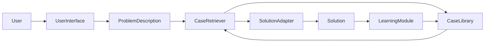
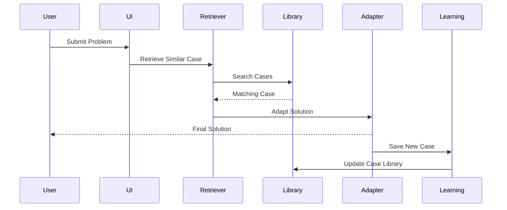

# Case-Based Reasoning (CBR) in Expert Systems

## Table of Contents

- Introduction
- What is Case-Based Reasoning?
- Definition
- Why Case-Based Reasoning is Important
- History
- Need for Case-Based Reasoning
- Characteristics
- Objectives
- Architecture
- Components of a CBR System
- CBR Cycle
- Working Principle
- The Four R's of CBR
- Similarity Measurement
- Case Representation
- Indexing Techniques
- Learning in CBR
- Medical Diagnosis Example
- Customer Support Example
- Legal Expert System Example
- Advantages
- Limitations
- Case-Based Reasoning vs Rule-Based Reasoning
- Applications
- Best Practices
- Summary
- Key Terms
- Quick Quiz
- References

---

# Introduction

Many real-world problems have been solved before. Instead of creating a completely new solution every time, humans often remember a similar past situation and adapt its solution to the current problem.

For example:

- A doctor diagnoses a patient by comparing symptoms with previous patients.
- A mechanic repairs a vehicle by recalling similar repair cases.
- A lawyer studies previous court judgments before handling a new case.

**Case-Based Reasoning (CBR)** allows Expert Systems to solve problems in the same way—by learning from previous experiences.

---

# What is Case-Based Reasoning?

Case-Based Reasoning (CBR) is an AI reasoning technique in which solutions to new problems are obtained by retrieving and adapting solutions from similar past cases stored in a Case Library.

Unlike traditional Expert Systems that rely mainly on IF–THEN rules, CBR relies on previous experiences.

---

## Definition

> **Case-Based Reasoning (CBR) is an AI problem-solving approach that solves new problems by retrieving, adapting, and learning from previously solved cases.**

---

# Why Case-Based Reasoning is Important

Case-Based Reasoning helps Expert Systems to:

- Learn from experience
- Reuse previous solutions
- Improve over time
- Reduce knowledge engineering effort
- Solve complex real-world problems
- Adapt to changing environments

---

# History

- **1982** – Roger Schank proposed dynamic memory theory.
- **Late 1980s** – Janet Kolodner developed practical CBR systems.
- **1990s** – CBR became popular in medical diagnosis and technical support.
- **Today** – Used in AI assistants, recommendation systems, legal systems, and intelligent customer support.

---

# Need for Case-Based Reasoning

Traditional rule-based systems require many manually written rules.

Example:

```
IF Fever

AND Cough

THEN Flu
```

However, if a rare disease appears, no rule may exist.

A CBR system instead searches for similar historical cases and adapts previous solutions.

---

# Characteristics

Case-Based Reasoning is:

- Experience-based
- Knowledge-driven
- Adaptive
- Incremental
- Explainable
- Learning-oriented
- Flexible
- Reusable

---

# Objectives

The objectives of CBR are:

- Solve new problems using past cases
- Reduce repeated work
- Learn continuously
- Improve decision quality
- Reuse expert knowledge
- Increase adaptability

---

# Architecture



---

# Components of a CBR System

## User Interface

Receives the problem description and displays the final solution.

---

## Problem Description Module

Stores information about the current problem.

Example

```
Temperature = 39°C

Cough = Yes

Age = 42
```

---

## Case Library

Stores previously solved cases.

Example

```
Case #101

Symptoms

↓

Diagnosis

↓

Treatment
```

---

## Case Retriever

Finds the most similar historical cases.

---

## Solution Adapter

Modifies previous solutions to fit the current problem.

---

## Learning Module

Stores the newly solved case for future use.

---

# Internal Architecture

```mermaid
flowchart TD

Current Problem

-->

Case Retrieval

-->

Similar Case

-->

Solution Adaptation

-->

Final Solution

-->

Case Retention

-->

Case Library
```

---

# CBR Cycle

The Case-Based Reasoning process consists of four major steps known as the **Four R's**.


---

# The Four R's of CBR

## 1. Retrieve

Find the most similar past case.

---

## 2. Reuse

Reuse or adapt the previous solution.

---

## 3. Revise

Test and improve the adapted solution if necessary.

---

## 4. Retain

Store the new solution as a new case for future use.

---

# Working Principle

```mermaid
flowchart TD

Start

-->

Input Problem

-->

Search Case Library

-->

Similar Case Found?

Similar Case Found?

-->|Yes| Adapt Solution

Similar Case Found?

-->|No| Expert Solves Problem

Adapt Solution

-->

Test Solution

-->

Store New Case

-->

End

Expert Solves Problem

-->

Store New Case
```

---

# Similarity Measurement

A CBR system compares the current problem with previous cases.

Example

| Feature | Current | Stored Case |
|----------|----------|-------------|
| Fever | Yes | Yes |
| Cough | Yes | Yes |
| Age | 40 | 42 |
| Similarity | **95%** | |

The highest similarity score is selected.

---

# Case Representation

A case generally contains:

```text
Case ID

Problem

Symptoms

Diagnosis

Solution

Outcome

Date

Confidence
```

---

# Indexing Techniques

Efficient retrieval requires indexing.

Common indexing methods include:

- Feature-based indexing
- Attribute indexing
- Hierarchical indexing
- Decision-tree indexing
- Hash indexing
- Semantic indexing

---

# Learning in CBR

One of the major strengths of CBR is continuous learning.

```mermaid
flowchart LR

New Problem

-->

Solved

-->

Store Case

-->

Case Library

-->

Future Problems
```

Each solved problem improves the knowledge base.

---

# Medical Diagnosis Example

Current Patient

```
Temperature = 39°C

Cough = Yes

Body Pain = Yes
```

Similar Case Found

```
Case #245

Diagnosis

Flu

Treatment

Rest + Medication
```

The previous treatment is adapted for the current patient.

---

# Customer Support Example

Problem

```
Laptop does not boot.
```

Case Library

```
Case #121

Cause

RAM Not Properly Installed

Solution

Reinstall RAM
```

The same solution is suggested.

---

# Legal Expert System Example

Current Case

```
Contract Violation
```

Previous Cases

```
Case A

Compensation Awarded

Similarity = 92%
```

The legal expert system recommends arguments based on Case A.

---

# Complete Workflow



---

# Advantages

- Learns continuously
- Reuses previous knowledge
- Reduces rule creation effort
- Handles complex problems
- Easy to update
- Explainable decisions
- Improves over time

---

# Limitations

- Requires a large case library
- Retrieval may become slow
- Similarity measurement can be difficult
- Poor-quality cases reduce accuracy
- Case adaptation may require expert knowledge

---

# Case-Based Reasoning vs Rule-Based Reasoning

| Feature | Case-Based Reasoning | Rule-Based Reasoning |
|----------|----------------------|----------------------|
| Knowledge | Previous cases | IF–THEN rules |
| Learning | Continuous | Usually static |
| Adaptability | High | Moderate |
| Knowledge Acquisition | Easier | Difficult |
| Reasoning | Experience-based | Logic-based |
| Maintenance | Add new cases | Update rules |

---

# Applications

Case-Based Reasoning is widely used in:

- Medical diagnosis
- Customer support
- Legal advisory systems
- Insurance claim processing
- Technical troubleshooting
- Help desk systems
- Product recommendation
- Robotics
- Intelligent tutoring systems
- Predictive maintenance

---

# Best Practices

- Maintain a high-quality case library.
- Remove duplicate or outdated cases.
- Design effective similarity measures.
- Validate adapted solutions.
- Store every successfully solved case.
- Organize cases using efficient indexing.
- Periodically review case quality.
- Combine CBR with rule-based reasoning when appropriate.

---

# Summary

**Case-Based Reasoning (CBR)** is an intelligent problem-solving approach in which Expert Systems solve new problems by retrieving and adapting solutions from similar past cases. Through the **Retrieve, Reuse, Revise, and Retain (4R)** cycle, CBR systems continuously learn from experience and improve their performance over time. Their ability to reuse knowledge, adapt solutions, and learn incrementally makes them highly effective for domains such as healthcare, law, customer support, finance, and technical troubleshooting.

---

# Key Terms

| Term | Meaning |
|------|---------|
| Case-Based Reasoning (CBR) | Problem solving using previous cases |
| Case Library | Repository of solved cases |
| Retrieve | Find similar previous cases |
| Reuse | Adapt a previous solution |
| Revise | Improve the adapted solution |
| Retain | Store the new case |
| Similarity Measure | Degree of similarity between cases |
| Case Adaptation | Modifying an old solution for a new problem |

---

# Quick Quiz

## Beginner

1. What is Case-Based Reasoning?
2. What is a Case Library?
3. What are the Four R's of CBR?
4. Why does CBR learn continuously?
5. What is similarity measurement?

---

## Intermediate

1. Explain the CBR cycle.
2. Compare Case-Based Reasoning and Rule-Based Reasoning.
3. Why is case adaptation important?
4. How does indexing improve retrieval?
5. What information is typically stored in a case?

---

## Advanced

1. Design a Case-Based Reasoning system for hospital diagnosis.
2. Explain different similarity measurement techniques.
3. Discuss hybrid systems combining CBR and rule-based reasoning.
4. Compare CBR with machine learning approaches.
5. Explain challenges in maintaining large Case Libraries.

---

# References

## Books

- *Case-Based Reasoning: Experiences, Lessons, and Future Directions* — Janet Kolodner
- *Dynamic Memory: A Theory of Learning in Computers and People* — Roger Schank
- *Artificial Intelligence: A Modern Approach* — Stuart Russell & Peter Norvig
- *Expert Systems: Principles and Programming* — Joseph C. Giarratano & Gary D. Riley

## Online Resources

- IBM AI Documentation
- AAAI Digital Library
- IEEE Xplore – Case-Based Reasoning Research
- MIT OpenCourseWare – Artificial Intelligence
- Stanford Artificial Intelligence Laboratory