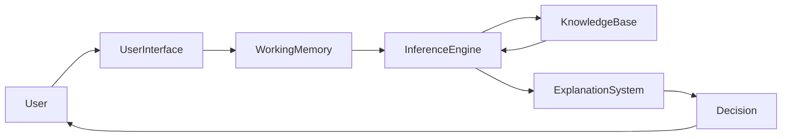
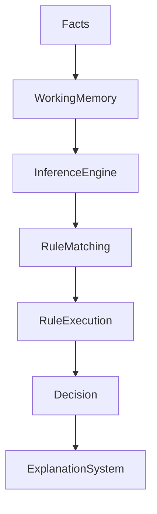
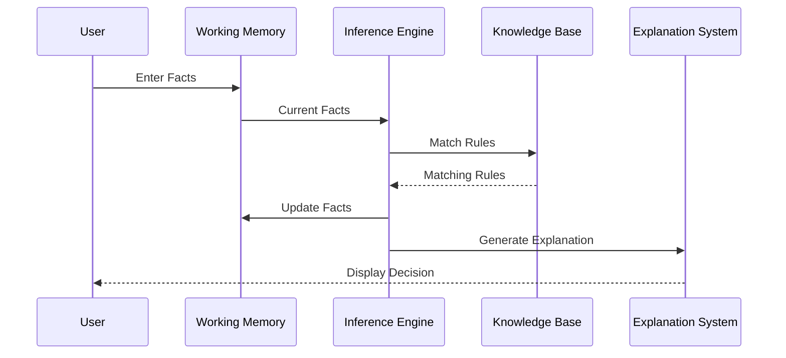

# Rule-Based Systems in Expert Systems

## Table of Contents

- Introduction
- What is a Rule-Based System?
- Definition
- Why Rule-Based Systems are Important
- History
- Need for Rule-Based Systems
- Characteristics
- Objectives
- Architecture
- Components of a Rule-Based System
- Structure of Rules
- Types of Rules
- Working Principle
- Rule Matching
- Rule Execution
- Rule Chaining
- Rule Life Cycle
- Rule Representation
- Medical Diagnosis Example
- Loan Approval Example
- Industrial Automation Example
- Advantages
- Limitations
- Rule-Based Systems vs Case-Based Systems
- Rule-Based Systems vs Machine Learning
- Applications
- Best Practices
- Summary
- Key Terms
- Quick Quiz
- References

---

# Introduction

A **Rule-Based System (RBS)** is one of the oldest and most widely used approaches in Artificial Intelligence and Expert Systems. It represents knowledge using a collection of **IF–THEN rules**, allowing computers to make logical decisions similar to human experts.

Instead of learning from data, a Rule-Based System relies on explicitly defined rules created by domain experts. The **Inference Engine** evaluates these rules against known facts and produces conclusions.

Many classic Expert Systems, including **MYCIN**, **DENDRAL**, and **XCON**, were built using rule-based reasoning.

---

# What is a Rule-Based System?

A Rule-Based System is an intelligent system that represents knowledge as a collection of **IF–THEN rules** and uses logical reasoning to solve problems and make decisions.

---

## Definition

> **A Rule-Based System is a knowledge-based AI system that applies IF–THEN production rules to known facts in order to derive conclusions or perform actions.**

---

# Why Rule-Based Systems are Important

Rule-Based Systems provide:

- Transparent reasoning
- Explainable decisions
- Consistent results
- Easy knowledge representation
- Modular design
- Reliable automation
- Human-readable logic

---

# History

| Year | Development |
|------|-------------|
| 1965 | Development of production rule systems |
| 1972 | DENDRAL demonstrated rule-based reasoning |
| 1976 | MYCIN used medical diagnosis rules |
| 1980s | Commercial Expert Systems became popular |
| Today | Used in business rules, diagnostics, automation, and decision support |

---

# Need for Rule-Based Systems

Without rules:

- Decision making becomes inconsistent.
- Human expertise cannot be automated.
- Knowledge is difficult to reuse.
- Manual decision making becomes slow.

Rule-Based Systems provide standardized and repeatable reasoning.

---

# Characteristics

A Rule-Based System is:

- Knowledge-based
- Modular
- Deterministic
- Explainable
- Easy to maintain
- Rule-driven
- Consistent
- Transparent

---

# Objectives

The objectives of a Rule-Based System are:

- Represent expert knowledge
- Automate reasoning
- Solve complex problems
- Support decision making
- Improve consistency
- Reduce human effort

---

# Architecture



---

# Components of a Rule-Based System

## User Interface

Accepts input and displays results.

---

## Knowledge Base

Stores facts and production rules.

Example

```
IF Temperature > 38°C

THEN Fever
```

---

## Working Memory

Stores current facts.

Example

```
Temperature = 39°C

Cough = Yes
```

---

## Inference Engine

Matches rules with facts and performs reasoning.

---

## Explanation System

Explains how and why a conclusion was reached.

---

# Internal Architecture



---

# Structure of Rules

A production rule has two parts:

```text
IF <Condition>

THEN <Action>
```

Example

```text
IF Temperature > 38°C

AND Cough = Yes

THEN Diagnosis = Flu
```

---

# Types of Rules

## Simple Rule

```text
IF Rain

THEN Carry Umbrella
```

---

## Multiple Condition Rule

```text
IF Fever

AND Cough

AND Body Pain

THEN Flu
```

---

## Nested Rule

```text
IF Fever

THEN Check Infection

IF Infection

THEN Antibiotics
```

---

## Action Rule

```text
IF Smoke Detected

THEN Activate Alarm
```

---

## Recommendation Rule

```text
IF Credit Score > 750

THEN Recommend Premium Loan
```

---

# Working Principle

The Rule-Based System follows these steps:

1. Receive facts.
2. Store facts in Working Memory.
3. Match rules.
4. Select applicable rules.
5. Execute a rule.
6. Generate new facts.
7. Repeat until no rules remain.

---

# Rule Matching

Facts

```text
Temperature = 39°C

Cough = Yes
```

Rule

```text
IF Temperature > 38°C

AND Cough = Yes

THEN Flu
```

The conditions match.

↓

Rule is activated.

---

# Rule Execution

Activated Rule

```text
IF Fever

THEN Diagnosis = Flu
```

After execution

```text
Diagnosis = Flu
```

is added to Working Memory.

---

# Rule Chaining

## Forward Chaining

```mermaid
flowchart LR

Facts

-->

Rule 1

-->

New Facts

-->

Rule 2

-->

Conclusion
```

Starts from known facts and derives conclusions.

---

## Backward Chaining

```mermaid
flowchart TD

Goal

-->

Find Rule

-->

Check Facts

-->

Goal Verified
```

Starts from a goal and works backward to verify it.

---

# Rule Life Cycle


---

# Rule Representation

Example Rule Base

```text
Rule 1

IF Temperature > 38°C

THEN Fever

----------------------

Rule 2

IF Fever

AND Cough

THEN Flu

----------------------

Rule 3

IF Flu

THEN Recommend Rest
```

---

# Medical Diagnosis Example

Facts

```text
Temperature = 39°C

Cough = Yes

Body Pain = Yes
```

Rule Base

```text
IF Temperature > 38°C

THEN Fever

----------------------

IF Fever

AND Cough

THEN Flu

----------------------

IF Flu

THEN Medicine
```

Result

```text
Diagnosis = Flu

Medicine Recommended
```

---

# Loan Approval Example

Facts

```text
Income = ₹15,00,000

Credit Score = 810

Employment = Permanent
```

Rule

```text
IF Income > ₹10,00,000

AND Credit Score > 750

THEN Loan Approved
```

Output

```text
Loan Approved
```

---

# Industrial Automation Example

Facts

```text
Temperature = High

Pressure = High
```

Rule

```text
IF Temperature High

AND Pressure High

THEN Stop Machine
```

Output

```text
Emergency Shutdown
```

---

# Complete Workflow



---

# Advantages

- Easy to understand
- Highly explainable
- Transparent reasoning
- Modular knowledge
- Easy debugging
- Reliable decision making
- Consistent execution
- Suitable for deterministic problems

---

# Limitations

- Knowledge acquisition is difficult
- Large rule bases become difficult to manage
- Poor handling of uncertainty
- No automatic learning
- Rule conflicts may occur
- Maintenance becomes expensive as systems grow

---

# Rule-Based Systems vs Case-Based Systems

| Rule-Based System | Case-Based System |
|-------------------|-------------------|
| Uses IF–THEN rules | Uses previous cases |
| Knowledge created by experts | Knowledge learned from cases |
| Logic-based reasoning | Experience-based reasoning |
| Static knowledge | Continuously growing knowledge |
| Best for well-defined domains | Best for experience-rich domains |

---

# Rule-Based Systems vs Machine Learning

| Rule-Based System | Machine Learning |
|-------------------|------------------|
| Explicit rules | Learns from data |
| Explainable | May be difficult to explain |
| No training required | Requires training |
| Predictable | Probabilistic |
| Human-created knowledge | Data-driven knowledge |

---

# Applications

Rule-Based Systems are widely used in:

- Medical diagnosis
- Banking
- Insurance
- Tax advisory
- Customer support
- Manufacturing
- Robotics
- Industrial automation
- Network management
- Cybersecurity
- Legal advisory
- Business rule management

---

# Best Practices

- Write clear and independent rules.
- Avoid duplicate or conflicting rules.
- Organize rules into logical groups.
- Assign rule priorities when necessary.
- Validate rules with domain experts.
- Regularly review and update the rule base.
- Document every rule.
- Test the system using real-world scenarios.

---

# Summary

A **Rule-Based System** is a knowledge-based AI system that represents expertise through **IF–THEN production rules**. By combining a **Knowledge Base**, **Working Memory**, and an **Inference Engine**, it performs logical reasoning to reach consistent and explainable decisions. Rule-Based Systems are widely used in Expert Systems because they are transparent, modular, easy to understand, and highly reliable for domains where knowledge can be explicitly expressed as rules.

---

# Key Terms

| Term | Meaning |
|------|---------|
| Rule-Based System | AI system using IF–THEN rules |
| Production Rule | IF–THEN knowledge statement |
| Knowledge Base | Repository of rules and facts |
| Working Memory | Temporary storage for current facts |
| Inference Engine | Executes logical reasoning |
| Rule Matching | Comparing facts with rule conditions |
| Forward Chaining | Data-driven reasoning |
| Backward Chaining | Goal-driven reasoning |

---

# Quick Quiz

## Beginner

1. What is a Rule-Based System?
2. What is a production rule?
3. What are the two parts of an IF–THEN rule?
4. What is the role of the Inference Engine?
5. What is Working Memory?

---

## Intermediate

1. Explain the architecture of a Rule-Based System.
2. Compare Forward Chaining and Backward Chaining.
3. Why are Rule-Based Systems explainable?
4. What causes rule conflicts?
5. Describe the rule execution process.

---

## Advanced

1. Design a Rule-Based System for hospital diagnosis.
2. Compare Rule-Based Systems with Machine Learning models.
3. Explain how conflict resolution improves rule execution.
4. Discuss challenges in maintaining large rule bases.
5. Explain the importance of Rule-Based Systems in Explainable AI (XAI).

---

# References

## Books

- *Expert Systems: Principles and Programming* — Joseph C. Giarratano & Gary D. Riley
- *Artificial Intelligence: A Modern Approach* — Stuart Russell & Peter Norvig
- *Knowledge Representation and Reasoning* — Ronald Brachman & Hector Levesque
- *Artificial Intelligence* — Elaine Rich & Kevin Knight

## Online Resources

- CLIPS Documentation
- IBM AI Documentation
- Stanford Artificial Intelligence Laboratory
- MIT OpenCourseWare – Artificial Intelligence
- Microsoft AI Learning Resources
```