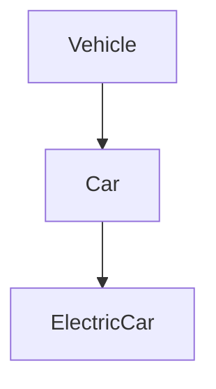
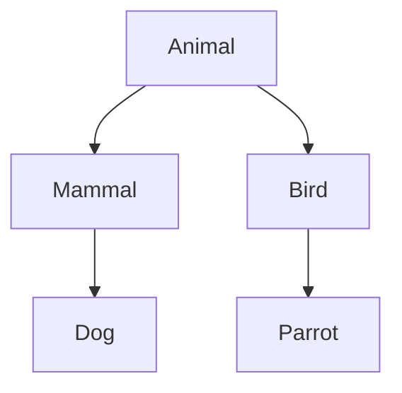
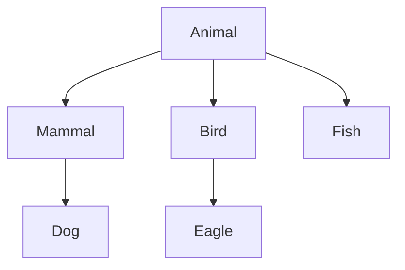
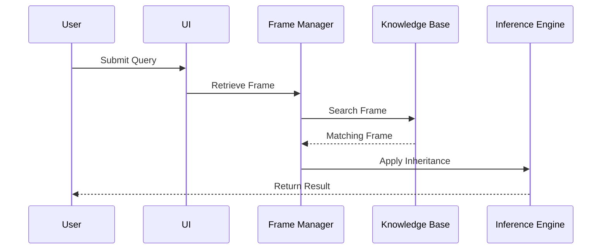

# Frame-Based Systems in Expert Systems

## Table of Contents

- Introduction
- What is a Frame-Based System?
- Definition
- Why Frame-Based Systems are Important
- History
- Need for Frame-Based Systems
- Characteristics
- Objectives
- Architecture
- Components of a Frame-Based System
- Structure of a Frame
- Slots and Fillers
- Inheritance
- Types of Frames
- Working Principle
- Frame Relationships
- Knowledge Representation
- Medical Diagnosis Example
- Animal Classification Example
- University Management Example
- Advantages
- Limitations
- Frame-Based Systems vs Rule-Based Systems
- Frame-Based Systems vs Semantic Networks
- Applications
- Best Practices
- Summary
- Key Terms
- Quick Quiz
- References

---

# Introduction

One of the biggest challenges in Artificial Intelligence is representing knowledge in a way that resembles how humans organize information. Humans naturally group related information into objects, concepts, and categories.

For example, when we think about a **Car**, we automatically associate information such as:

- Brand
- Model
- Engine
- Color
- Speed
- Fuel Type

A **Frame-Based System** stores knowledge in a similar way. It represents real-world objects as **frames**, where each frame contains attributes (called **slots**) and their corresponding values (called **fillers**).

Frame-Based Systems provide an organized, object-oriented approach to knowledge representation and are widely used in Expert Systems.

---

# What is a Frame-Based System?

A Frame-Based System is a knowledge representation technique where knowledge is organized into structured objects called **frames**.

Each frame represents an object, concept, event, or situation and contains related information about it.

---

## Definition

> **A Frame-Based System is a knowledge representation method in which knowledge is stored as interconnected frames containing slots (attributes) and fillers (values), allowing inheritance and structured reasoning.**

---

# Why Frame-Based Systems are Important

Frame-Based Systems provide:

- Structured knowledge representation
- Reusable knowledge
- Easy inheritance
- Natural object modeling
- Efficient organization
- Better maintainability
- Human-readable knowledge

---

# History

| Year | Development |
|------|-------------|
| 1974 | Marvin Minsky introduced the concept of Frames |
| 1980s | Widely adopted in Expert Systems |
| 1990s | Used in object-oriented knowledge representation |
| Today | Applied in AI, NLP, robotics, and semantic systems |

---

# Need for Frame-Based Systems

Suppose an Expert System stores information about thousands of vehicles.

Instead of repeating common information for every vehicle, a Frame-Based System stores common properties once and allows child frames to inherit them.

Example:

```
Vehicle

↓

Car

↓

Electric Car
```

Each child inherits properties from its parent.

---

# Characteristics

A Frame-Based System is:

- Object-oriented
- Hierarchical
- Structured
- Modular
- Reusable
- Inheritable
- Explainable
- Extendable

---

# Objectives

The objectives are:

- Represent structured knowledge
- Reduce redundancy
- Support inheritance
- Improve knowledge reuse
- Organize complex information
- Simplify maintenance

---

# Architecture


---

# Components of a Frame-Based System

## User Interface

Accepts queries and displays results.

---

## Knowledge Base

Stores all frames and relationships.

---

## Frame Manager

Creates, updates, and retrieves frames.

---

## Inference Engine

Uses frame information to perform reasoning.

---

## Explanation System

Explains how conclusions were reached.

---

# Structure of a Frame

A frame consists of:

- Frame Name
- Slots
- Fillers
- Procedures (optional)
- Parent Frame
- Child Frames

Example

```text
Frame: Car

Slots

Brand = Toyota

Color = White

Fuel = Petrol

Doors = 4

Max Speed = 180 km/h
```

---

# Slots and Fillers

A **Slot** is an attribute.

A **Filler** is the value assigned to that attribute.

Example

| Slot | Filler |
|------|---------|
| Brand | Toyota |
| Color | White |
| Fuel | Petrol |
| Doors | 4 |
| Speed | 180 km/h |

---

# Inheritance

Frames can inherit properties from parent frames.



Example

Vehicle Frame

```text
Wheels = 4

Engine = Yes
```

Car Frame

```text
Brand = Toyota

Fuel = Petrol
```

Electric Car Frame

```text
Battery = 100 kWh
```

The Electric Car automatically inherits all properties from **Vehicle** and **Car**.

---

# Types of Frames

## Generic Frame

Represents a general concept.

Example

```text
Vehicle
```

---

## Instance Frame

Represents a specific object.

Example

```text
Toyota Corolla
```

---

## Prototype Frame

Acts as a template for creating similar frames.

---

## Class Frame

Represents a category of objects.

Example

```text
Animal

Vehicle

Student
```

---

# Working Principle

The Frame-Based System performs the following steps:

1. Store knowledge as frames.
2. Organize frames hierarchically.
3. Retrieve the required frame.
4. Inherit missing properties.
5. Apply reasoning.
6. Return the result.

---

# Frame Relationships



Each child inherits properties from its parent.

---

# Knowledge Representation

Example

```text
Frame: Student

Name = Rahul

Age = 20

Department = Computer Science

Semester = 5

CGPA = 8.7
```

---

# Medical Diagnosis Example

Patient Frame

```text
Name = John

Age = 45

Temperature = 39°C

Symptoms

- Fever

- Cough

- Body Pain
```

Disease Frame

```text
Disease = Flu

Medicine = Antiviral

Rest = Yes
```

The Expert System links the Patient frame with the Disease frame to recommend treatment.

---

# Animal Classification Example



Dog inherits:

- Living Thing
- Warm Blooded
- Four Legs

---

# University Management Example

Frame

```text
Student

↓

Graduate Student

↓

PhD Student
```

Inheritance

```text
Student

↓

ID

Name

Department

↓

Graduate Student

Research Area

↓

PhD Student

Supervisor
```

---

# Complete Workflow



---

# Advantages

- Structured knowledge representation
- Supports inheritance
- Reduces redundancy
- Easy maintenance
- Modular design
- Human-readable
- Suitable for object-oriented reasoning
- Reusable knowledge

---

# Limitations

- Difficult to represent procedural knowledge
- Large frame hierarchies become complex
- Inheritance conflicts may occur
- Limited handling of uncertainty
- Not suitable for all problem domains

---

# Frame-Based Systems vs Rule-Based Systems

| Frame-Based System | Rule-Based System |
|--------------------|-------------------|
| Uses frames | Uses IF–THEN rules |
| Object-oriented | Logic-oriented |
| Supports inheritance | No inheritance |
| Good for structured knowledge | Good for procedural reasoning |
| Represents objects | Represents decisions |

---

# Frame-Based Systems vs Semantic Networks

| Frame-Based System | Semantic Network |
|--------------------|------------------|
| Frames contain attributes | Nodes connected by relationships |
| Supports slots and fillers | Represents associations |
| Rich object representation | Simpler relationship representation |
| Better for structured objects | Better for conceptual links |

---

# Applications

Frame-Based Systems are widely used in:

- Expert Systems
- Medical diagnosis
- Robotics
- Natural Language Processing
- Knowledge Management
- Intelligent Tutoring Systems
- Object-oriented AI
- Decision Support Systems
- Manufacturing
- Product Configuration

---

# Best Practices

- Design a clear frame hierarchy.
- Use inheritance to avoid redundancy.
- Keep slot names consistent.
- Avoid circular inheritance.
- Group related frames logically.
- Document frame relationships.
- Validate inherited properties.
- Regularly update the Knowledge Base.

---

# Summary

A **Frame-Based System** is a structured knowledge representation technique that organizes information into **frames** containing **slots** and **fillers**. By supporting **inheritance**, **hierarchical organization**, and **object-oriented modeling**, Frame-Based Systems reduce redundancy and simplify knowledge management. They are particularly effective for representing real-world objects, concepts, and relationships, making them valuable in Expert Systems, Natural Language Processing, robotics, and intelligent decision-support applications.

---

# Key Terms

| Term | Meaning |
|------|---------|
| Frame | Structured representation of an object or concept |
| Slot | Attribute of a frame |
| Filler | Value assigned to a slot |
| Inheritance | Receiving properties from parent frames |
| Generic Frame | General class of objects |
| Instance Frame | Specific object |
| Prototype Frame | Template frame |
| Frame Hierarchy | Parent-child relationship among frames |

---

# Quick Quiz

## Beginner

1. What is a Frame-Based System?
2. What is a frame?
3. What is a slot?
4. What is a filler?
5. What is inheritance?

---

## Intermediate

1. Explain the architecture of a Frame-Based System.
2. Compare Generic Frames and Instance Frames.
3. Why is inheritance useful?
4. Compare Frame-Based Systems and Rule-Based Systems.
5. Explain frame relationships with an example.

---

## Advanced

1. Design a Frame-Based System for a hospital management system.
2. Compare Frame-Based Systems and Semantic Networks.
3. Discuss inheritance conflicts and possible solutions.
4. Explain the role of Frame-Based Systems in modern knowledge representation.
5. How can Frame-Based Systems be integrated with Rule-Based Expert Systems?

---

# References

## Books

- **Frames for the Representation of Knowledge** — Marvin Minsky
- **Artificial Intelligence: A Modern Approach** — Stuart Russell & Peter Norvig
- **Expert Systems: Principles and Programming** — Joseph C. Giarratano & Gary D. Riley
- **Knowledge Representation and Reasoning** — Ronald Brachman & Hector Levesque

## Online Resources

- IBM AI Documentation
- Stanford Artificial Intelligence Laboratory
- MIT OpenCourseWare – Artificial Intelligence
- IEEE Xplore – Knowledge Representation Research
- Microsoft AI Learning Resources
```