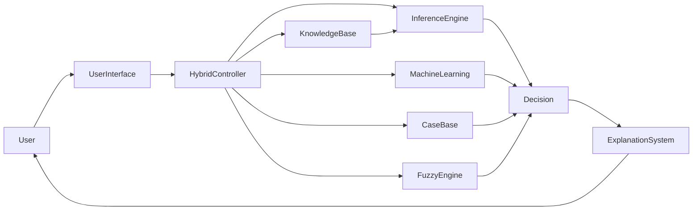
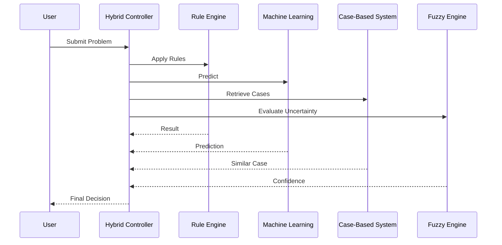

# Hybrid Expert Systems

## Table of Contents

- Introduction
- What is a Hybrid Expert System?
- Definition
- Why Hybrid Expert Systems are Important
- History
- Need for Hybrid Expert Systems
- Characteristics
- Objectives
- Architecture
- Components of a Hybrid Expert System
- Types of Hybrid Expert Systems
- Working Principle
- Integration Techniques
- Knowledge Representation
- Hybrid Reasoning Process
- Medical Diagnosis Example
- Financial Fraud Detection Example
- Autonomous Vehicle Example
- Industrial Predictive Maintenance Example
- Advantages
- Limitations
- Hybrid Expert Systems vs Traditional Expert Systems
- Hybrid Expert Systems vs Machine Learning
- Applications
- Best Practices
- Summary
- Key Terms
- Quick Quiz
- References

---

# Introduction

Traditional Expert Systems are highly effective for solving problems with well-defined rules and structured knowledge. However, many real-world problems involve uncertainty, incomplete information, large datasets, and continuously changing environments.

No single Artificial Intelligence technique can efficiently solve every type of problem.

To overcome these limitations, AI combines multiple intelligent techniques into a single system called a **Hybrid Expert System**.

A Hybrid Expert System combines two or more AI methods, allowing the strengths of one technique to compensate for the weaknesses of another.

---

# What is a Hybrid Expert System?

A **Hybrid Expert System** is an Expert System that integrates multiple Artificial Intelligence techniques—such as Rule-Based Systems, Fuzzy Logic, Neural Networks, Machine Learning, Case-Based Reasoning, Genetic Algorithms, or Bayesian Networks—to improve reasoning, learning, and decision making.

---

## Definition

> **A Hybrid Expert System is an intelligent system that combines two or more AI techniques to provide more accurate, flexible, adaptive, and efficient problem-solving than a single AI approach.**

---

# Why Hybrid Expert Systems are Important

Hybrid Expert Systems:

- Improve decision accuracy
- Handle uncertainty
- Learn from data
- Adapt to changing environments
- Combine symbolic and data-driven reasoning
- Solve complex real-world problems
- Increase reliability

---

# History

| Year | Development |
|------|-------------|
| 1970s | Rule-Based Expert Systems emerged |
| 1980s | Fuzzy Expert Systems became popular |
| 1990s | Neural Networks integrated with Expert Systems |
| 2000s | Machine Learning combined with Expert Systems |
| Today | Hybrid AI powers autonomous systems, healthcare, finance, and robotics |

---

# Need for Hybrid Expert Systems

Consider medical diagnosis.

A Rule-Based System can apply medical rules.

A Machine Learning model can recognize disease patterns.

A Case-Based System can retrieve similar patient cases.

A Fuzzy System can reason with vague symptoms.

Combining all these methods creates a more intelligent and accurate diagnostic system.

---

# Characteristics

A Hybrid Expert System is:

- Intelligent
- Flexible
- Adaptive
- Knowledge-driven
- Data-driven
- Explainable (partially or fully)
- Scalable
- Robust

---

# Objectives

The objectives are:

- Improve decision quality
- Combine multiple reasoning methods
- Handle uncertainty
- Learn from experience
- Increase adaptability
- Reduce weaknesses of individual AI methods

---

# Architecture



---

# Components of a Hybrid Expert System

## User Interface

Communicates with users.

---

## Knowledge Base

Stores expert knowledge and rules.

---

## Inference Engine

Performs logical reasoning using rules.

---

## Machine Learning Module

Learns patterns from historical data.

---

## Case-Based Reasoning Module

Retrieves solutions from similar past cases.

---

## Fuzzy Inference Engine

Handles vague and uncertain information.

---

## Hybrid Controller

Coordinates communication between all AI modules.

---

## Explanation System

Explains the reasoning process and final decision.

---

# Internal Architecture

```mermaid
flowchart TD

Input

-->

Hybrid Controller

Hybrid Controller

-->

Rule-Based Engine

Hybrid Controller

-->

Machine Learning

Hybrid Controller

-->

Case-Based Reasoning

Hybrid Controller

-->

Fuzzy Logic

Rule-Based Engine --> Decision

Machine Learning --> Decision

Case-Based Reasoning --> Decision

Fuzzy Logic --> Decision

Decision --> Output
```

---

# Types of Hybrid Expert Systems

## Rule-Based + Fuzzy Logic

Uses rules together with fuzzy reasoning.

Example

```
Medical Diagnosis

Industrial Control
```

---

## Rule-Based + Neural Network

Combines logical reasoning with pattern recognition.

Example

```
Disease Detection

Image Classification
```

---

## Rule-Based + Machine Learning

Uses predefined rules and learns from historical data.

Example

```
Fraud Detection

Cybersecurity
```

---

## Rule-Based + Case-Based Reasoning

Uses rules together with previous cases.

Example

```
Legal Advisory

Technical Support
```

---

## Multi-Hybrid Systems

Combine several AI techniques simultaneously.

Example

```
Rule-Based

+

Machine Learning

+

Fuzzy Logic

+

Case-Based Reasoning
```

---

# Working Principle

A Hybrid Expert System follows these steps:

1. Accept user input.
2. Identify the appropriate AI modules.
3. Apply rule-based reasoning.
4. Perform machine learning predictions.
5. Retrieve similar historical cases.
6. Handle uncertainty using fuzzy reasoning.
7. Combine all results.
8. Produce the final decision.
9. Explain the reasoning.

---

# Integration Techniques

Common integration approaches include:

- Sequential integration
- Parallel integration
- Layered architecture
- Shared knowledge base
- Blackboard architecture
- Ensemble decision making

---

# Knowledge Representation

Knowledge may be stored using:

- IF–THEN rules
- Frames
- Semantic networks
- Case libraries
- Neural network weights
- Fuzzy rules
- Bayesian probabilities

---

# Hybrid Reasoning Process

```mermaid
flowchart TD

Input

-->

Rule Evaluation

-->

Machine Learning Prediction

-->

Case Retrieval

-->

Fuzzy Reasoning

-->

Decision Fusion

-->

Final Decision
```

---

# Medical Diagnosis Example

Input

```text
Temperature = 38.8°C

Cough = Mild

Blood Test = Positive
```

Modules

- Rule-Based Engine → Checks diagnostic rules
- Machine Learning → Predicts disease probability
- Case-Based Reasoning → Retrieves similar patients
- Fuzzy Logic → Evaluates symptom severity

Output

```text
Diagnosis

Influenza

Confidence

94%
```

---

# Financial Fraud Detection Example

Input

```text
Transaction Amount

₹2,50,000

Location

Unknown

Device

New
```

Modules

- Rule-Based Engine → Detects suspicious transactions
- Machine Learning → Predicts fraud score
- Case-Based Reasoning → Finds similar fraud cases

Output

```text
Fraud Risk

96%
```

---

# Autonomous Vehicle Example

Modules

- Rule-Based System → Traffic rules
- Neural Network → Object recognition
- Fuzzy Logic → Road conditions
- Machine Learning → Driving behavior prediction

Output

```text
Recommended Speed

42 km/h
```

---

# Industrial Predictive Maintenance Example

Input

```text
Temperature

High

Vibration

High

Pressure

Normal
```

Modules

- Rule-Based Diagnosis
- Machine Learning Failure Prediction
- Case-Based Similar Failures

Output

```text
Machine Failure Probability

91%
```

---

# Complete Workflow



---

# Advantages

- Combines strengths of multiple AI techniques
- Improves accuracy
- Handles uncertainty
- Learns from data
- Adapts to new situations
- Better real-world performance
- More robust than single-method systems
- Supports complex decision making

---

# Limitations

- Complex system design
- Higher development cost
- Increased computational requirements
- Difficult integration
- Maintenance can be challenging
- Explanation may become more difficult with many AI components

---

# Hybrid Expert Systems vs Traditional Expert Systems

| Hybrid Expert System | Traditional Expert System |
|----------------------|---------------------------|
| Multiple AI techniques | Single AI technique |
| Learns from data | Usually static |
| Handles uncertainty better | Limited uncertainty handling |
| More adaptive | Less adaptive |
| Higher accuracy | Moderate accuracy |
| More complex | Simpler design |

---

# Hybrid Expert Systems vs Machine Learning

| Hybrid Expert System | Machine Learning |
|----------------------|------------------|
| Uses rules and learning | Primarily learns from data |
| Explainable reasoning | May be difficult to explain |
| Expert knowledge included | Mostly data-driven |
| Handles symbolic reasoning | Limited symbolic reasoning |
| Combines multiple methods | Usually one learning model |

---

# Applications

Hybrid Expert Systems are used in:

- Medical diagnosis
- Financial fraud detection
- Banking
- Insurance
- Cybersecurity
- Robotics
- Autonomous vehicles
- Manufacturing
- Smart agriculture
- Intelligent tutoring systems
- Industrial automation
- Decision support systems

---

# Best Practices

- Choose complementary AI techniques.
- Keep system architecture modular.
- Validate each module independently.
- Use a shared knowledge representation where appropriate.
- Regularly update learning models.
- Test integration thoroughly.
- Maintain explanation capabilities.
- Monitor system performance continuously.

---

# Summary

A **Hybrid Expert System** combines multiple Artificial Intelligence techniques—such as **Rule-Based Systems, Machine Learning, Fuzzy Logic, Case-Based Reasoning, Neural Networks,** and other methods—to solve complex problems more effectively than a single approach. By integrating symbolic reasoning with data-driven learning, Hybrid Expert Systems provide improved accuracy, adaptability, robustness, and decision-making capabilities. They are widely used in healthcare, finance, robotics, industrial automation, and intelligent decision-support systems.

---

# Key Terms

| Term | Meaning |
|------|---------|
| Hybrid Expert System | Expert System combining multiple AI techniques |
| Hybrid Controller | Coordinates different AI modules |
| Decision Fusion | Combining outputs from multiple AI methods |
| Symbolic AI | AI based on explicit knowledge and rules |
| Data-Driven AI | AI based on learning from data |
| Machine Learning | Learning patterns from data |
| Fuzzy Logic | Reasoning with uncertainty |
| Case-Based Reasoning | Solving problems using previous cases |

---

# Quick Quiz

## Beginner

1. What is a Hybrid Expert System?
2. Why are Hybrid Expert Systems needed?
3. What is the role of the Hybrid Controller?
4. Name four AI techniques commonly used in Hybrid Expert Systems.
5. What is decision fusion?

---

## Intermediate

1. Explain the architecture of a Hybrid Expert System.
2. Compare Rule-Based Systems and Hybrid Expert Systems.
3. Why are Hybrid Expert Systems more accurate?
4. Describe the working principle of a Hybrid Expert System.
5. Compare Hybrid Expert Systems with Machine Learning systems.

---

## Advanced

1. Design a Hybrid Expert System for autonomous driving.
2. Explain how multiple AI techniques cooperate in a Hybrid Expert System.
3. Compare Hybrid Expert Systems with Explainable AI (XAI) approaches.
4. Discuss the challenges of integrating Machine Learning with Rule-Based reasoning.
5. Explain how Hybrid Expert Systems can improve medical decision support.

---

# References

## Books

- **Artificial Intelligence: A Modern Approach** — Stuart Russell & Peter Norvig
- **Expert Systems: Principles and Programming** — Joseph C. Giarratano & Gary D. Riley
- **Knowledge Representation and Reasoning** — Ronald Brachman & Hector Levesque
- **Neuro-Fuzzy and Soft Computing** — Jang, Sun & Mizutani

## Online Resources

- IBM AI Documentation
- MIT OpenCourseWare – Artificial Intelligence
- Stanford Artificial Intelligence Laboratory
- IEEE Xplore – Hybrid Intelligent Systems
- Microsoft AI Learning Resources
```