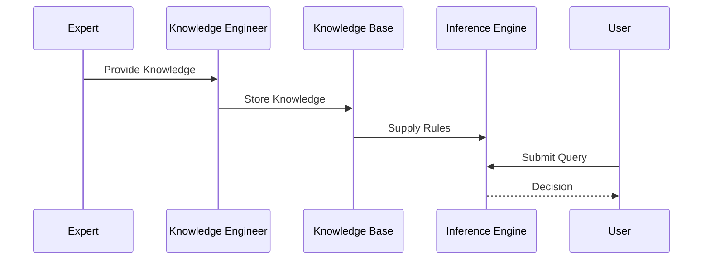

# Knowledge Engineering in Expert Systems

## Table of Contents

- Introduction
- What is Knowledge Engineering?
- Definition
- Why Knowledge Engineering is Important
- History
- Need for Knowledge Engineering
- Characteristics
- Objectives
- Knowledge Engineering Life Cycle
- Architecture
- Components of Knowledge Engineering
- Knowledge Acquisition
- Knowledge Representation
- Knowledge Validation
- Knowledge Verification
- Knowledge Maintenance
- Knowledge Engineering Process
- Role of a Knowledge Engineer
- Knowledge Sources
- Knowledge Acquisition Techniques
- Challenges in Knowledge Engineering
- Medical Diagnosis Example
- Banking Example
- Industrial Automation Example
- Advantages
- Limitations
- Knowledge Engineering vs Software Engineering
- Knowledge Engineering vs Data Engineering
- Applications
- Best Practices
- Summary
- Key Terms
- Quick Quiz
- References

---

# Introduction

An Expert System is only as good as the knowledge it contains. Even the most advanced Inference Engine cannot make intelligent decisions if the Knowledge Base is incomplete, inaccurate, or outdated.

The process of collecting, organizing, validating, representing, and maintaining expert knowledge is known as **Knowledge Engineering**.

Knowledge Engineering is one of the most important phases in building an Expert System because it transforms human expertise into a form that computers can understand and reason with.

---

# What is Knowledge Engineering?

Knowledge Engineering is the discipline of acquiring knowledge from domain experts and other sources, organizing it, representing it in a machine-readable format, validating its correctness, and maintaining it throughout the life of an Expert System.

---

## Definition

> **Knowledge Engineering is the systematic process of acquiring, organizing, representing, validating, implementing, and maintaining expert knowledge for use in Artificial Intelligence and Expert Systems.**

---

# Why Knowledge Engineering is Important

Knowledge Engineering enables Expert Systems to:

- Capture expert knowledge
- Preserve organizational expertise
- Improve decision quality
- Ensure consistent reasoning
- Simplify knowledge maintenance
- Reduce dependency on human experts
- Build scalable intelligent systems

---

# History

| Year | Development |
|------|-------------|
| 1960s | Early AI research focused on knowledge representation |
| 1970s | Knowledge Engineering emerged with Expert Systems |
| 1980s | Commercial Expert Systems increased demand for knowledge engineers |
| 1990s | Knowledge management techniques evolved |
| Today | Used in AI, machine learning, knowledge graphs, and intelligent systems |

---

# Need for Knowledge Engineering

Without Knowledge Engineering:

- Knowledge remains only in human experts.
- Decision making becomes inconsistent.
- Expert knowledge may be lost.
- Updating knowledge becomes difficult.
- Intelligent systems become unreliable.

Knowledge Engineering converts human expertise into reusable digital knowledge.

---

# Characteristics

Knowledge Engineering is:

- Knowledge-centered
- Systematic
- Structured
- Collaborative
- Iterative
- Explainable
- Maintainable
- Domain-specific

---

# Objectives

The objectives are:

- Capture expert knowledge
- Build an accurate Knowledge Base
- Improve reasoning quality
- Validate expert knowledge
- Enable knowledge reuse
- Simplify system maintenance
- Preserve organizational knowledge

---

# Knowledge Engineering Life Cycle

```mermaid
flowchart LR

Knowledge Acquisition

-->

Knowledge Analysis

-->

Knowledge Representation

-->

Knowledge Validation

-->

Implementation

-->

Knowledge Maintenance

-->

Knowledge Improvement
```

---

# Architecture

```mermaid
flowchart LR

Domain Expert

-->

Knowledge Engineer

-->

Knowledge Acquisition

-->

Knowledge Base

-->

Inference Engine

-->

Expert System

Expert System

-->

User
```

---

# Components of Knowledge Engineering

## Domain Expert

Provides specialized knowledge.

Example

```
Doctor

Lawyer

Engineer

Financial Analyst
```

---

## Knowledge Engineer

Collects, organizes, and converts expert knowledge into a machine-readable format.

---

## Knowledge Base

Stores:

- Facts
- Rules
- Frames
- Cases
- Ontologies

---

## Inference Engine

Uses stored knowledge to perform reasoning.

---

## User Interface

Allows users to interact with the Expert System.

---

# Knowledge Acquisition

Knowledge Acquisition is the process of collecting knowledge from various sources.

Knowledge sources include:

- Human experts
- Books
- Research papers
- Manuals
- Databases
- Historical records
- Sensors
- Organizational documents

---

# Knowledge Representation

After acquisition, knowledge is represented in forms such as:

- Production Rules
- Frames
- Semantic Networks
- Ontologies
- Decision Trees
- Logic
- Case Libraries
- Knowledge Graphs

---

# Knowledge Validation

Knowledge Validation checks whether the acquired knowledge is correct and useful.

Validation ensures:

- Correct rules
- Accurate facts
- Logical consistency
- Reliable conclusions

---

# Knowledge Verification

Verification checks whether the knowledge has been implemented correctly.

It answers questions such as:

- Are all rules complete?
- Are there contradictions?
- Are rules executable?
- Are outputs correct?

---

# Knowledge Maintenance

Knowledge must be updated regularly because:

- New research becomes available.
- Business rules change.
- Medical treatments improve.
- Regulations are updated.
- Technologies evolve.

Maintenance activities include:

- Adding new knowledge
- Updating existing knowledge
- Removing obsolete knowledge
- Resolving conflicts

---

# Knowledge Engineering Process

```mermaid
flowchart TD

Problem Identification

-->

Knowledge Acquisition

-->

Knowledge Analysis

-->

Knowledge Representation

-->

Knowledge Validation

-->

Knowledge Base

-->

Inference Engine

-->

Testing

-->

Deployment

-->

Maintenance
```

---

# Role of a Knowledge Engineer

A Knowledge Engineer is responsible for:

- Interviewing domain experts
- Collecting knowledge
- Organizing information
- Designing the Knowledge Base
- Creating rules
- Validating knowledge
- Testing the Expert System
- Maintaining knowledge over time

---

# Knowledge Sources

Knowledge may come from:

| Source | Example |
|---------|----------|
| Human Experts | Doctors, Engineers |
| Books | Medical textbooks |
| Research Papers | Scientific journals |
| Databases | Hospital records |
| Sensors | IoT devices |
| Historical Cases | Customer complaints |
| Organizational Documents | Policies and procedures |

---

# Knowledge Acquisition Techniques

## Interviews

Direct discussions with domain experts.

---

## Observation

Watching experts perform tasks.

---

## Questionnaires

Structured surveys for collecting knowledge.

---

## Document Analysis

Studying manuals, reports, and research papers.

---

## Think-Aloud Protocol

Experts explain their reasoning while solving problems.

---

## Case Analysis

Studying previous real-world cases.

---

# Challenges in Knowledge Engineering

Common challenges include:

- Knowledge acquisition bottleneck
- Expert availability
- Tacit knowledge that is difficult to express
- Conflicting expert opinions
- Rapidly changing knowledge
- Knowledge inconsistency
- High development cost
- Continuous maintenance requirements

---

# Medical Diagnosis Example

Knowledge Acquisition

```
Doctor Interviews
```

Knowledge Representation

```text
IF

Temperature > 38°C

AND

Cough = Yes

THEN

Diagnosis = Flu
```

Validation

Medical experts verify the rule.

---

# Banking Example

Knowledge Acquisition

```
Financial Experts
```

Rule

```text
IF

Credit Score > 750

AND

Income > ₹10,00,000

THEN

Loan Approved
```

---

# Industrial Automation Example

Knowledge Source

```
Maintenance Engineers
```

Rule

```text
IF

Temperature = High

AND

Pressure = High

THEN

Emergency Shutdown
```

---

# Complete Workflow



---

# Advantages

- Preserves expert knowledge
- Improves consistency
- Enables knowledge reuse
- Supports intelligent decision making
- Reduces dependence on experts
- Simplifies maintenance
- Builds scalable AI systems

---

# Limitations

- Knowledge acquisition is time-consuming
- Experts may disagree
- Tacit knowledge is difficult to capture
- Maintenance requires continuous effort
- Development costs can be high
- Knowledge can become outdated

---

# Knowledge Engineering vs Software Engineering

| Knowledge Engineering | Software Engineering |
|------------------------|----------------------|
| Focuses on knowledge | Focuses on software |
| Builds Knowledge Bases | Builds software systems |
| Uses expert knowledge | Uses programming logic |
| AI-oriented | General software development |
| Supports reasoning | Supports computation |

---

# Knowledge Engineering vs Data Engineering

| Knowledge Engineering | Data Engineering |
|------------------------|------------------|
| Works with expert knowledge | Works with raw data |
| Builds Knowledge Bases | Builds data pipelines |
| Symbolic reasoning | Data processing |
| Rule-based knowledge | Structured and unstructured data |
| Used in Expert Systems | Used in analytics and ML |

---

# Applications

Knowledge Engineering is used in:

- Expert Systems
- Medical diagnosis
- Banking
- Insurance
- Robotics
- Cybersecurity
- Manufacturing
- Knowledge Management
- Intelligent Tutoring Systems
- Legal advisory
- Decision Support Systems
- Knowledge Graphs

---

# Best Practices

- Collaborate closely with domain experts.
- Use multiple knowledge sources.
- Validate knowledge before deployment.
- Document all rules and assumptions.
- Keep the Knowledge Base modular.
- Review and update knowledge regularly.
- Test with real-world scenarios.
- Maintain version control for knowledge updates.

---

# Summary

**Knowledge Engineering** is the systematic process of acquiring, organizing, representing, validating, implementing, and maintaining expert knowledge for use in Expert Systems. It acts as the bridge between human expertise and computer-based reasoning. Through activities such as knowledge acquisition, representation, validation, and maintenance, Knowledge Engineering ensures that Expert Systems remain accurate, explainable, reliable, and capable of solving complex real-world problems.

---

# Key Terms

| Term | Meaning |
|------|---------|
| Knowledge Engineering | Process of building and maintaining Knowledge Bases |
| Knowledge Acquisition | Collecting knowledge from experts and other sources |
| Knowledge Representation | Converting knowledge into machine-readable form |
| Knowledge Validation | Checking correctness and usefulness of knowledge |
| Knowledge Verification | Ensuring correct implementation of knowledge |
| Knowledge Maintenance | Updating and managing knowledge over time |
| Domain Expert | Subject matter specialist |
| Knowledge Engineer | Person responsible for building the Knowledge Base |

---

# Quick Quiz

## Beginner

1. What is Knowledge Engineering?
2. Why is Knowledge Engineering important?
3. What is a Knowledge Base?
4. Who is a Knowledge Engineer?
5. What is Knowledge Acquisition?

---

## Intermediate

1. Explain the Knowledge Engineering life cycle.
2. Compare Knowledge Validation and Knowledge Verification.
3. What are common knowledge acquisition techniques?
4. Why is Knowledge Maintenance necessary?
5. Explain the role of a Domain Expert.

---

## Advanced

1. Design a Knowledge Engineering process for a hospital Expert System.
2. Explain the Knowledge Acquisition Bottleneck and ways to overcome it.
3. Compare Knowledge Engineering with Software Engineering.
4. Discuss the role of ontologies in Knowledge Engineering.
5. Explain how Knowledge Engineering supports modern Explainable AI (XAI).

---

# References

## Books

- **Expert Systems: Principles and Programming** — Joseph C. Giarratano & Gary D. Riley
- **Artificial Intelligence: A Modern Approach** — Stuart Russell & Peter Norvig
- **Knowledge Representation and Reasoning** — Ronald Brachman & Hector Levesque
- **Building Expert Systems** — Frederick Hayes-Roth

## Online Resources

- IBM AI Documentation
- Stanford Artificial Intelligence Laboratory
- MIT OpenCourseWare – Artificial Intelligence
- IEEE Xplore – Knowledge Engineering Research
- Microsoft AI Learning Resources
```