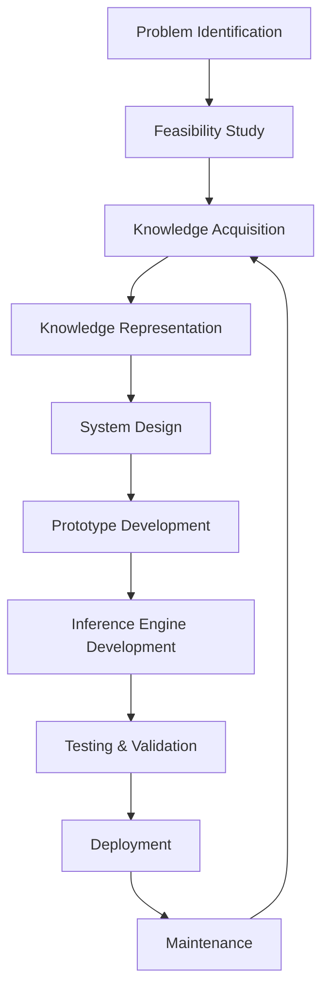
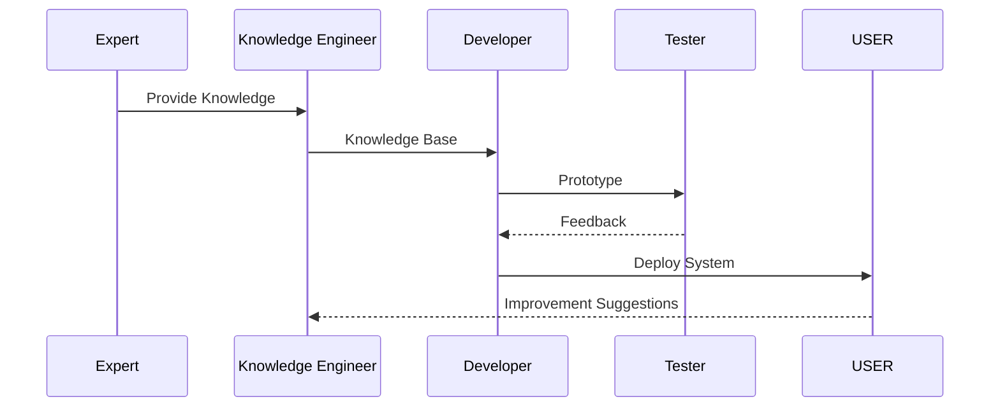

# Expert System Development Lifecycle (ESDLC)

## Table of Contents

- Introduction
- What is the Expert System Development Lifecycle?
- Definition
- Why ESDLC is Important
- History
- Need for ESDLC
- Characteristics
- Objectives
- Development Life Cycle Overview
- Phases of ESDLC
- Architecture of the Development Process
- Phase 1: Problem Identification
- Phase 2: Feasibility Study
- Phase 3: Knowledge Acquisition
- Phase 4: Knowledge Representation
- Phase 5: System Design
- Phase 6: Prototype Development
- Phase 7: Inference Engine Development
- Phase 8: Testing and Validation
- Phase 9: Deployment
- Phase 10: Maintenance and Knowledge Updating
- Roles in Expert System Development
- Development Methodologies
- Medical Diagnosis Example
- Loan Approval Example
- Manufacturing Example
- Advantages
- Challenges
- Best Practices
- Summary
- Key Terms
- Quick Quiz
- References

---

# Introduction

Building an Expert System involves much more than writing software. It requires collecting expert knowledge, organizing it into a Knowledge Base, designing reasoning mechanisms, validating decisions, deploying the system, and continuously updating its knowledge.

To manage this process efficiently, developers follow a structured approach known as the **Expert System Development Lifecycle (ESDLC)**.

The ESDLC provides a systematic framework for planning, developing, testing, deploying, and maintaining Expert Systems.

---

# What is the Expert System Development Lifecycle?

The **Expert System Development Lifecycle (ESDLC)** is a structured sequence of phases used to design, build, test, deploy, and maintain an Expert System.

Unlike the traditional Software Development Lifecycle (SDLC), ESDLC places significant emphasis on **knowledge acquisition**, **knowledge representation**, and **reasoning mechanisms**.

---

## Definition

> **The Expert System Development Lifecycle (ESDLC) is the systematic process of developing an Expert System through phases such as problem identification, knowledge acquisition, knowledge representation, implementation, testing, deployment, and maintenance.**

---

# Why ESDLC is Important

Following a structured lifecycle helps:

- Build reliable Expert Systems
- Capture expert knowledge accurately
- Reduce development risks
- Improve system quality
- Ensure maintainability
- Support continuous knowledge updates
- Produce explainable AI systems

---

# History

| Period | Development |
|---------|-------------|
| 1970s | Early Expert Systems developed without formal processes |
| 1980s | Structured Knowledge Engineering methodologies emerged |
| 1990s | Commercial Expert System development frameworks evolved |
| Today | Hybrid AI systems combine ESDLC with Agile, DevOps, and MLOps practices |

---

# Need for ESDLC

Without a structured lifecycle:

- Knowledge may be incomplete or inconsistent.
- Expert knowledge may be difficult to maintain.
- System quality becomes unpredictable.
- Validation becomes difficult.
- Updates become expensive.

A defined lifecycle ensures systematic development and long-term maintainability.

---

# Characteristics

An effective ESDLC is:

- Structured
- Knowledge-centric
- Iterative
- Modular
- Explainable
- Collaborative
- Maintainable
- Scalable

---

# Objectives

The objectives of ESDLC are:

- Develop high-quality Expert Systems
- Capture expert knowledge effectively
- Ensure accurate reasoning
- Simplify maintenance
- Reduce development costs
- Improve reliability
- Enable future expansion

---

# Development Life Cycle Overview

```mermaid
flowchart LR

Problem

-->

Feasibility

-->

Knowledge Acquisition

-->

Knowledge Representation

-->

Design

-->

Development

-->

Testing

-->

Deployment

-->

Maintenance
```

---

# Phases of ESDLC

1. Problem Identification
2. Feasibility Study
3. Knowledge Acquisition
4. Knowledge Representation
5. System Design
6. Prototype Development
7. Inference Engine Development
8. Testing and Validation
9. Deployment
10. Maintenance and Knowledge Updating

---

# Architecture of the Development Process

```mermaid
flowchart TD

Problem

-->

Knowledge Engineer

Knowledge Engineer

-->

Domain Expert

Domain Expert

-->

Knowledge Base

Knowledge Base

-->

Inference Engine

Inference Engine

-->

Prototype

Prototype

-->

Testing

Testing

-->

Deployment

Deployment

-->

Maintenance
```

---

# Phase 1: Problem Identification

The first step is defining the problem.

Activities include:

- Identify the domain.
- Define project goals.
- Determine users.
- Analyze system requirements.
- Define project scope.

Example:

```
Develop an Expert System for hospital diagnosis.
```

---

# Phase 2: Feasibility Study

Evaluate whether the project is practical.

Areas examined include:

- Technical feasibility
- Economic feasibility
- Operational feasibility
- Legal feasibility
- Time feasibility

---

# Phase 3: Knowledge Acquisition

Collect knowledge from:

- Domain experts
- Books
- Research papers
- Databases
- Historical records
- Organizational documents

Methods include:

- Interviews
- Observation
- Questionnaires
- Document analysis
- Think-aloud protocols

---

# Phase 4: Knowledge Representation

Convert acquired knowledge into machine-readable formats.

Common techniques:

- Production Rules
- Frames
- Semantic Networks
- Ontologies
- Case Libraries
- Decision Trees
- Logic-Based Representation

Example

```text
IF Temperature > 38°C

AND Cough = Yes

THEN Diagnosis = Flu
```

---

# Phase 5: System Design

Design system architecture.

Major components:

- User Interface
- Knowledge Base
- Working Memory
- Inference Engine
- Explanation System
- Knowledge Acquisition Module

---

# Phase 6: Prototype Development

Develop an initial working version.

Purpose:

- Validate requirements
- Collect user feedback
- Improve system design
- Identify missing knowledge

---

# Phase 7: Inference Engine Development

Develop reasoning mechanisms.

Common reasoning methods:

- Forward Chaining
- Backward Chaining
- Fuzzy Reasoning
- Case-Based Reasoning
- Hybrid Reasoning

---

# Phase 8: Testing and Validation

Testing ensures the Expert System produces correct decisions.

Testing includes:

- Functional testing
- Rule validation
- Knowledge verification
- Performance testing
- User acceptance testing

---

# Phase 9: Deployment

Deploy the Expert System to end users.

Deployment activities:

- Installation
- Configuration
- User training
- Documentation
- Performance monitoring

---

# Phase 10: Maintenance and Knowledge Updating

Expert knowledge changes over time.

Maintenance activities include:

- Updating rules
- Adding new knowledge
- Removing outdated knowledge
- Improving reasoning
- Fixing defects
- Performance optimization

---

# Overall Workflow



Knowledge continuously evolves, so maintenance often leads back to new knowledge acquisition.

---

# Roles in Expert System Development

| Role | Responsibility |
|------|----------------|
| Domain Expert | Provides domain knowledge |
| Knowledge Engineer | Captures and models knowledge |
| AI Developer | Implements the system |
| Software Engineer | Develops application components |
| Tester | Validates correctness |
| End User | Uses the Expert System |
| Project Manager | Coordinates development |

---

# Development Methodologies

Common methodologies include:

- Waterfall
- Spiral
- Incremental
- Agile
- Rapid Prototyping
- Hybrid Agile + Knowledge Engineering

---

# Medical Diagnosis Example

Project Goal

```
Diagnose infectious diseases.
```

Knowledge Sources

- Doctors
- Medical textbooks
- Clinical guidelines

Representation

```text
IF Fever

AND Cough

THEN Influenza
```

Testing

Compare system recommendations with doctor diagnoses.

---

# Loan Approval Example

Knowledge Source

- Financial experts
- Banking regulations

Rule

```text
IF Credit Score > 750

AND Income > ₹10,00,000

THEN Loan Approved
```

---

# Manufacturing Example

Knowledge Source

- Maintenance engineers
- Equipment manuals
- Sensor data

Rule

```text
IF Temperature = High

AND Pressure = High

THEN Stop Machine
```

---

# Complete Development Process



---

# Advantages

- Structured development process
- High-quality Knowledge Base
- Better maintainability
- Reliable reasoning
- Easier validation
- Continuous improvement
- Reduced project risk

---

# Challenges

- Knowledge acquisition bottleneck
- Expert availability
- High development cost
- Knowledge changes over time
- Validation complexity
- Integration with existing systems
- Long development cycles for complex domains

---

# Best Practices

- Clearly define project scope.
- Involve domain experts early.
- Build prototypes quickly.
- Validate knowledge continuously.
- Keep the Knowledge Base modular.
- Document all rules and assumptions.
- Test with real-world cases.
- Plan for long-term maintenance.
- Version-control the Knowledge Base.
- Gather user feedback after deployment.

---

# Summary

The **Expert System Development Lifecycle (ESDLC)** provides a structured approach for developing intelligent systems by combining software engineering practices with knowledge engineering principles. It covers every stage—from **problem identification** and **knowledge acquisition** to **testing**, **deployment**, and **continuous maintenance**. By following the ESDLC, organizations can build Expert Systems that are reliable, explainable, maintainable, and capable of adapting to evolving domain knowledge.

---

# Key Terms

| Term | Meaning |
|------|---------|
| ESDLC | Expert System Development Lifecycle |
| Knowledge Acquisition | Collecting expert knowledge |
| Knowledge Representation | Converting knowledge into machine-readable form |
| Prototype | Initial working version of the system |
| Inference Engine | Performs reasoning using stored knowledge |
| Knowledge Base | Repository of facts and rules |
| Validation | Ensuring knowledge is correct |
| Maintenance | Updating and improving the Expert System |

---

# Quick Quiz

## Beginner

1. What is the Expert System Development Lifecycle?
2. Why is ESDLC important?
3. What is the first phase of ESDLC?
4. What is knowledge acquisition?
5. Why is maintenance necessary?

---

## Intermediate

1. Explain each phase of the ESDLC.
2. Compare ESDLC with the traditional SDLC.
3. Why is prototyping useful?
4. Explain the role of the Knowledge Engineer.
5. Describe the testing process in Expert Systems.

---

## Advanced

1. Design an ESDLC for a medical diagnosis Expert System.
2. Explain the knowledge acquisition bottleneck and possible solutions.
3. Discuss how Agile practices can be integrated into ESDLC.
4. Compare traditional Expert System development with Hybrid AI development.
5. Explain why continuous knowledge maintenance is essential for long-term system accuracy.

---

# References

## Books

- **Expert Systems: Principles and Programming** — Joseph C. Giarratano & Gary D. Riley
- **Artificial Intelligence: A Modern Approach** — Stuart Russell & Peter Norvig
- **Building Expert Systems** — Frederick Hayes-Roth
- **Knowledge Representation and Reasoning** — Ronald Brachman & Hector Levesque

## Online Resources

- IBM AI Documentation
- MIT OpenCourseWare – Artificial Intelligence
- Stanford Artificial Intelligence Laboratory
- IEEE Xplore – Expert Systems and Knowledge Engineering
- Microsoft AI Learning Resources