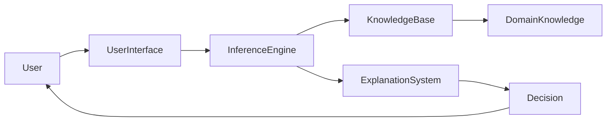
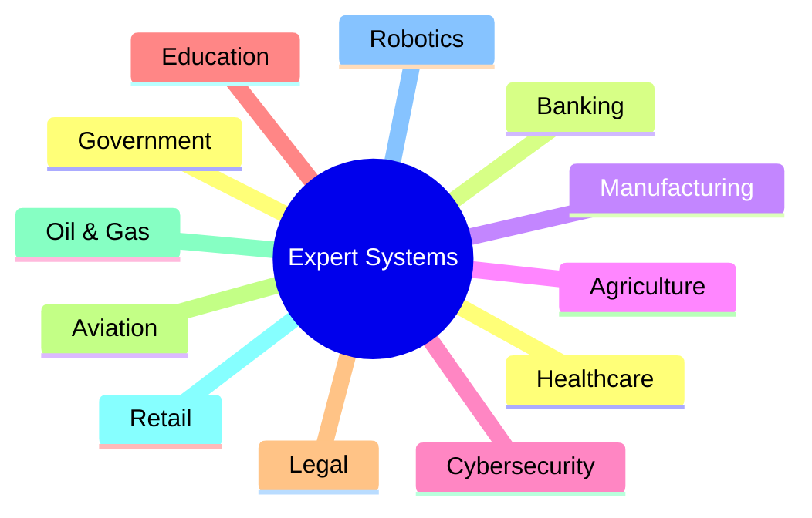
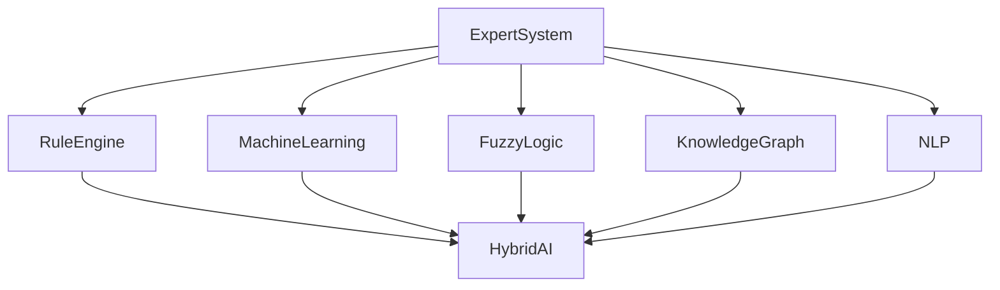

# Real-World Applications and Case Studies of Expert Systems

## Table of Contents

- Introduction
- What are Real-World Expert Systems?
- Why Expert Systems are Used in Industry
- Evolution of Real-World Expert Systems
- Key Characteristics
- General Architecture
- Major Application Areas
- Healthcare and Medicine
- Banking and Finance
- Manufacturing
- Cybersecurity
- Agriculture
- Education
- Legal Systems
- Oil and Gas Industry
- Aviation and Aerospace
- Telecommunications
- Retail and E-commerce
- Transportation and Logistics
- Government and Defense
- Famous Expert Systems
- Modern AI + Expert Systems
- Industry Case Studies
- Advantages
- Challenges
- Future Trends
- Summary
- Key Terms
- Quick Quiz
- References

---

# Introduction

Expert Systems have been successfully used in industries for more than five decades. They help organizations automate decision-making by capturing human expertise and applying logical reasoning to solve complex problems.

Today, Expert Systems are often integrated with **Machine Learning**, **Fuzzy Logic**, **Knowledge Graphs**, **Big Data**, and **Cloud Computing** to create intelligent decision-support systems.

They are widely used in healthcare, finance, manufacturing, cybersecurity, agriculture, transportation, and many other fields.

---

# What are Real-World Expert Systems?

A **Real-World Expert System** is an AI system that applies expert knowledge and reasoning techniques to solve practical problems in a specific domain.

Instead of replacing human experts, these systems assist professionals by providing recommendations, diagnoses, predictions, and decision support.

---

## Definition

> **A Real-World Expert System is an AI-based decision-support system that uses domain knowledge and inference mechanisms to solve practical problems in industries and organizations.**

---

# Why Expert Systems are Used in Industry

Organizations use Expert Systems to:

- Improve decision quality
- Reduce operational costs
- Increase productivity
- Preserve expert knowledge
- Support inexperienced employees
- Improve consistency
- Reduce human error
- Enable 24/7 decision support

---

# Evolution of Real-World Expert Systems

| Era | Development |
|------|-------------|
| 1970s | Research Expert Systems |
| 1980s | Commercial Expert Systems |
| 1990s | Enterprise Decision Support Systems |
| 2000s | Web-Based Expert Systems |
| 2010s | Cloud Expert Systems |
| Today | Hybrid AI and Explainable AI (XAI) systems |

---

# Key Characteristics

Real-world Expert Systems are:

- Domain-specific
- Knowledge-driven
- Explainable
- Reliable
- Scalable
- Maintainable
- Modular
- Decision-oriented

---

# General Architecture



---

# Major Application Areas



---

# Healthcare and Medicine

Expert Systems assist doctors by:

- Diagnosing diseases
- Recommending treatments
- Suggesting medications
- Detecting drug interactions
- Supporting clinical decisions

Example workflow


Applications:

- Disease diagnosis
- Medical imaging
- ICU monitoring
- Clinical decision support

---

# Banking and Finance

Applications include:

- Loan approval
- Credit risk analysis
- Fraud detection
- Investment advisory
- Insurance underwriting

Example Rule

```text
IF Credit Score > 750

AND Income > ₹10,00,000

THEN Approve Loan
```

---

# Manufacturing

Manufacturing Expert Systems perform:

- Fault diagnosis
- Machine monitoring
- Predictive maintenance
- Production planning
- Quality inspection

Example

```text
IF Temperature = High

AND Vibration = High

THEN Machine Failure Risk
```

---

# Cybersecurity

Applications include:

- Intrusion detection
- Malware analysis
- Threat intelligence
- Incident response
- Security auditing

Example

```text
IF Multiple Failed Logins

AND Unknown Location

THEN Possible Attack
```

---

# Agriculture

Expert Systems help farmers with:

- Crop selection
- Fertilizer recommendations
- Disease diagnosis
- Irrigation planning
- Pest management

Example

```text
IF Soil Moisture = Low

THEN Start Irrigation
```

---

# Education

Applications include:

- Intelligent tutoring systems
- Personalized learning
- Student performance prediction
- Course recommendations
- Academic advising

---

# Legal Systems

Expert Systems support:

- Legal research
- Contract analysis
- Compliance checking
- Case recommendation
- Legal advisory

---

# Oil and Gas Industry

Applications include:

- Equipment monitoring
- Drilling optimization
- Reservoir analysis
- Fault diagnosis
- Safety management

---

# Aviation and Aerospace

Used for:

- Aircraft diagnostics
- Flight planning
- Fault detection
- Maintenance scheduling
- Safety analysis

---

# Telecommunications

Applications:

- Network fault diagnosis
- Traffic optimization
- Customer support
- Service monitoring
- Resource allocation

---

# Retail and E-commerce

Expert Systems assist with:

- Product recommendations
- Inventory management
- Customer support
- Dynamic pricing
- Demand forecasting

---

# Transportation and Logistics

Applications:

- Route optimization
- Fleet management
- Traffic management
- Warehouse automation
- Delivery planning

---

# Government and Defense

Applications include:

- Intelligence analysis
- Disaster management
- Border security
- Resource planning
- Military decision support

---

# Famous Expert Systems

## DENDRAL

Purpose:

- Chemical structure analysis

Key Features:

- Rule-Based reasoning
- Organic chemistry

---

## MYCIN

Purpose:

- Medical diagnosis

Features:

- Antibiotic recommendation
- Bacterial infection diagnosis
- Confidence factors

---

## XCON (R1)

Purpose:

- Computer configuration

Developed for:

- Digital Equipment Corporation (DEC)

Benefits:

- Automated hardware configuration
- Reduced configuration errors

---

## PROSPECTOR

Purpose:

- Mineral exploration

Features:

- Geological reasoning
- Probability-based decisions

---

## CADUCEUS

Purpose:

- Internal medicine diagnosis

Features:

- Thousands of medical rules
- Clinical reasoning

---

# Modern AI + Expert Systems

Modern systems combine Expert Systems with:

- Machine Learning
- Deep Learning
- Fuzzy Logic
- Knowledge Graphs
- Natural Language Processing
- Big Data
- Cloud Computing
- Internet of Things (IoT)



---

# Industry Case Studies

## Case Study 1 – Hospital Diagnosis

Problem

Doctors need faster diagnosis support.

Solution

Medical Expert System with:

- Rule-Based reasoning
- Patient database
- Drug interaction checking

Benefits

- Faster diagnosis
- Improved consistency
- Better treatment recommendations

---

## Case Study 2 – Banking Fraud Detection

Problem

Large number of fraudulent transactions.

Solution

Hybrid Expert System using:

- Rules
- Machine Learning
- Historical fraud cases

Benefits

- Faster fraud detection
- Lower financial losses
- Improved security

---

## Case Study 3 – Manufacturing

Problem

Unexpected machine failures.

Solution

Expert System monitors:

- Temperature
- Pressure
- Vibration

Benefits

- Predictive maintenance
- Reduced downtime
- Lower repair costs

---

## Case Study 4 – Agriculture

Problem

Low crop productivity.

Solution

Expert System recommends:

- Crops
- Fertilizers
- Irrigation schedules
- Pest control

Benefits

- Increased yield
- Reduced water usage
- Better resource utilization

---

# Advantages

- Preserves expert knowledge
- Faster decision making
- Improved consistency
- Reduced operational costs
- Increased productivity
- Explainable reasoning
- Supports complex decision making
- Available 24/7

---

# Challenges

- Knowledge acquisition bottleneck
- High development cost
- Continuous maintenance
- Limited creativity
- Domain-specific knowledge
- Integration complexity
- Handling rapidly changing knowledge

---

# Future Trends

Future Expert Systems will increasingly integrate with:

- Generative AI
- Explainable AI (XAI)
- Autonomous Robots
- Large Language Models (LLMs)
- Digital Twins
- Edge AI
- Knowledge Graphs
- Multi-Agent Systems
- Reinforcement Learning

---

# Summary

Expert Systems have evolved from simple rule-based programs into powerful decision-support platforms used across healthcare, banking, manufacturing, cybersecurity, education, transportation, agriculture, and government. Modern Expert Systems often combine symbolic reasoning with Machine Learning, Fuzzy Logic, and Knowledge Graphs to create **Hybrid AI** solutions that are accurate, explainable, and scalable. Despite challenges such as knowledge acquisition and maintenance, they continue to play a vital role in solving complex real-world problems.

---

# Key Terms

| Term | Meaning |
|------|---------|
| Decision Support System | Assists humans in making decisions |
| Domain Expert | Specialist in a particular field |
| MYCIN | Medical Expert System |
| DENDRAL | Chemical analysis Expert System |
| XCON | Computer configuration Expert System |
| Hybrid AI | Combination of multiple AI techniques |
| Explainable AI (XAI) | AI whose decisions can be understood by humans |
| Predictive Maintenance | Predicting equipment failures before they occur |

---

# Quick Quiz

## Beginner

1. What is a Real-World Expert System?
2. Name four industries that use Expert Systems.
3. What is MYCIN?
4. What is XCON used for?
5. Why are Expert Systems important?

---

## Intermediate

1. Explain how Expert Systems are used in healthcare.
2. Compare Expert Systems in banking and manufacturing.
3. Why are Hybrid Expert Systems becoming popular?
4. Explain the architecture of a real-world Expert System.
5. Discuss the role of Explainable AI in Expert Systems.

---

## Advanced

1. Design an Expert System for smart agriculture.
2. Explain how Expert Systems can be integrated with Large Language Models (LLMs).
3. Compare traditional Expert Systems with modern Hybrid AI systems.
4. Discuss the future of Expert Systems in Industry 4.0.
5. Design a real-world cybersecurity Expert System with rule-based and machine learning components.

---

# References

## Books

- **Artificial Intelligence: A Modern Approach** — Stuart Russell & Peter Norvig
- **Expert Systems: Principles and Programming** — Joseph C. Giarratano & Gary D. Riley
- **Building Expert Systems** — Frederick Hayes-Roth
- **Knowledge Representation and Reasoning** — Ronald Brachman & Hector Levesque

## Online Resources

- IBM AI Documentation
- Microsoft AI Learning Resources
- MIT OpenCourseWare – Artificial Intelligence
- Stanford Artificial Intelligence Laboratory
- IEEE Xplore – Expert Systems Research