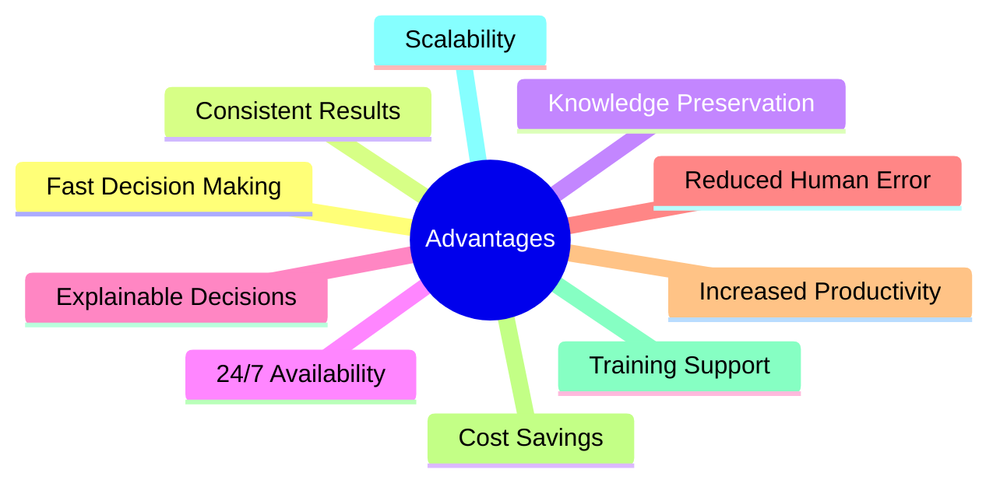
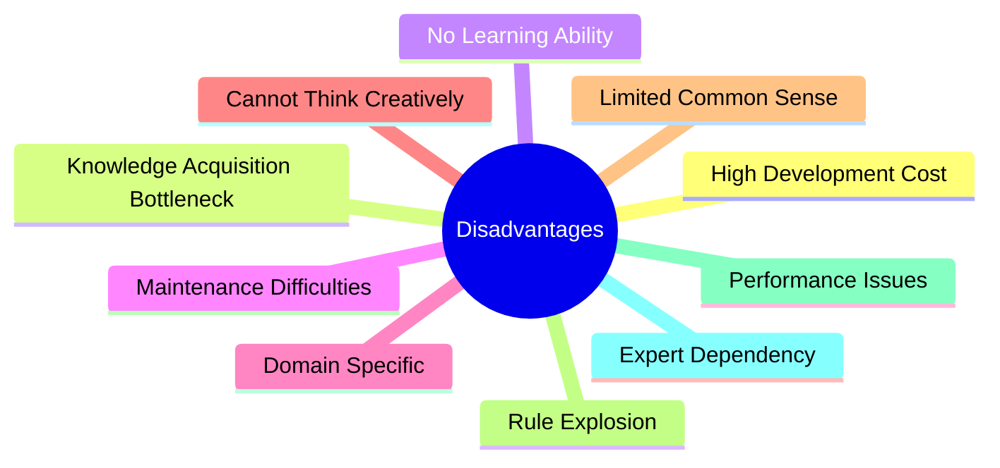
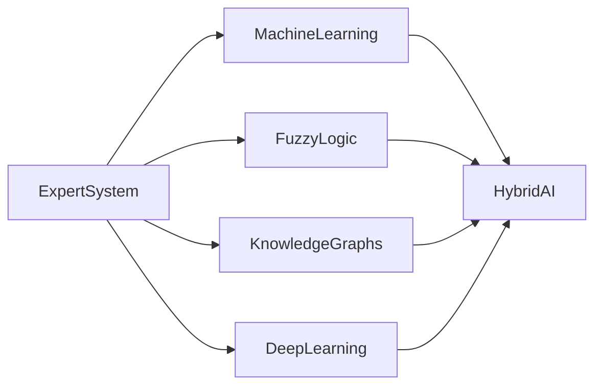

# Advantages and Disadvantages of Expert Systems

## Table of Contents

- Introduction
- Why Evaluate Expert Systems?
- Advantages of Expert Systems
- Disadvantages of Expert Systems
- Advantages Explained
- Disadvantages Explained
- Comparison Table
- Real-World Examples
- When Should Expert Systems Be Used?
- When Should They Not Be Used?
- Modern Improvements
- Future Outlook
- Summary
- Key Terms
- Quick Quiz
- References

---

# Introduction

Expert Systems are among the earliest successful applications of Artificial Intelligence. They simulate the decision-making ability of human experts by using a **Knowledge Base**, an **Inference Engine**, and logical reasoning techniques.

Although Expert Systems provide many benefits such as consistent decision-making, knowledge preservation, and automation, they also have limitations including high development costs, lack of learning ability, and difficulty handling rapidly changing knowledge.

Understanding both their strengths and weaknesses helps organizations decide when Expert Systems are the right solution.

---

# Why Evaluate Expert Systems?

Evaluating Expert Systems helps organizations to:

- Determine project feasibility
- Understand system limitations
- Improve decision-making
- Choose appropriate AI technologies
- Reduce development risks
- Improve system performance

---

# Advantages of Expert Systems



---

# Advantages Explained

## 1. Knowledge Preservation

Expert Systems preserve valuable knowledge from experienced professionals.

Benefits:

- Prevents knowledge loss
- Stores organizational expertise
- Allows future reuse

Example:

A hospital stores medical expertise from senior doctors.

---

## 2. Fast Decision Making

Expert Systems process thousands of rules within seconds.

Applications:

- Medical diagnosis
- Loan approval
- Fault detection

---

## 3. Consistent Decisions

Unlike humans, Expert Systems do not become tired or emotional.

Advantages:

- Same input
- Same reasoning
- Same output

This improves reliability.

---

## 4. 24/7 Availability

Expert Systems can operate continuously without breaks.

Useful for:

- Customer support
- Manufacturing
- Network monitoring
- Healthcare

---

## 5. Reduced Human Error

Rules are executed exactly as defined.

Example:

```text
IF Temperature > 38°C

AND Cough = Yes

THEN Diagnosis = Flu
```

No accidental omission of rules.

---

## 6. Explainable Decisions

Most Expert Systems include an **Explanation System**.

Example:

```
Diagnosis: Influenza

Reason:

Temperature > 38°C

Cough = Yes

Body Pain = Yes
```

Users can understand how the conclusion was reached.

---

## 7. Improved Productivity

Employees spend less time on repetitive decision-making.

Applications:

- Banking
- Insurance
- Technical support
- Manufacturing

---

## 8. Cost Savings

Benefits include:

- Reduced operational costs
- Lower training expenses
- Fewer mistakes
- Increased efficiency

---

## 9. Supports Training

New employees can learn by observing the system's reasoning process.

Example:

Medical interns use diagnostic Expert Systems for learning.

---

## 10. Handles Complex Rules

Expert Systems can manage thousands of interconnected rules efficiently.

Example:

Large medical diagnosis systems containing thousands of diagnostic rules.

---

# Disadvantages of Expert Systems



---

# Disadvantages Explained

## 1. High Development Cost

Building Expert Systems requires:

- Domain experts
- Knowledge engineers
- AI developers
- Extensive testing

This increases project costs.

---

## 2. Knowledge Acquisition Bottleneck

Extracting knowledge from experts is difficult because:

- Experts may disagree.
- Knowledge may be incomplete.
- Tacit knowledge is difficult to explain.

This is one of the biggest challenges.

---

## 3. No Learning Ability

Traditional Expert Systems cannot automatically learn from new data.

Unlike Machine Learning systems, knowledge must be updated manually.

---

## 4. Maintenance is Difficult

Knowledge changes over time.

Maintenance activities include:

- Updating rules
- Removing outdated knowledge
- Adding new knowledge
- Resolving conflicts

Large Knowledge Bases become difficult to maintain.

---

## 5. Domain-Specific

An Expert System designed for healthcare cannot automatically solve legal or financial problems.

Each domain requires a separate Knowledge Base.

---

## 6. Limited Creativity

Expert Systems only apply predefined rules.

They cannot:

- Invent new ideas
- Think creatively
- Use intuition
- Make imaginative decisions

---

## 7. Lack of Common Sense

Expert Systems only know what has been explicitly encoded.

They cannot naturally understand everyday situations without corresponding rules.

---

## 8. Rule Explosion

As systems grow:

- Number of rules increases
- Rule conflicts occur
- Performance decreases
- Maintenance becomes more complex

---

## 9. Performance Issues

Very large Knowledge Bases require:

- More memory
- More processing power
- Better optimization

---

## 10. Dependence on Experts

If domain experts are unavailable:

- Knowledge acquisition slows down.
- Updates become difficult.
- System quality may decline.

---

# Advantages vs Disadvantages

| Advantages | Disadvantages |
|------------|---------------|
| Fast decisions | High development cost |
| Consistent reasoning | Difficult knowledge acquisition |
| Knowledge preservation | No automatic learning |
| Explainable results | Maintenance challenges |
| Reduced human error | Domain-specific |
| 24/7 availability | Limited creativity |
| Increased productivity | Lacks common sense |
| Cost savings over time | Rule explosion |
| Supports training | Expert dependency |
| Reliable automation | Scalability challenges |

---

# Real-World Examples

## Medical Diagnosis

Advantages:

- Faster diagnosis
- Consistent recommendations
- Clinical decision support

Limitations:

- Requires continuous medical updates.
- Cannot replace experienced physicians.

---

## Banking

Advantages:

- Loan approval automation
- Fraud detection
- Risk assessment

Limitations:

- Financial regulations frequently change.
- Rules require regular updates.

---

## Manufacturing

Advantages:

- Predictive maintenance
- Fault diagnosis
- Reduced downtime

Limitations:

- Equipment upgrades require Knowledge Base updates.

---

## Agriculture

Advantages:

- Crop recommendations
- Irrigation advice
- Pest diagnosis

Limitations:

- Weather conditions change rapidly.
- Local knowledge must be updated frequently.

---

# When Should Expert Systems Be Used?

Expert Systems are suitable when:

- Knowledge is well-defined.
- Rules are stable.
- Decisions require consistency.
- Expert knowledge must be preserved.
- Explainability is important.
- Human experts are scarce.

Examples:

- Medical diagnosis
- Tax advisory
- Legal advisory
- Industrial fault diagnosis
- Equipment troubleshooting

---

# When Should They Not Be Used?

Expert Systems are less suitable when:

- Problems require creativity.
- Data changes continuously.
- Knowledge is highly uncertain.
- Learning from massive datasets is required.
- Human intuition is essential.

Examples:

- Artistic creation
- Stock market prediction (without learning models)
- Autonomous driving using only rules
- Image recognition using only rule-based logic

---

# Modern Improvements

Modern AI addresses many traditional limitations by combining Expert Systems with:



Benefits:

- Automatic learning
- Better uncertainty handling
- Improved accuracy
- Adaptability
- More intelligent decision-making

---

# Future Outlook

Future Expert Systems are expected to integrate with:

- Large Language Models (LLMs)
- Explainable AI (XAI)
- Knowledge Graphs
- Autonomous Robots
- Multi-Agent Systems
- Internet of Things (IoT)
- Cloud Computing
- Edge AI
- Digital Twins

These integrations will make Expert Systems more adaptive, collaborative, and intelligent.

---

# Summary

Expert Systems provide **fast, consistent, explainable, and reliable decision-making** by capturing and applying expert knowledge. Their major strengths include knowledge preservation, reduced human error, continuous availability, and improved productivity. However, they also face challenges such as **high development costs**, **knowledge acquisition bottlenecks**, **lack of automatic learning**, and **maintenance complexity**. Modern Hybrid AI approaches combine Expert Systems with Machine Learning, Fuzzy Logic, and Knowledge Graphs to overcome many of these limitations and extend their capabilities.

---

# Key Terms

| Term | Meaning |
|------|---------|
| Knowledge Preservation | Storing expert knowledge for future use |
| Knowledge Acquisition Bottleneck | Difficulty in collecting expert knowledge |
| Rule Explosion | Rapid growth in the number of rules |
| Explainability | Ability to explain decisions |
| Hybrid AI | Combination of multiple AI techniques |
| Domain-Specific | Designed for a particular field |
| Scalability | Ability to grow without major performance loss |
| Maintenance | Updating and managing the Knowledge Base |

---

# Quick Quiz

## Beginner

1. What are the main advantages of Expert Systems?
2. Why are Expert Systems consistent?
3. What is knowledge preservation?
4. Why are Expert Systems available 24/7?
5. What is the Knowledge Acquisition Bottleneck?

---

## Intermediate

1. Explain why Expert Systems are explainable.
2. Compare the advantages and disadvantages of Expert Systems.
3. Why do traditional Expert Systems lack learning ability?
4. What is rule explosion?
5. How do Hybrid AI systems improve Expert Systems?

---

## Advanced

1. Design an Expert System for a hospital and identify its advantages and limitations.
2. Explain how Machine Learning can overcome traditional Expert System limitations.
3. Discuss the challenges of maintaining large Knowledge Bases.
4. Compare Expert Systems with modern AI-based decision-support systems.
5. Analyze the future role of Expert Systems in Explainable AI (XAI).

---

# References

## Books

- **Expert Systems: Principles and Programming** — Joseph C. Giarratano & Gary D. Riley
- **Artificial Intelligence: A Modern Approach** — Stuart Russell & Peter Norvig
- **Knowledge Representation and Reasoning** — Ronald Brachman & Hector Levesque
- **Building Expert Systems** — Frederick Hayes-Roth

## Online Resources

- IBM AI Documentation
- MIT OpenCourseWare – Artificial Intelligence
- Stanford Artificial Intelligence Laboratory
- IEEE Xplore – Expert Systems Research
- Microsoft AI Learning Resources