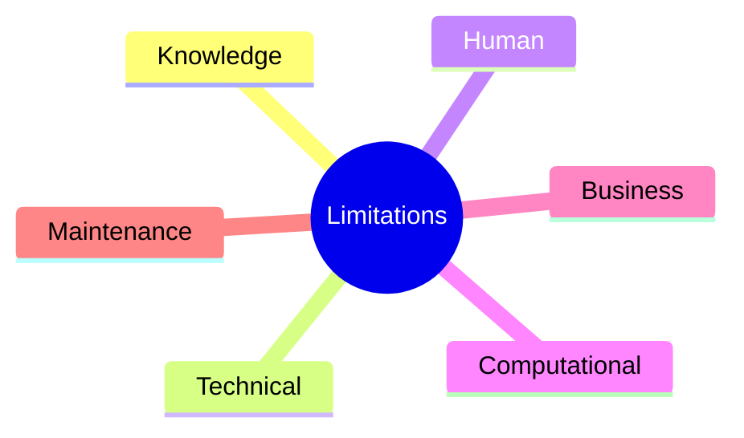
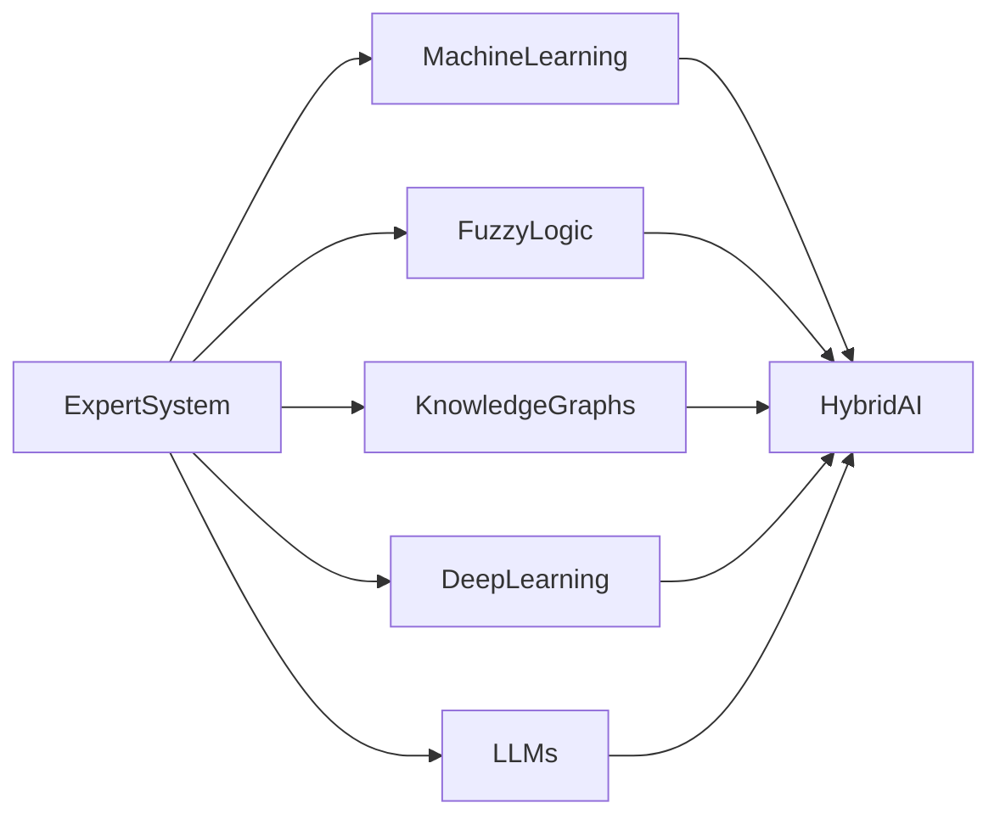

# Limitations of Expert Systems

## Table of Contents

- Introduction
- What are the Limitations of Expert Systems?
- Why Understanding Limitations is Important
- Categories of Limitations
- Technical Limitations
- Knowledge-Related Limitations
- Human-Related Limitations
- Computational Limitations
- Business Limitations
- Real-World Examples
- Comparison with Modern AI
- Overcoming Limitations
- Future Improvements
- Summary
- Key Terms
- Quick Quiz
- References

---

# Introduction

Expert Systems are one of the earliest successful applications of Artificial Intelligence. They can solve complex domain-specific problems by using a **Knowledge Base**, **Inference Engine**, and **logical reasoning**.

Although Expert Systems provide fast, consistent, and explainable decision-making, they are not perfect. Traditional Expert Systems depend heavily on manually created knowledge and predefined rules, making them unsuitable for many dynamic and uncertain real-world environments.

Understanding these limitations helps organizations determine when an Expert System is appropriate and when other AI techniques, such as Machine Learning or Hybrid AI, should be used.

---

# What are the Limitations of Expert Systems?

**Limitations** are the weaknesses or constraints that reduce the effectiveness, flexibility, scalability, or applicability of Expert Systems.

These limitations arise because Expert Systems rely primarily on explicitly encoded knowledge rather than learning from experience.

---

## Definition

> **The limitations of Expert Systems are the practical, technical, and operational constraints that prevent them from solving every type of problem with the flexibility and adaptability of human experts.**

---

# Why Understanding Limitations is Important

Studying limitations helps to:

- Select the right AI technology
- Reduce project risks
- Improve system design
- Plan maintenance
- Choose hybrid AI approaches
- Understand realistic expectations

---

# Categories of Limitations



---

# Technical Limitations

## 1. No Learning Capability

Traditional Expert Systems cannot automatically learn from new experiences.

Example:

A medical Expert System cannot discover a new disease unless experts manually update the Knowledge Base.

---

## 2. Static Knowledge Base

Knowledge remains fixed until modified.

Problems include:

- Outdated rules
- Old regulations
- Obsolete medical guidelines
- Technology changes

---

## 3. Rule Explosion

As knowledge grows:

- Rules increase rapidly
- Relationships become complicated
- Performance decreases
- Maintenance becomes difficult

Example

```text
100 Rules

↓

500 Rules

↓

5,000 Rules

↓

50,000 Rules
```

---

## 4. Scalability Problems

Large Expert Systems require:

- More memory
- More processing time
- Better optimization
- Efficient rule indexing

---

## 5. Performance Bottlenecks

Searching thousands of rules increases inference time.

This is especially problematic in real-time systems.

---

# Knowledge-Related Limitations

## 1. Knowledge Acquisition Bottleneck

Collecting expert knowledge is difficult because:

- Experts are busy.
- Knowledge may be incomplete.
- Tacit knowledge is difficult to explain.
- Different experts may disagree.

This is considered one of the biggest challenges in Expert System development.

---

## 2. Knowledge Representation Difficulties

Some knowledge is difficult to express using:

- IF–THEN rules
- Frames
- Semantic Networks

Examples include:

- Human intuition
- Creativity
- Common sense
- Emotional reasoning

---

## 3. Knowledge Obsolescence

Knowledge changes continuously.

Examples:

- Medical treatments
- Tax regulations
- Cybersecurity threats
- Legal policies

Frequent updates are required.

---

## 4. Knowledge Conflicts

Different experts may provide contradictory rules.

Example

Expert A

```text
IF Fever

THEN Viral Infection
```

Expert B

```text
IF Fever

THEN Bacterial Infection
```

Conflict resolution mechanisms are required.

---

# Human-Related Limitations

## 1. Lack of Creativity

Expert Systems cannot:

- Invent new ideas
- Think outside predefined knowledge
- Perform creative reasoning

---

## 2. No Common Sense

Expert Systems only know what has been explicitly encoded.

Unlike humans, they cannot infer obvious everyday facts without rules.

---

## 3. No Intuition

Humans often make decisions based on experience and intuition.

Traditional Expert Systems rely only on logical reasoning.

---

## 4. No Emotional Intelligence

Expert Systems cannot understand:

- Emotions
- Feelings
- Human relationships
- Social context

---

# Computational Limitations

## 1. High Development Cost

Building Expert Systems requires:

- Domain experts
- Knowledge engineers
- AI developers
- Testing teams

This increases project costs.

---

## 2. High Maintenance Cost

Knowledge Bases require continuous updates.

Maintenance activities include:

- Rule updates
- Knowledge validation
- Conflict resolution
- Performance optimization

---

## 3. Computational Complexity

Large Knowledge Bases increase:

- Search complexity
- Rule matching time
- Memory usage

---

# Business Limitations

## 1. Domain Specificity

Expert Systems usually work only within one domain.

Example:

A medical Expert System cannot perform legal reasoning.

---

## 2. Dependence on Experts

If experts are unavailable:

- Development slows
- Updates become difficult
- Knowledge quality decreases

---

## 3. Long Development Time

Knowledge acquisition, validation, testing, and deployment can take months or years.

---

## 4. Limited Adaptability

Traditional Expert Systems cannot automatically adapt to:

- New environments
- New regulations
- New products
- New diseases

---

# Complete View of Limitations

```mermaid
flowchart TD

Expert System

-->

Knowledge Limitations

Expert System

-->

Technical Limitations

Expert System

-->

Human Limitations

Expert System

-->

Business Limitations

Knowledge Limitations --> Reduced Accuracy

Technical Limitations --> Lower Performance

Human Limitations --> Reduced Flexibility

Business Limitations --> Higher Cost
```

---

# Real-World Examples

## Medical Diagnosis

Limitation

A new disease appears.

Problem

The Expert System cannot diagnose it until experts update the Knowledge Base.

---

## Banking

Limitation

Government regulations change.

Problem

Loan approval rules become outdated.

---

## Cybersecurity

Limitation

New malware appears every day.

Problem

Static rules cannot detect unknown threats.

---

## Manufacturing

Limitation

Machines are upgraded.

Problem

Maintenance rules must be rewritten.

---

# Comparison with Modern AI

| Expert Systems | Modern AI |
|---------------|-----------|
| Rule-based | Learns from data |
| Static knowledge | Continuously learns |
| Explainable | May be less explainable |
| Manual updates | Automatic model retraining |
| Domain-specific | More adaptable |
| Limited creativity | Can generate novel outputs |
| Symbolic reasoning | Statistical and neural reasoning |

---

# Overcoming Limitations

Modern AI improves Expert Systems through:



Solutions include:

- Machine Learning for automatic learning
- Fuzzy Logic for uncertainty handling
- Case-Based Reasoning for experience reuse
- Knowledge Graphs for richer knowledge representation
- Large Language Models (LLMs) for natural language understanding
- Hybrid AI to combine symbolic and data-driven approaches

---

# Future Improvements

Future Expert Systems are expected to:

- Learn continuously from new data
- Integrate with Generative AI
- Use Explainable AI (XAI)
- Support autonomous decision-making
- Utilize Knowledge Graphs
- Collaborate with Multi-Agent Systems
- Operate on cloud and edge platforms

---

# Summary

Although Expert Systems are effective for structured, rule-based decision-making, they have important limitations. These include **knowledge acquisition bottlenecks**, **lack of automatic learning**, **difficulty handling uncertainty**, **maintenance complexity**, **high development costs**, **limited creativity**, and **domain-specific operation**. Modern AI addresses many of these challenges by integrating Expert Systems with Machine Learning, Fuzzy Logic, Knowledge Graphs, Large Language Models, and other AI techniques to create more adaptive and intelligent Hybrid AI systems.

---

# Key Terms

| Term | Meaning |
|------|---------|
| Knowledge Acquisition Bottleneck | Difficulty in collecting expert knowledge |
| Rule Explosion | Rapid growth in the number of rules |
| Static Knowledge | Knowledge that does not update automatically |
| Knowledge Obsolescence | Knowledge becoming outdated over time |
| Scalability | Ability to handle increasing system size efficiently |
| Hybrid AI | Combination of multiple AI techniques |
| Common Sense Reasoning | Everyday reasoning beyond explicit rules |
| Domain Specific | Limited to a particular application area |

---

# Quick Quiz

## Beginner

1. What is the biggest limitation of traditional Expert Systems?
2. Why can't Expert Systems learn automatically?
3. What is the Knowledge Acquisition Bottleneck?
4. What is rule explosion?
5. Why are Expert Systems domain-specific?

---

## Intermediate

1. Explain the technical limitations of Expert Systems.
2. Compare knowledge-related and business-related limitations.
3. Why is maintaining a Knowledge Base difficult?
4. Explain why Expert Systems lack common sense.
5. How does Hybrid AI overcome traditional limitations?

---

## Advanced

1. Design a Hybrid Expert System that addresses the limitations of traditional Expert Systems.
2. Compare the limitations of Expert Systems with Machine Learning systems.
3. Discuss strategies for reducing the Knowledge Acquisition Bottleneck.
4. Explain how Knowledge Graphs improve Expert Systems.
5. Analyze the future role of Expert Systems in Explainable AI (XAI).

---

# References

## Books

- **Expert Systems: Principles and Programming** — Joseph C. Giarratano & Gary D. Riley
- **Artificial Intelligence: A Modern Approach** — Stuart Russell & Peter Norvig
- **Knowledge Representation and Reasoning** — Ronald Brachman & Hector Levesque
- **Building Expert Systems** — Frederick Hayes-Roth

## Online Resources

- IBM AI Documentation
- MIT OpenCourseWare – Artificial Intelligence
- Stanford Artificial Intelligence Laboratory
- IEEE Xplore – Expert Systems Research
- Microsoft AI Learning Resources