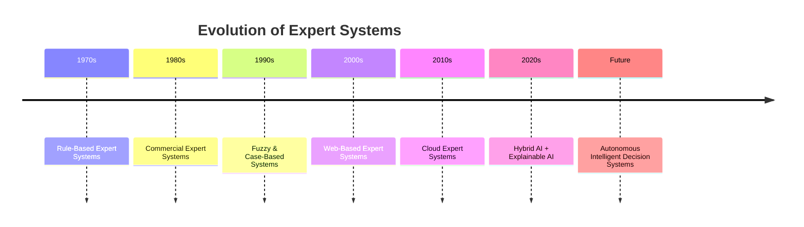
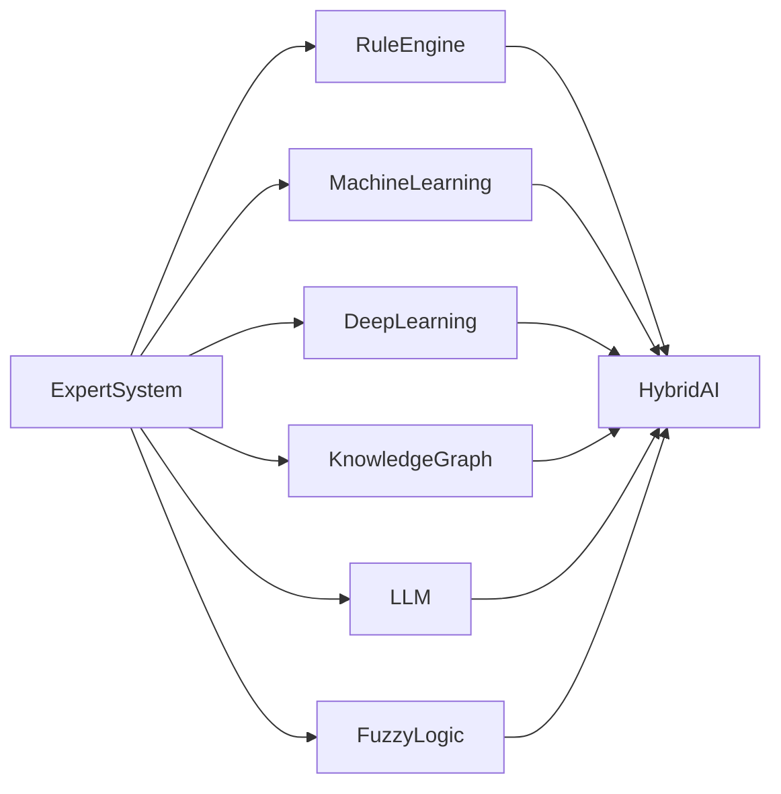
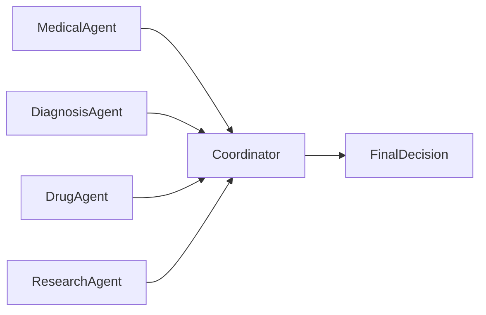

# Future of Expert Systems

## Table of Contents

- Introduction
- Why the Future of Expert Systems Matters
- Evolution of Expert Systems
- Current Trends
- Future Technologies
- Integration with Modern AI
- Explainable AI (XAI)
- Large Language Models (LLMs)
- Hybrid AI Systems
- Knowledge Graphs
- Multi-Agent Systems
- Internet of Things (IoT)
- Cloud Computing
- Edge AI
- Digital Twins
- Robotics and Autonomous Systems
- Industry-Wise Future Applications
- Challenges
- Opportunities
- Future Architecture
- Predictions for the Next Decade
- Summary
- Key Terms
- Quick Quiz
- References

---

# Introduction

Expert Systems have evolved significantly since their introduction in the 1970s. Early systems such as **DENDRAL**, **MYCIN**, and **XCON** demonstrated that computers could imitate human expert reasoning using rule-based knowledge.

However, traditional Expert Systems have limitations such as static knowledge, lack of learning, and difficulty handling uncertainty.

The future of Expert Systems lies in integrating symbolic reasoning with modern Artificial Intelligence technologies including **Machine Learning**, **Deep Learning**, **Large Language Models (LLMs)**, **Knowledge Graphs**, **Explainable AI (XAI)**, **Internet of Things (IoT)**, and **Multi-Agent Systems**.

Rather than disappearing, Expert Systems are evolving into intelligent, adaptive, and explainable decision-support systems.

---

# Why the Future of Expert Systems Matters

Future Expert Systems aim to:

- Learn continuously
- Handle uncertainty
- Explain decisions
- Collaborate with humans
- Process massive knowledge bases
- Support autonomous decision-making
- Improve trust in AI

---

# Evolution of Expert Systems



---

# Current Trends

Modern Expert Systems increasingly integrate with:

- Machine Learning
- Deep Learning
- Natural Language Processing (NLP)
- Knowledge Graphs
- Cloud Computing
- IoT
- Robotics
- Explainable AI (XAI)
- Generative AI
- Large Language Models (LLMs)

---

# Future Technologies

| Technology | Role |
|------------|------|
| Machine Learning | Automatic learning from data |
| Deep Learning | Pattern recognition |
| LLMs | Natural language understanding and reasoning |
| Knowledge Graphs | Structured knowledge representation |
| XAI | Explainable decision making |
| IoT | Real-time sensor data |
| Cloud Computing | Scalable infrastructure |
| Edge AI | Low-latency local inference |
| Digital Twins | Simulation and prediction |
| Multi-Agent Systems | Collaborative intelligence |

---

# Integration with Modern AI



The result is **Hybrid AI**, combining symbolic reasoning with data-driven intelligence.

---

# Explainable AI (XAI)

Future Expert Systems will become central to Explainable AI because they can clearly show:

- Which rules were applied
- Why a decision was made
- Confidence levels
- Alternative conclusions
- Supporting evidence

Example:

```text
Diagnosis: Influenza

Reason:
✓ Fever > 38°C
✓ Persistent Cough
✓ Positive Influenza Test

Confidence: 95%
```

---

# Large Language Models (LLMs)

LLMs such as modern conversational AI can enhance Expert Systems by:

- Understanding natural language
- Answering complex questions
- Summarizing expert knowledge
- Assisting knowledge engineers
- Generating documentation
- Explaining system reasoning

Example workflow:

```mermaid
flowchart LR

User

-->

LLM

-->

Expert System

-->

Knowledge Base

-->

Inference Engine

-->

Decision

-->

LLM

-->

Explanation

-->

User
```

---

# Hybrid AI Systems

Hybrid AI combines multiple AI techniques.

Components may include:

- Rule-Based Reasoning
- Machine Learning
- Neural Networks
- Case-Based Reasoning
- Fuzzy Logic
- Bayesian Networks
- LLMs

Advantages:

- Better accuracy
- Better adaptability
- Improved explainability
- Continuous learning
- Robust decision-making

---

# Knowledge Graphs

Knowledge Graphs provide:

- Rich semantic relationships
- Connected knowledge
- Improved reasoning
- Better information retrieval
- Easier knowledge updates

Example:


---

# Multi-Agent Systems

Future Expert Systems will collaborate with multiple intelligent agents.



Benefits:

- Distributed intelligence
- Parallel reasoning
- Fault tolerance
- Scalability

---

# Internet of Things (IoT)

IoT devices provide continuous real-time data.

Applications:

- Smart hospitals
- Smart factories
- Smart agriculture
- Smart cities
- Energy management

Workflow:

```mermaid
flowchart LR

Sensors

-->

IoT Gateway

-->

Expert System

-->

Decision

-->

Action
```

---

# Cloud Computing

Cloud platforms enable:

- Centralized Knowledge Bases
- High availability
- Global accessibility
- Automatic updates
- Large-scale deployment

Benefits:

- Scalability
- Cost efficiency
- Collaboration
- Reliability

---

# Edge AI

Instead of sending every request to the cloud, future Expert Systems will perform reasoning directly on local devices.

Applications:

- Autonomous vehicles
- Medical devices
- Drones
- Industrial robots
- Smart cameras

Advantages:

- Low latency
- Improved privacy
- Reduced bandwidth usage
- Faster response times

---

# Digital Twins

Digital Twins create virtual models of physical systems.

Expert Systems use them for:

- Predictive maintenance
- Simulation
- Risk analysis
- Process optimization

Example:

```mermaid
flowchart LR

Physical Machine

-->

Digital Twin

-->

Expert System

-->

Maintenance Recommendation
```

---

# Robotics and Autonomous Systems

Future robots will integrate Expert Systems for:

- Decision making
- Fault diagnosis
- Task planning
- Human collaboration
- Safety monitoring

Examples:

- Warehouse robots
- Surgical robots
- Space exploration
- Agricultural robots
- Disaster response robots

---

# Industry-Wise Future Applications

| Industry | Future Applications |
|----------|---------------------|
| Healthcare | AI-assisted diagnosis, personalized treatment |
| Banking | Intelligent fraud prevention, financial advisory |
| Manufacturing | Self-optimizing factories |
| Agriculture | Autonomous farming systems |
| Cybersecurity | Automated threat hunting |
| Transportation | Autonomous traffic management |
| Education | Personalized AI tutors |
| Government | Smart policy decision support |
| Energy | Intelligent power grid management |
| Retail | Hyper-personalized recommendations |

---

# Challenges

Future Expert Systems must address:

- Data privacy
- AI ethics
- Bias in knowledge
- Knowledge validation
- Cybersecurity risks
- Integration complexity
- Regulatory compliance
- Trustworthiness

---

# Opportunities

Future opportunities include:

- Human-AI collaboration
- Explainable AI
- Healthcare innovation
- Sustainable agriculture
- Smart cities
- Autonomous industries
- Personalized education
- Scientific discovery

---

# Future Architecture

```mermaid
flowchart TD

User

-->

Natural Language Interface

-->

LLM

-->

Expert System Controller

Expert System Controller --> Rule Engine

Expert System Controller --> Machine Learning

Expert System Controller --> Knowledge Graph

Expert System Controller --> Fuzzy Engine

Expert System Controller --> Multi-Agent System

Rule Engine --> Decision Fusion

Machine Learning --> Decision Fusion

Knowledge Graph --> Decision Fusion

Fuzzy Engine --> Decision Fusion

Multi-Agent System --> Decision Fusion

Decision Fusion --> Explanation System

Explanation System --> User
```

---

# Predictions for the Next Decade

Expected developments include:

- Self-learning Expert Systems
- Real-time Knowledge Base updates
- Integration with Generative AI
- Human-like conversational interfaces
- More autonomous decision support
- Wider adoption in healthcare and industry
- Stronger Explainable AI capabilities
- Collaborative Multi-Agent ecosystems
- AI-assisted scientific research
- Personalized expert assistants

---

# Summary

The future of Expert Systems lies in their transformation from static rule-based systems into **adaptive Hybrid AI platforms**. By combining symbolic reasoning with Machine Learning, Deep Learning, Large Language Models, Knowledge Graphs, IoT, Cloud Computing, Edge AI, and Explainable AI, future Expert Systems will become more intelligent, scalable, transparent, and collaborative. These systems will continue to play a crucial role in decision support across healthcare, finance, manufacturing, cybersecurity, education, robotics, and smart cities while maintaining the explainability that distinguishes them from many purely data-driven AI models.

---

# Key Terms

| Term | Meaning |
|------|---------|
| Hybrid AI | Combination of symbolic and data-driven AI |
| Explainable AI (XAI) | AI whose decisions can be understood by humans |
| Large Language Model (LLM) | AI model capable of understanding and generating natural language |
| Knowledge Graph | Structured representation of entities and relationships |
| Multi-Agent System | Multiple intelligent agents working together |
| Digital Twin | Virtual model of a physical system |
| Edge AI | AI processing performed on local devices |
| IoT | Network of interconnected smart devices |

---

# Quick Quiz

## Beginner

1. Why are Expert Systems evolving?
2. What is Hybrid AI?
3. What role do LLMs play in future Expert Systems?
4. What is Explainable AI (XAI)?
5. What is a Knowledge Graph?

---

## Intermediate

1. Compare traditional and future Expert Systems.
2. Explain how IoT enhances Expert Systems.
3. Describe the role of Edge AI in autonomous systems.
4. Why are Hybrid AI systems more powerful?
5. Explain the benefits of Multi-Agent Systems.

---

## Advanced

1. Design a future healthcare Expert System using LLMs, Knowledge Graphs, and IoT.
2. Compare Hybrid AI with traditional rule-based Expert Systems.
3. Explain how Digital Twins improve industrial Expert Systems.
4. Discuss ethical challenges in future Expert Systems.
5. Analyze the role of Explainable AI in building trustworthy autonomous decision-support systems.

---

# References

## Books

- **Artificial Intelligence: A Modern Approach** — Stuart Russell & Peter Norvig
- **Expert Systems: Principles and Programming** — Joseph C. Giarratano & Gary D. Riley
- **Knowledge Representation and Reasoning** — Ronald Brachman & Hector Levesque
- **Life 3.0** — Max Tegmark

## Online Resources

- IBM AI Documentation
- Microsoft AI Learning Resources
- MIT OpenCourseWare – Artificial Intelligence
- Stanford Artificial Intelligence Laboratory
- IEEE Xplore – Explainable AI and Expert Systems
- ACM Digital Library