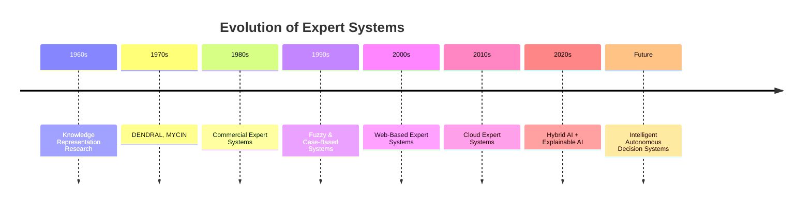
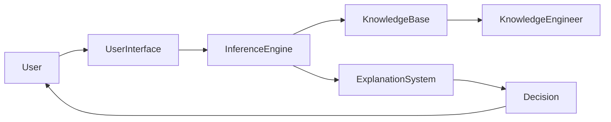
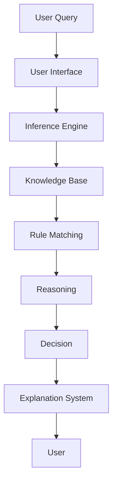

# Expert Systems Summary

## Table of Contents

- Introduction
- What are Expert Systems?
- Core Concepts
- Evolution
- Architecture Overview
- Knowledge Representation
- Inference Techniques
- Types of Expert Systems
- Development Lifecycle
- Real-World Applications
- Advantages
- Limitations
- Future of Expert Systems
- Complete Workflow
- Key Takeaways
- Glossary
- Final Quiz
- References

---

# Introduction

Expert Systems are one of the earliest and most successful applications of Artificial Intelligence (AI). They are designed to simulate the decision-making ability of human experts in a specific domain by using stored knowledge and logical reasoning.

Unlike conventional software that follows fixed procedures, Expert Systems apply expert knowledge and inference techniques to solve complex problems, provide recommendations, diagnose issues, and support decision-making.

Although modern AI includes Machine Learning, Deep Learning, and Large Language Models (LLMs), Expert Systems remain an important foundation of Explainable AI because their reasoning process is transparent and understandable.

---

# What are Expert Systems?

An **Expert System** is an Artificial Intelligence system that emulates the reasoning and decision-making abilities of a human expert using a **Knowledge Base** and an **Inference Engine**.

### Definition

> **An Expert System is an AI program that uses expert knowledge, logical reasoning, and inference techniques to solve domain-specific problems and provide expert-level recommendations.**

---

# Core Concepts

An Expert System consists of several interconnected components:

- Knowledge Base
- Knowledge Representation
- Inference Engine
- Working Memory
- Explanation System
- User Interface
- Knowledge Acquisition Module

These components work together to analyze user inputs, apply reasoning rules, and generate recommendations or decisions.

---

# Evolution



---

# Architecture Overview



---

# Knowledge Representation

Knowledge can be represented using:

| Technique | Description |
|-----------|-------------|
| Production Rules | IF–THEN rules |
| Frames | Object-based knowledge |
| Semantic Networks | Graph relationships |
| Ontologies | Structured domain concepts |
| Decision Trees | Hierarchical decisions |
| Case Libraries | Previous problem solutions |
| Knowledge Graphs | Connected semantic knowledge |

---

# Inference Techniques

Expert Systems reason using different methods.

### Forward Chaining

- Data-driven reasoning
- Starts with facts
- Produces conclusions

### Backward Chaining

- Goal-driven reasoning
- Starts with a hypothesis
- Searches for supporting facts

### Conflict Resolution

When multiple rules match simultaneously, the system selects the most appropriate rule based on predefined strategies.

---

# Types of Expert Systems

Modern Expert Systems include:

- Rule-Based Expert Systems
- Frame-Based Systems
- Case-Based Reasoning Systems
- Fuzzy Expert Systems
- Bayesian Expert Systems
- Neural Expert Systems
- Hybrid Expert Systems

---

# Development Lifecycle

```mermaid
flowchart LR

Problem

-->

Feasibility

-->

Knowledge Acquisition

-->

Knowledge Representation

-->

Design

-->

Development

-->

Testing

-->

Deployment

-->

Maintenance
```

Major phases include:

1. Problem Identification
2. Feasibility Study
3. Knowledge Acquisition
4. Knowledge Representation
5. System Design
6. Development
7. Testing
8. Deployment
9. Maintenance

---

# Real-World Applications

Expert Systems are widely used in:

| Industry | Applications |
|----------|--------------|
| Healthcare | Medical diagnosis, treatment recommendations |
| Banking | Loan approval, fraud detection |
| Manufacturing | Predictive maintenance, quality control |
| Cybersecurity | Threat detection, incident response |
| Agriculture | Crop selection, irrigation planning |
| Education | Intelligent tutoring systems |
| Legal | Legal advisory, compliance checking |
| Aviation | Aircraft diagnostics |
| Retail | Product recommendations |
| Government | Decision support systems |

---

# Advantages

Expert Systems provide:

- Fast decision-making
- Consistent reasoning
- Knowledge preservation
- Reduced human error
- Explainable decisions
- 24/7 availability
- Improved productivity
- Lower operational costs
- Reliable automation

---

# Limitations

Traditional Expert Systems have several limitations:

- Knowledge acquisition bottleneck
- High development cost
- Static Knowledge Base
- No automatic learning
- Difficult maintenance
- Rule explosion
- Domain specificity
- Limited creativity
- Lack of common sense
- Dependence on human experts

---

# Future of Expert Systems

The next generation of Expert Systems will integrate with:

- Machine Learning
- Deep Learning
- Large Language Models (LLMs)
- Explainable AI (XAI)
- Knowledge Graphs
- Internet of Things (IoT)
- Cloud Computing
- Edge AI
- Digital Twins
- Multi-Agent Systems

These technologies will create **Hybrid AI** systems that combine symbolic reasoning with data-driven intelligence.

---

# Complete Workflow



---

# Key Takeaways

- Expert Systems imitate the reasoning of human experts.
- They rely on a **Knowledge Base** and an **Inference Engine**.
- Knowledge is represented using rules, frames, semantic networks, ontologies, and cases.
- Forward Chaining is data-driven, while Backward Chaining is goal-driven.
- Expert Systems are widely used in healthcare, banking, manufacturing, cybersecurity, education, and many other industries.
- Their strengths include explainability, consistency, and knowledge preservation.
- Their limitations include static knowledge, lack of learning, and maintenance challenges.
- Modern Hybrid AI combines Expert Systems with Machine Learning, Fuzzy Logic, Knowledge Graphs, and LLMs to overcome traditional limitations.
- Expert Systems continue to play a vital role in Explainable AI and intelligent decision-support systems.

---

# Glossary

| Term | Meaning |
|------|---------|
| Expert System | AI system that mimics expert reasoning |
| Knowledge Base | Repository of facts and rules |
| Inference Engine | Performs logical reasoning |
| Knowledge Engineering | Process of building and maintaining knowledge |
| Forward Chaining | Data-driven inference |
| Backward Chaining | Goal-driven inference |
| Rule-Based System | Expert System using IF–THEN rules |
| Hybrid AI | Combination of symbolic and data-driven AI |
| Explainable AI (XAI) | AI whose reasoning can be understood by humans |
| Knowledge Graph | Structured representation of connected knowledge |

---

# Final Quiz

## Beginner

1. What is an Expert System?
2. What are the two primary components of an Expert System?
3. What is a Knowledge Base?
4. What is an Inference Engine?
5. Name three real-world applications of Expert Systems.

---

## Intermediate

1. Compare Forward Chaining and Backward Chaining.
2. Explain the role of Knowledge Engineering.
3. Describe the Expert System Development Lifecycle.
4. What are the advantages of Expert Systems?
5. Why are Expert Systems considered Explainable AI?

---

## Advanced

1. Design an Expert System for hospital diagnosis.
2. Compare Expert Systems with Machine Learning systems.
3. Explain the role of Knowledge Graphs in modern Expert Systems.
4. Design a Hybrid AI architecture combining Rule-Based reasoning, Machine Learning, and LLMs.
5. Discuss the future of Expert Systems in Industry 5.0 and Explainable AI.

---

# References

## Books

- **Artificial Intelligence: A Modern Approach** — Stuart Russell & Peter Norvig
- **Expert Systems: Principles and Programming** — Joseph C. Giarratano & Gary D. Riley
- **Knowledge Representation and Reasoning** — Ronald Brachman & Hector Levesque
- **Building Expert Systems** — Frederick Hayes-Roth

## Online Resources

- IBM AI Documentation
- Microsoft AI Learning Resources
- MIT OpenCourseWare – Artificial Intelligence
- Stanford Artificial Intelligence Laboratory
- IEEE Xplore – Expert Systems and Knowledge Engineering
- ACM Digital Library